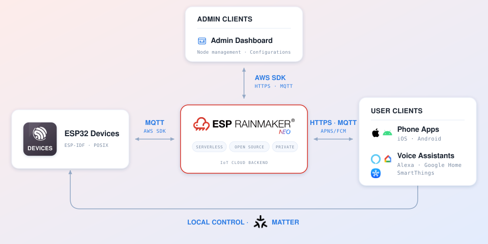

# ESP RainMaker Neo - IoT Cloud

**Tools**

&nbsp;

&nbsp;

**Documentation**

&nbsp;

---

## Introduction

ESP RainMaker Neo is a serverless, open-source IoT cloud for ESP devices that you deploy into your own AWS account. It scales with your fleet and is pay-as-you-go. Devices connect over MQTT through AWS IoT. Phone apps, the admin dashboard and voice assistants reach the same backend over REST APIs and MQTT.

  

### Repositories

| Repository                                                                            | Holds                                            |
| ------------------------------------------------------------------------------------- | ------------------------------------------------ |
| [esp-rainmaker-neo](https://github.com/espressif/esp-rainmaker-neo)                   | (this repository) Cloud backend, admin dashboard |
| [esp-rainmaker-neo-firmware](https://github.com/espressif/esp-rainmaker-neo-firmware) | Device firmware SDK                              |
| [esp-rainmaker-home](https://github.com/espressif/esp-rainmaker-home) [esp-rainmaker-neo-app-sdk-ts](https://github.com/espressif/esp-rainmaker-neo-app-sdk-ts) | ESP RainMaker Home phone app (iOS and Android) ESP RainMaker Neo App SDK (TypeScript) |

---

## Get Started

There are three ways to use it, in increasing order of involvement:

1. [Quick start](#option-1-public-esp-rainmaker-neo): Public ESP RainMaker Neo
2. [Deploy in your own account](#option-2-packaged-esp-rainmaker-neo): Packaged ESP RainMaker Neo
3. [Built From Source](#option-3-built-from-source-esp-rainmaker-neo): Built-From-Source ESP RainMaker Neo

### Option 1: Public ESP RainMaker Neo

Use the public ESP RainMaker Neo deployment — no cloud setup at all. Check out the detailed documentation [here](https://docs.neo.rainmaker.espressif.com/) for more information.

### Option 2: Packaged ESP RainMaker Neo

Run the pre-built ESP RainMaker Neo cloud in your own AWS account. Check out the detailed documentation [here](https://docs.neo.rainmaker.espressif.com/) for more information.

### Option 3: Built-From-Source ESP RainMaker Neo

Build, modify and deploy the cloud yourself. This repository holds the cloud backend, its infrastructure, the admin dashboard, docs, and the test tooling.

See **[BUILD.md](BUILD.md)** for the full guide.

## Specs & Documents

The cloud specification lives as Markdown under [docs/en/specs/](docs/en/specs/), with [docs/en/index.md](docs/en/index.md) as the table of contents. The pages are readable directly in the repo; to build and view the HTML docs locally, see the [docs build guide](docs/README.md).

- [HTTP, MQTT and Events Reference](https://api.docs.neo.rainmaker.espressif.com)
- [Glossary](misc/GLOSSARY.md)

## Contributing

Contributions are welcome — bug fixes, features, docs and tests alike. Start with [CONTRIBUTING.md](CONTRIBUTING.md).

Bug reports and feature requests go through the [issue templates](.github/ISSUE_TEMPLATE/); questions belong in [Discussions](https://github.com/espressif/esp-rainmaker-neo/discussions).

## Security

**Never report a security vulnerability in a public issue.** See [SECURITY.md](SECURITY.md) for the private reporting process and what to include.
