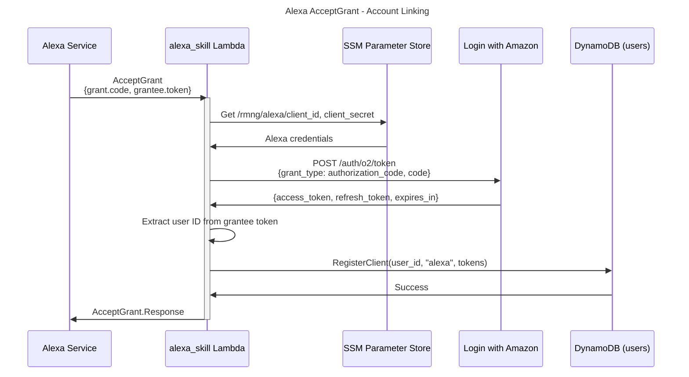
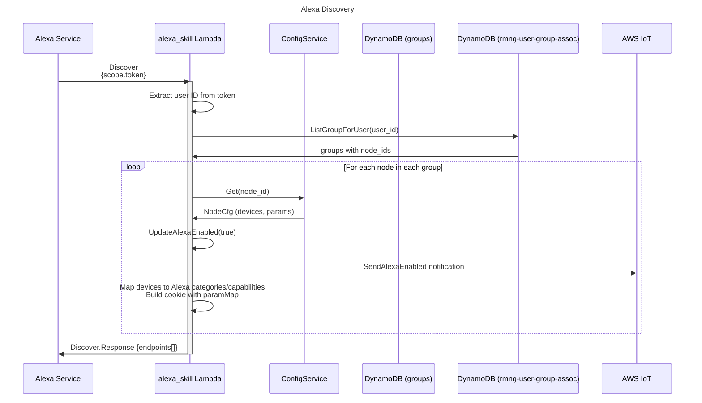
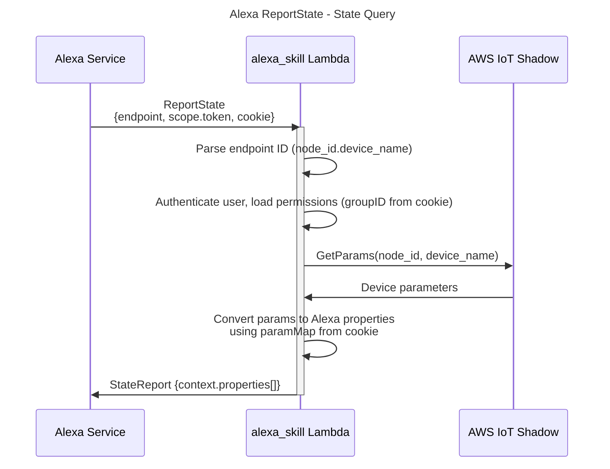
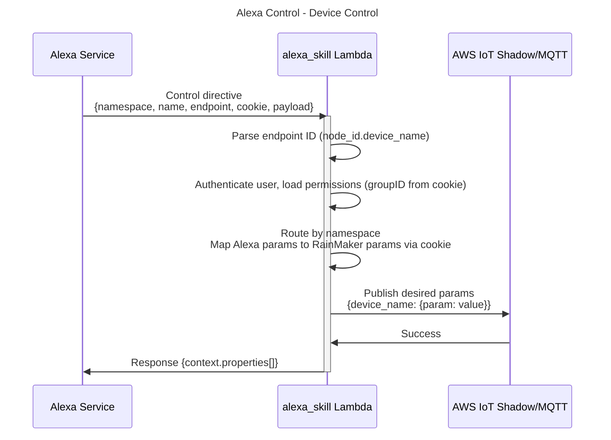

# Alexa Smart Home

## What is Alexa Smart Home

Alexa Smart Home is the Amazon Alexa integration that allows users to control their RainMaker devices via Alexa voice commands. It implements the [Alexa Smart Home Skill API](https://developer.amazon.com/en-US/docs/alexa/smarthome/understand-the-smart-home-skill-api.html), handling device discovery, state reporting, device control, account linking (AcceptGrant), and proactive state change notifications.

## Why it is needed

To enable voice control and Alexa app integration for RainMaker devices. Users link their RainMaker account with Alexa via OAuth against the ESP User issuer and can then say things like "Alexa, turn on the light" to control their devices. Alexa also receives proactive ChangeReport notifications when device state changes physically, keeping the Alexa app in sync.

## Pre-requisites

- User is registered and authenticated
- Alexa Skill configuration

## Architecture

Two Lambda functions serve the Alexa integration:

1. **`alexa_skill`** — Handles Smart Home directives (Discovery, ReportState, PowerController, BrightnessController, Authorization). Invoked directly by the Alexa service (not via API Gateway).
2. **`alexa_cfg`** — Handles Alexa configuration management (store credentials, register redirect URIs on the voice-assistant OIDC client, add Lambda trigger). Invoked via API Gateway.

## Configuration

### OIDC VA Client

Account linking runs against the ESP User OIDC identity provider, not Cognito. A confidential OAuth 2.1 client (`va-client`) is seeded into the ESP User client registry (`espuser-oauth-clients`) for voice-assistant account linking:
- **OAuth flow**: Authorization Code Grant (`grant_types`: `authorization_code`, `refresh_token`)
- **Scopes**: `openid`, `email`, `phone`, `profile`
- **Redirect URIs**: registered dynamically by the config API (there are no hardcoded initial values); each POST unions its URIs onto the client's existing set, so the Alexa and Google Voice redirect URIs coexist on the shared `va-client` row
- **Client ID**: `va-client` — the registry client id (also available in SSM `/espuser/base/va-client-id`)
- **Client Secret**: the generated secret for `va-client`, retrievable via the superadmin clients API (`GET /v1/admin/clients?get_secret=true`) or SSM `/espuser/base/va-client-secret`
- **OIDC endpoints**: the `authorization_endpoint` and `token_endpoint` published in the discovery document (`/.well-known/openid-configuration`). Both are served on the ESP User API Gateway base (`EspUserApiUrl`): `<api-url>/oauth2/authorize` and `<api-url>/oauth2/token`.

### Automated Setup (recommended)

`tools/alexa_setup.py` performs the entire skill setup — all four manual
console steps below — in one command via SMAPI (Alexa Skill Management API) plus
the config API. Only the final **enable + account-link in the Alexa app** stays
manual (it is an end-user OAuth consent flow that Amazon does not expose to SMAPI).

#### One-time prerequisites

1. **LWA Security Profile** (lets the script authenticate to SMAPI as you):
   - Create one at [Login with Amazon console](https://developer.amazon.com/loginwithamazon/console/site/lwa/overview.html)
     → note **Client ID** + **Client Secret**.
   - On its **Web Settings**, add Allowed Return URL exactly: `http://127.0.0.1:9090/cb`.
   - The profile must live in the **same developer account** that owns the skill/vendor.
2. **AWS credentials — only for the standalone-script path** (the morpheus.py path posts
   the config as the `--user` super-admin instead, so it needs no AWS creds):
   ```bash
   aws sso login --profile <profile>
   export AWS_PROFILE=<profile>
   ```

#### Run

**Via morpheus.py** (recommended — the config-API POST is authenticated as the given
super-admin user, no AWS creds needed). All inputs come from a config file:

```json
// alexa_skills_config.json
{
  "smapi_client_id": "amzn1.application-oa2-client.xxxx",   // LWA security profile
  "smapi_client_secret": "xxxx",
  "skill_name": "ESP RainMaker",         // optional
  "skill_id": "amzn1.ask.skill.xxxx"     // optional; omit to create a new skill
}
```
```bash
python cli/morpheus.py --user super_admin@example.com
> alexa_setup_auto          # reads alexa_skills_config.json by default
```

**Or the script directly** (config-API POST is SigV4-signed with your AWS creds):
```bash
export SMAPI_CLIENT_ID=amzn1.application-oa2-client.xxxx     # LWA profile
export SMAPI_CLIENT_SECRET=xxxx
./myenv/bin/python tools/alexa_setup.py [--skill-name ...] [--skill-id ...]
```

`skill_id` / `--skill-id` unset → create a new skill; set → update that skill
(idempotent). Other values (va-client creds, issuer endpoints, endpoint ARNs) are
read from `rmng-outputs.json` automatically — the CDK stack-outputs file written
at the repository root by a deploy, which is how the tooling discovers the
deployment's API Gateway URL, Lambda ARNs and pool ids.

#### Helpful commands

Inside the `python cli/morpheus.py --user <email>` context (config-driven, no env vars).
The config file defaults to `alexa_skills_config.json`; pass a path only to override:
```
alexa_setup_auto [config.json] [skill name]   # create/update + full setup
alexa_list_skills                             # list all skills (id + name)
alexa_delete_skill <skill_id>                 # delete a skill
```

The standalone script exposes the same operations plus read-only diagnostics
(used mainly in CI / without a morpheus.py user session):
```bash
./myenv/bin/python tools/alexa_setup.py --skill-id ... --status          # per-step report
./myenv/bin/python tools/alexa_setup.py --skill-id ... --status --debug  # + raw SMAPI JSON
./myenv/bin/python tools/alexa_setup.py --list-skills
./myenv/bin/python tools/alexa_setup.py --skill-id ... --delete
./myenv/bin/python tools/alexa_setup.py --dry-run                         # validate, no writes
```

#### Useful overrides

| Flag / Var | Purpose |
|---|---|
| `--skill-id` | update an existing skill instead of creating a new one |
| `--skill-name` | skill name (default `ESP RainMaker`) — distinct names for test skills |
| `--manufacturer` / `ALEXA_MANUFACTURER_NAME` | brand advertised in discovery (see [Manufacturer name](#manufacturer-name)); omitted leaves the stored brand alone, `''` resets it to `Espressif` |
| `PRIVACY_POLICY_URL` | manifest privacy URL (defaults to the RainMaker privacy URL) |
| `ALEXA_REDIRECT_URLS` | comma-separated override if the vendor's redirect URLs differ from `…/api/skill/link/<vendorId>` |
| `SMAPI_REDIRECT_PORT` | loopback port for LWA consent (default `9090`; must match the profile's Return URL) |
| `ALEXA_CONFIG_API_URL` / `RMNG_REGION` | override the config API URL / region (else from outputs) |

---

### Manual Setup (Alexa Developer Console — reference)

The steps the automated script performs, for reference or manual operation. Must be
done before calling the Store Configuration API.

#### Step 1: Create Alexa Smart Home Skill

1. Go to [Alexa Developer Console](https://developer.amazon.com/alexa/console/ask)
2. Click **Create Skill**
3. Select **Smart Home** as the skill type
4. Note the **Skill ID** (e.g., `amzn1.ask.skill.xxx`) — this is the `skill_id` for the config API
5. Under **Account Linking**:
   - **Authorization URI**: the discovery document's `authorization_endpoint` (`<api-url>/oauth2/authorize`)
   - **Access Token URI**: the discovery document's `token_endpoint` (`<api-url>/oauth2/token`)
   - **Client ID**: `va-client` (the OIDC client id; SSM `/espuser/base/va-client-id`)
   - **Client Secret**: the `va-client` secret from the superadmin clients API (`GET /v1/admin/clients?get_secret=true`) or SSM `/espuser/base/va-client-secret`
   - **Scope**: `openid`, `email`, `phone`, `profile`
   - **Alexa Redirect URLs**: Copy the redirect URLs shown by Amazon (e.g., `https://pitangui.amazon.com/api/skill/link/...`, `https://layla.amazon.com/api/skill/link/...`, `https://alexa.amazon.co.jp/api/skill/link/...`)

#### Step 2: Get Alexa Client Credentials

1. In the [Alexa Developer Console](https://developer.amazon.com/alexa/console/ask), open your skill
2. Go to **Account Linking** section
3. Note the **Alexa Client ID** and **Alexa Client Secret** shown at the bottom — these are the Alexa credentials for AcceptGrant token exchange

#### Step 3: Store Configuration via API

Store the configuration by calling the admin configuration API below. It persists the Alexa credentials to SSM, updates the Cognito VA client callback URLs, and grants the Alexa service permission to invoke the skill Lambda.

**API**: `POST /v1/admin/integrations/alexa/configuration`

**Authorization**: Super admin only (SigV4)

**Request**:
```json
{
  "redirect_uris": [
    "https://layla.amazon.com/api/skill/link/<skill-details>",
    "https://alexa.amazon.co.jp/api/skill/link/<skill-details>",
    "https://pitangui.amazon.com/api/skill/link/<skill-details>"
  ],
  "client_id": "<Alexa Client ID>",
  "client_secret": "<Alexa Client Secret>",
  "skill_id": "amzn1.ask.skill.xxx",
  "manufacturer_name": "Espressif"
}
```

**Process**:
1. Validate all four fields are present (`redirect_uris`, `client_id`, `client_secret`, `skill_id`)
2. Register the redirect URIs on the OIDC `va-client` registry row, unioning them onto its existing set (env var: `OIDC_VA_CLIENT_ID`, value `va-client`)
3. Store Alexa client ID in SSM `/rmng/alexa/client_id` and client secret in SSM `/rmng/alexa/client_secret`
4. Add Lambda invoke permission for `alexa-connectedhome.amazon.com` with the skill ID as event source token (env var: `ALEXA_SKILL_FUNCTION_NAME`)
5. If `manufacturer_name` is present, store it in SSM `/rmng/alexa/manufacturer_name` — see [Manufacturer name](#manufacturer-name)

**Response**:
```json
{
  "message": "success"
}
```

#### Step 4. Add Alexa lambda ARNs

1. Go to [Alexa Developer Console](https://developer.amazon.com/alexa/console/ask)
2. Go to **Smart Home > Default endpoint**
3. Set the Lambda ARN from rmng-outputs.json (`AlexaSkillFunctionArn`)

> Note: You would need this lambda deployed in 3 regions to support users from all locations. If any region is unavailable, the users from there won't be able to link their account.

## Smart Home Directives

### Authentication

Alexa sends an ESP User access token (issued to the voice-assistant client at account linking) in the `scope.token` field of the directive payload or endpoint. The Lambda extracts the user ID using this token. The `alexa_skill` Lambda is invoked directly by the Alexa service (not via API Gateway) — the Alexa service principal `alexa-connectedhome.amazon.com` has Lambda invoke permission gated by the skill ID.

### Endpoint ID Format

Devices are identified as `<node_id>.<device_name>` (e.g., `ABC123.Light1`). This composite ID maps an Alexa endpoint back to a specific RainMaker node and device within that node.

### Cookie

During Discovery, each endpoint carries a `cookie` containing:
- `groupID` — the group the node belongs to (for permission loading)
- `paramMap_<Capability>` — maps Alexa capability interfaces to RainMaker parameter names (e.g., `paramMap_PowerController: "Power"`)

This cookie is sent back by Alexa on ReportState and Control requests, avoiding additional lookups.

All directives are served by a single Lambda function. The Lambda routes requests based on `directive.header.namespace` and `directive.header.name`:

| Namespace                          | Name            | Handled as                |
| ---------------------------------- | --------------- | ------------------------- |
| `Alexa.Authorization`              | `AcceptGrant`   | Account linking           |
| `Alexa.Discovery`                  | `Discover`      | Device discovery          |
| `Alexa.PowerController`            | `TurnOn/Off`    | Power control             |
| `Alexa.BrightnessController`       | `SetBrightness` | Brightness control        |
| `Alexa.ColorController`            | `SetColor`      | Colour control            |
| `Alexa.ColorTemperatureController` | —               | Colour-temperature control |
| `Alexa.ToggleController`           | —               | Generic toggles           |
| `Alexa.ModeController`             | —               | Generic modes             |
| `Alexa`                            | `ReportState`   | State queries             |

Namespace dispatch happens first; only the bare `Alexa` namespace branches
further on `header.name`. An unrecognized namespace — or an `Alexa` directive
whose name is not `ReportState` — returns an error.

### AcceptGrant (Account Linking)

Alexa sends AcceptGrant when the user links their RainMaker account via the Alexa app.

**Request**:
```json
{
  "directive": {
    "header": {
      "namespace": "Alexa.Authorization",
      "name": "AcceptGrant",
      "messageId": "uuid",
      "payloadVersion": "3"
    },
    "payload": {
      "grant": {
        "type": "OAuth2.AuthorizationCode",
        "code": "<authorization-code>"
      },
      "grantee": {
        "type": "BearerToken",
        "token": "<esp-user-access-token>"
      }
    }
  }
}
```

**Process**:
1. Retrieve Alexa client ID and secret from SSM (`/rmng/alexa/client_id`, `/rmng/alexa/client_secret`)
2. Exchange the authorization code for Alexa access/refresh tokens via `https://api.amazon.com/auth/o2/token`
3. Extract user ID from the grantee token (ESP User access token)
4. Store the Alexa OAuth bundle (access token, refresh token, expiry, region) as an `alexa` endpoint row in `rmng-user-endpoints`

**Response**:
```json
{
  "event": {
    "header": {
      "namespace": "Alexa.Authorization",
      "name": "AcceptGrant.Response",
      "messageId": "uuid",
      "payloadVersion": "3"
    },
    "payload": {}
  }
}
```

**Sequence Diagram**:



### Discovery

Alexa sends Discovery when the user links their account or requests a device refresh.

**Request**:
```json
{
  "directive": {
    "header": {
      "namespace": "Alexa.Discovery",
      "name": "Discover",
      "messageId": "uuid",
      "payloadVersion": "3"
    },
    "payload": {
      "scope": {
        "type": "BearerToken",
        "token": "<esp-user-access-token>"
      }
    }
  }
}
```

**Process**:
1. Get user ID from the ESP User access token
2. (Optional) If Alexa access token is needed for ChangeReport notifications:
   - Lookup user's Alexa tokens from client registry
   - If access token is expired (timestamp older than 1 hour), refresh using refresh token via `https://api.amazon.com/auth/o2/token`
   - Update stored access token and timestamp in client registry
3. List all groups for the user via `group.ListGroupForUser()`
4. For each group, iterate over `nodeIDs`
5. For each node, fetch node config via `ConfigService.Get()`
6. Mark node as Alexa-enabled and send a notification to the device on the `rainmaker/nodes/<thingName>/from_cloud` topic with `{"event": ["notifications"], "notifications": {"alexa": true}}`
7. For each device in the node config:
   - Generate endpoint ID: `<node_id>.<device_name>`
   - Map RainMaker device type to Alexa display category
   - Determine capabilities from device parameters
   - Build `cookie` with group ID and parameter mappings
   - Add standard capabilities: `Alexa` (v3) and `Alexa.EndpointHealth` (v3.1)
   - Resolve `manufacturerName` — see [Manufacturer name](#manufacturer-name)

**Response**:
```json
{
  "event": {
    "header": {
      "namespace": "Alexa.Discovery",
      "name": "Discover.Response",
      "messageId": "uuid",
      "payloadVersion": "3"
    },
    "payload": {
      "endpoints": [
        {
          "endpointId": "node123.Light1",
          "manufacturerName": "Espressif",
          "description": "Espressif LED_Smart_v2",
          "friendlyName": "Light1",
          "displayCategories": ["LIGHT"],
          "additionalAttributes": {
            "manufacturer": "Espressif",
            "model": "LED_Smart_v2",
            "firmwareVersion": "1.1.0"
          },
          "capabilities": [
            {
              "type": "AlexaInterface",
              "interface": "Alexa",
              "version": "3"
            },
            {
              "type": "AlexaInterface",
              "interface": "Alexa.EndpointHealth",
              "version": "3.1",
              "properties": {
                "supported": [{ "name": "connectivity" }],
                "proactivelyReported": true,
                "retrievable": true
              }
            },
            {
              "type": "AlexaInterface",
              "interface": "Alexa.PowerController",
              "version": "3",
              "properties": {
                "supported": [{ "name": "powerState" }],
                "proactivelyReported": true,
                "retrievable": true
              }
            },
            {
              "type": "AlexaInterface",
              "interface": "Alexa.BrightnessController",
              "version": "3",
              "properties": {
                "supported": [{ "name": "brightness" }],
                "proactivelyReported": true,
                "retrievable": true
              }
            }
          ],
          "cookie": {
            "groupID": "abc123",
            "paramMap_PowerController": "Power",
            "paramMap_BrightnessController": "Brightness"
          }
        }
      ]
    }
  }
}
```

#### Manufacturer name

Works With Alexa (WWA) review rejects a placeholder manufacturer, so every endpoint advertises a
real brand in `manufacturerName` and in `additionalAttributes.manufacturer`. It is resolved per
node, in this order:

1. **The node's own report** — `info.manufacturer` in the node config, if the device sends one.
   Firmware is expected to leave this unset unless an OEM deliberately enables reporting it, so
   one firmware image can ship under several brands.
2. **The deployment's configured brand** — SSM `/rmng/alexa/manufacturer_name`, set through
   `manufacturer_name` on the [configuration API](#step-3-store-configuration-via-api). Rebranding
   a deployment is therefore a config API call, not a redeploy.
3. **`Espressif`** — the default when a deployment has configured no brand.

The value is cached for the lambda container's lifetime, so a change to it takes effect as
containers recycle rather than instantly.

`additionalAttributes.model` is the node's reported `info.model`, omitted when the node reports
none. `info.type` is an internal node-type identifier (e.g. `smartlight-mtr-app`), not a marketing
model name, so it is deliberately not used as a fallback.

#### Device Type Mapping

| RainMaker Type                  | Alexa Display Category |
| ------------------------------- | ---------------------- |
| `esp.device.air-conditioner`    | `AIR_CONDITIONER`      |
| `esp.device.blinds-external`    | `EXTERIOR_BLIND`       |
| `esp.device.blinds-internal`    | `INTERIOR_BLIND`       |
| `esp.device.contact-sensor`     | `CONTACT_SENSOR`       |
| `esp.device.doorbell`           | `DOORBELL`             |
| `esp.device.fan`                | `FAN`                  |
| `esp.device.garage-door-lock`   | `SMARTLOCK`            |
| `esp.device.garage-door`        | `GARAGE_DOOR`          |
| `esp.device.light`              | `LIGHT`                |
| `esp.device.lightbulb`          | `LIGHT`                |
| `esp.device.lock`               | `SMARTLOCK`            |
| `esp.device.motion-sensor`      | `MOTION_SENSOR`        |
| `esp.device.other`              | `OTHER`                |
| `esp.device.outlet`             | `SMARTPLUG`            |
| `esp.device.plug`               | `SMARTPLUG`            |
| `esp.device.security-panel`     | `SECURITY_PANEL`       |
| `esp.device.socket`             | `SMARTPLUG`            |
| `esp.device.speaker`            | `SPEAKER`              |
| `esp.device.switch`             | `SWITCH`               |
| `esp.device.temperature-sensor` | `TEMPERATURE_SENSOR`   |
| `esp.device.thermostat`         | `THERMOSTAT`           |
| `esp.device.tv`                 | `TV`                   |
| `esp.device.washer`             | `WASHER`               |
| `esp.device.water-heater`       | `WATER_HEATER`         |
| Unknown / nil                   | `OTHER` (default)      |

#### Capability Mapping

| RainMaker Param Type   | Alexa Capability             | Cookie Key                      |
| ---------------------- | ---------------------------- | ------------------------------- |
| `esp.param.brightness` | `Alexa.BrightnessController` | `paramMap_BrightnessController` |
| `esp.param.power`      | `Alexa.PowerController`      | `paramMap_PowerController`      |

Standard capabilities added to every endpoint:
- `Alexa` (v3) — base interface
- `Alexa.EndpointHealth` (v3.1) — connectivity status

**Sequence Diagram**:



### ReportState (State Query)

Alexa sends ReportState to get current device state.

**Request**:
```json
{
  "directive": {
    "header": {
      "namespace": "Alexa",
      "name": "ReportState",
      "messageId": "uuid",
      "correlationToken": "correlation-token",
      "payloadVersion": "3"
    },
    "endpoint": {
      "endpointId": "node123.Light1",
      "scope": {
        "type": "BearerToken",
        "token": "<esp-user-access-token>"
      },
      "cookie": {
        "groupID": "abc123",
        "paramMap_PowerController": "Power",
        "paramMap_BrightnessController": "Brightness"
      }
    },
    "payload": {}
  }
}
```

**Process**:
1. Parse endpoint ID into `node_id` and `device_name`
2. Authenticate user via Cognito token and load node permissions using `groupID` from cookie
3. Get device parameters from IoT reported shadow via `node.GetParams()`
4. Convert parameter values to Alexa context properties using capability handlers and cookie mappings
5. Add `Alexa.EndpointHealth` connectivity property

**State Conversion**:

| Capability             | RainMaker Param  | Alexa Property | Conversion                         |
| ---------------------- | ---------------- | -------------- | ---------------------------------- |
| `BrightnessController` | Brightness (int) | `brightness`   | Direct integer (0-100)             |
| `EndpointHealth`       | —                | `connectivity` | Always `{ "value": "OK" }`         |
| `PowerController`      | Power (bool)     | `powerState`   | `true` → `"ON"`, `false` → `"OFF"` |

**Response**:
```json
{
  "event": {
    "header": {
      "namespace": "Alexa",
      "name": "StateReport",
      "messageId": "uuid",
      "correlationToken": "correlation-token",
      "payloadVersion": "3"
    },
    "endpoint": {
      "endpointId": "node123.Light1"
    },
    "payload": ""
  },
  "context": {
    "properties": [
      {
        "namespace": "Alexa.PowerController",
        "name": "powerState",
        "value": "ON",
        "timeOfSample": "2024-01-01T00:00:00Z",
        "uncertaintyInMilliseconds": 0
      },
      {
        "namespace": "Alexa.BrightnessController",
        "name": "brightness",
        "value": 75,
        "timeOfSample": "2024-01-01T00:00:00Z",
        "uncertaintyInMilliseconds": 0
      },
      {
        "namespace": "Alexa.EndpointHealth",
        "name": "connectivity",
        "value": { "value": "OK" },
        "timeOfSample": "2024-01-01T00:00:00Z",
        "uncertaintyInMilliseconds": 0
      }
    ]
  }
}
```

**Sequence Diagram**:



### Control Directives (Device Control)

Alexa sends control directives when the user issues a voice command.

#### PowerController

**TurnOn Request**:
```json
{
  "directive": {
    "header": {
      "namespace": "Alexa.PowerController",
      "name": "TurnOn",
      "messageId": "uuid",
      "correlationToken": "correlation-token",
      "payloadVersion": "3"
    },
    "endpoint": {
      "endpointId": "node123.Light1",
      "scope": { "type": "BearerToken", "token": "<token>" },
      "cookie": { "groupID": "abc123", "paramMap_PowerController": "Power" }
    },
    "payload": {}
  }
}
```

#### BrightnessController

**SetBrightness Request**:
```json
{
  "directive": {
    "header": {
      "namespace": "Alexa.BrightnessController",
      "name": "SetBrightness",
      "messageId": "uuid",
      "correlationToken": "correlation-token",
      "payloadVersion": "3"
    },
    "endpoint": {
      "endpointId": "node123.Light1",
      "scope": { "type": "BearerToken", "token": "<token>" },
      "cookie": { "groupID": "abc123", "paramMap_BrightnessController": "Brightness" }
    },
    "payload": { "brightness": 75 }
  }
}
```

**Process** (common to all control directives):
1. Get bearer token from `directive.endpoint.scope.token` and optionally validate using `GET https://api.amazon.com/auth/o2/tokeninfo?access_token={BearerToken}` (for ESP RBAC context)
2. Parse endpoint ID into `node_id` and `device_name`
3. Authenticate user via Cognito token and load node permissions using `groupID` from cookie
4. Extract capability name from namespace (e.g., `Alexa.PowerController` → `PowerController`)
5. Route to the capability that owns the directive's namespace
6. Map Alexa params to RainMaker params using cookie parameter mappings
7. Subscribe to named shadow `params-<groupID>` for the device `<thingName>` to monitor state changes
8. Publish the control command to the device's desired params on the `rainmaker/nodes/<thingName>/user/params-<groupID>/params` topic
9. Wait for named shadow update for related parameter with timeout
   - If successful, respond with success and current state
   - If timeout or device not reachable, respond with appropriate error

**Command mapping**:

| Namespace                    | Directive       | Cookie Key                      | RainMaker Publish                      | Alexa Response Property |
| ---------------------------- | --------------- | ------------------------------- | -------------------------------------- | ----------------------- |
| `Alexa.BrightnessController` | `SetBrightness` | `paramMap_BrightnessController` | `{ "<device>": { "<param>": int } }`   | `brightness: int`       |
| `Alexa.PowerController`      | `TurnOn`        | `paramMap_PowerController`      | `{ "<device>": { "<param>": true } }`  | `powerState: "ON"`      |
| `Alexa.PowerController`      | `TurnOff`       | `paramMap_PowerController`      | `{ "<device>": { "<param>": false } }` | `powerState: "OFF"`     |

**Response** (same structure for all control directives):
```json
{
  "event": {
    "header": {
      "namespace": "Alexa",
      "name": "Response",
      "messageId": "uuid",
      "correlationToken": "correlation-token",
      "payloadVersion": "3"
    },
    "endpoint": {
      "endpointId": "node123.Light1",
      "scope": { "type": "BearerToken", "token": "<token>" }
    },
    "payload": {}
  },
  "context": {
    "properties": [
      {
        "namespace": "Alexa.PowerController",
        "name": "powerState",
        "value": "ON",
        "timeOfSample": "2024-01-01T00:00:00Z",
        "uncertaintyInMilliseconds": 0
      }
    ]
  }
}
```

**Sequence Diagram**:



## Proactive Notifications (ChangeReport)

When a device's state changes physically (e.g., user presses a physical button), the system sends a ChangeReport to Alexa to keep the Alexa app in sync.

### Dispatcher integration

ChangeReport is delivered through the shared [notifications dispatcher](notifications.md). Specifically:

- Registered service name: **`alexa`**
- Service kind: **user-specific**. The dispatcher resolves the user list for the originating group/subgroup before fanning out per-user.
- Trigger: a shadow update where the dispatch event's `notify` map contains an `"alexa"` key. Direct notifications (`notify/…` topics) are not supported by the Alexa channel — only `shadow_update` events are marshalled.
- Alexa is a bespoke adapter — it owns the URIs, the OAuth refresh-token grant flow, and the ChangeReport body shape, rather than reusing the generic webhook scaffold. See [notifications-webhooks.md](notifications-webhooks.md) for context on the two implementation patterns.

### Process
1. A shadow update notification is received with the node's current state and delta
2. Get node configuration to determine supported capabilities
3. For each device in the node config:
   - Build cookie from device capabilities
   - Generate context properties from the current state
   - Generate change properties from the delta state
   - Remove overlapping properties (context = current minus delta)
4. For each target user, for each linked endpoint:
   - Refresh the Alexa access token using the stored refresh token via `https://api.amazon.com/auth/o2/token`
   - Send the ChangeReport to the event gateway for the user's stored region, with the Bearer token.

### Region-aware gateway routing

Alexa's event gateway is regional and the account-linking token is region-scoped, so each ChangeReport must go to the gateway matching the user's Alexa region — sending to the wrong one is rejected (the user "never enabled" the skill there).

The user's region is captured at **AcceptGrant**: Smart Home skills run only in three AWS regions, and Alexa routes AcceptGrant to the regional Lambda matching the user, so that Lambda's `AWS_REGION` is the user's Alexa region. It is stored on the user's integration-token row (`region`) and used to select the gateway when sending:

| AWS region (stored at link) | Alexa region | Event gateway |
| --- | --- | --- |
| `us-east-1` | North America | `https://api.amazonalexa.com/v3/events` |
| `eu-west-1` | Europe | `https://api.eu.amazonalexa.com/v3/events` |
| `us-west-2` | Far East | `https://api.fe.amazonalexa.com/v3/events` |

A row with no stored region (or an unrecognized one) is skipped and logged — there is no fallback gateway.

### Token storage

Per-user Alexa credentials live in the same `rmng-user-endpoints` DynamoDB table that backs push registration, keyed by user and endpoint:

| Column                 | Value for Alexa                                                                       |
| ---------------------- | ------------------------------------------------------------------------------------- |
| `user_id`              | partition key, the Cognito identity                                                   |
| `integration_endpoint` | sort key, `alexa#<endpoint_id>`                                                       |
| `integration_id`       | `alexa`                                                                               |
| `endpoint_id`          | the Amazon `user_id` from LWA `/user/profile` — so one user can link several Amazon accounts |
| `integration_token`    | nested map: `{access_token, refresh_token, access_expires_at, token_type, region}`     |

The OAuth bundle is the nested `integration_token` map, and the `region` inside
it selects the event gateway.

This row is created by the AcceptGrant handler at account-link time (see [AcceptGrant (Account Linking)](#acceptgrant-account-linking)), which also records the user's region (the handling Lambda's `AWS_REGION`) for gateway routing, and is refreshed in place whenever the cached access token is past its `access_expires_at`. The refresh path POSTs `grant_type=refresh_token&refresh_token=...&client_id=...&client_secret=...` form-encoded to `https://api.amazon.com/auth/o2/token` using the client credentials stored via the [OIDC VA Client config](#oidc-va-client). A failed refresh for one user is logged and skipped; the broadcast continues to other users.

> **Known limitation.** The Alexa client ID and secret are read from SSM on
> every use — response caching is deliberately off, because invalidating the
> cache when the credentials are deleted is not implemented. The notifications
> path therefore reads SSM on every token refresh. (GVA does cache its
> service-account JSON.)

**ChangeReport Structure**:
```json
{
  "event": {
    "header": {
      "namespace": "Alexa",
      "name": "ChangeReport",
      "messageId": "uuid",
      "payloadVersion": "3"
    },
    "endpoint": {
      "endpointId": "node123.Light1",
      "scope": { "type": "BearerToken", "token": "<Alexa-access-token>" }
    },
    "payload": {
      "change": {
        "cause": { "type": "PHYSICAL_INTERACTION" },
        "properties": [
          {
            "namespace": "Alexa.PowerController",
            "name": "powerState",
            "value": "ON",
            "timeOfSample": "2024-01-01T00:00:00Z",
            "uncertaintyInMilliseconds": 0
          }
        ]
      }
    }
  },
  "context": {
    "properties": [
      {
        "namespace": "Alexa.BrightnessController",
        "name": "brightness",
        "value": 75,
        "timeOfSample": "2024-01-01T00:00:00Z",
        "uncertaintyInMilliseconds": 0
      },
      {
        "namespace": "Alexa.EndpointHealth",
        "name": "connectivity",
        "value": { "value": "OK" },
        "timeOfSample": "2024-01-01T00:00:00Z",
        "uncertaintyInMilliseconds": 0
      }
    ]
  }
}
```

### Error semantics

The Alexa channel is best-effort:
- A failed token refresh for one user is logged and skipped — other users still get their ChangeReport.
- A non-2xx response from Alexa for one (user, device) pair is logged and skipped — the next device in the same node, and the next user, still get attempted.
- The dispatcher only sees a hard failure if the marshal step itself fails, in which case `alexa` is dropped for that event but other channels (push, GVA, …) still fire.

There is no retry, no DLQ, and no delivery receipt — observability comes from logs and the Alexa developer console.

## Beta Sharing

An unpublished Smart Home skill can be shared with a limited set of test accounts before it is submitted for certification. This lets operators validate the end-to-end flow with real Alexa accounts.

### Step 1: Fill Skill Preview Details

Go to **Distribution** -> **Skill Preview** and complete the required fields for your locale(s), including the public name, descriptions, example phrases, category (Smart Home), skill icons, and your own Privacy Policy and Terms of Use URLs. These values are what beta testers see when they install the skill.

### Step 2: Privacy & Compliance

On the same page, complete the **Privacy & Compliance** questionnaire accurately for your deployment.

### Step 3: Enable Beta Test

1. Go to **Availability** and select **Beta Test**
2. Add the email addresses of the users you want to share the skill with (each must match an Amazon account)
3. Copy the generated invitation link and share it with those testers so they can install the skill (e.g., `https://skills-store.amazon.com/deeplink/tvt/<id>`)

## Testing

Download the Alexa app and enable the skill. Link your RainMaker account via the account linking flow in the skill settings.
