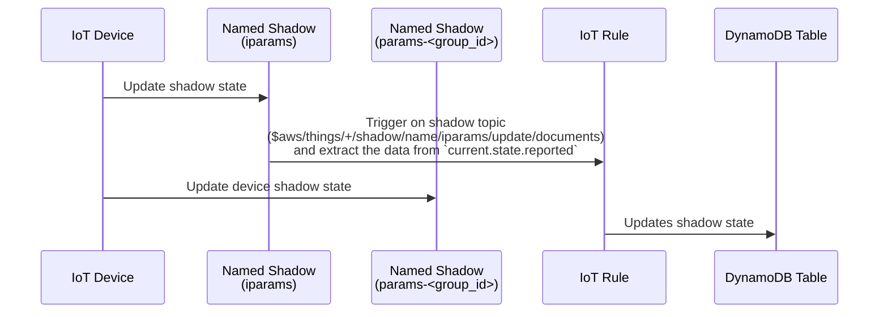
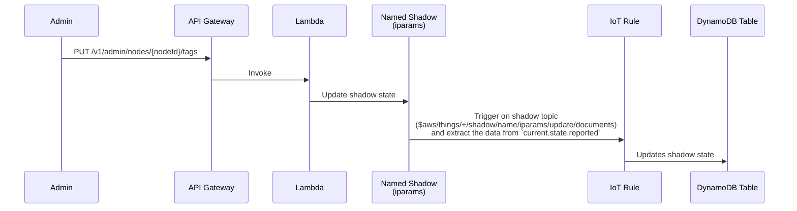
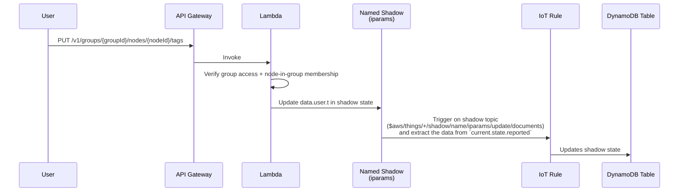

# Indexed Parameters (the `iparams` shadow)

Every node carries one **named shadow called `iparams`** — the *indexed*
parameters shadow. It holds the slow-moving, searchable facts about a node
(device identity, admin tags, user tags, online flag) as opposed to the
fast-moving control state, which lives in the group shadow
`params-<group_id>[-<subgroup>…]`.

Two things consume it:

- **AWS IoT fleet indexing** indexes `iparams` (and only `iparams`), which is
  what makes the admin dashboard's node search and filtering possible. See
  [Fleet Indexing](admin/fleet-indexing.md).
- **An IoT topic rule** (`iparams_index_rule`) mirrors every accepted shadow
  document into DynamoDB, so the tags can be read back through the REST API
  without a shadow read per node.

This page documents that shadow: who writes which part of it, how the mirror
rule works, and the exact document shape it produces.

## Who writes what

| Section | Writer | Path |
| --- | --- | --- |
| `data.device.t` | the node itself, over MQTT | node → `iparams` shadow directly |
| `data.admin.t` | admin | `GET`/`PUT /v1/admin/nodes/{nodeId}/tags` |
| `data.user.t` | user | `GET`/`PUT /v1/groups/{groupId}/nodes/{nodeId}/tags` |
| `online` | the node (on connect) and the presence handler (on disconnect) | see [node_connection.md](node_connection.md) |

### The mirror rule

`iparams_index_rule` subscribes to

```
$aws/things/+/shadow/name/iparams/update/documents
```

and selects `topic(3)` as `node_id` plus `current.state.reported` as `iparams`,
writing one item per node into the indexed-params DynamoDB table.
`update/documents` is the AWS shadow topic that carries both `previous` and
`current` states for an accepted write.

### Device



### Admin

Admin tags are managed via REST APIs:

- `GET /v1/admin/nodes/{nodeId}/tags` — read admin/device tags
- `PUT /v1/admin/nodes/{nodeId}/tags` — update admin/device tags



### User

User tags are managed over REST, on the group-scoped node route:

- `GET /v1/groups/{groupId}/nodes/{nodeId}/tags` — read user tags
- `PUT /v1/groups/{groupId}/nodes/{nodeId}/tags` — update user tags



Tag writes reach the shadow only through these REST routes. The single IoT rule
attached to the `iparams` shadow is the DynamoDB mirror described above, so tags
published on an MQTT topic are not ingested.

## Document shape

### The reported state

The cloud models the `iparams` reported state as:

```json
{
  "online": true,
  "disconnect_info": { "...": "written by the presence handler on disconnect" },
  "data": {
    "admin":  { "t": { "serial_no": "1234567890" } },
    "device": { "t": { "type": "Light", "model": "Led", "fw_version": "1.0.0" } },
    "user":   { "t": { "city": "pune" } }
  },
  "params": {
    "Light": { "power": true, "brightness": 100 }
  }
}
```

Three properties of that layout carry weight:

- **Tags sit one level down, under `t`.** `data.<source>.t.<key>` is the tag
  path. Each of the three `data` sections has exactly one writer (see [Who
  writes what](#who-writes-what)), and a write to one never merges into another.
- **The firmware-version key is `fw_version`.** It is what the fleet-indexing
  custom fields aggregate on and what the dashboard reads.
- **`params` is keyed by device, then parameter** — `params.<device>.<param>`.
  `online` is a top-level field of the reported state.

Deleting a tag is a write of `null` at its path; the shadow merge removes the
key. Clearing all of a user's tags writes `{"data":{"user":{"t":null}}}`.