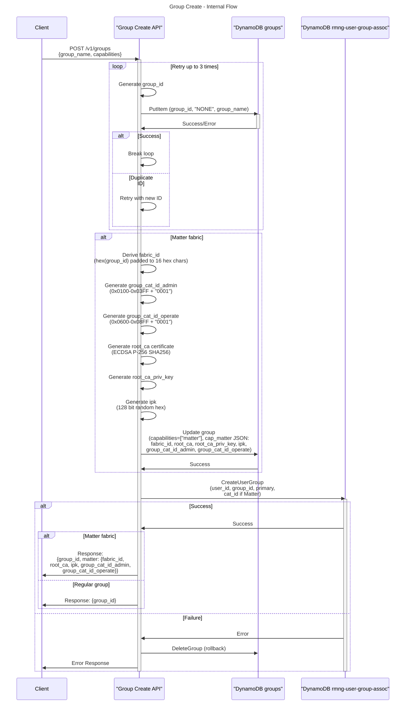
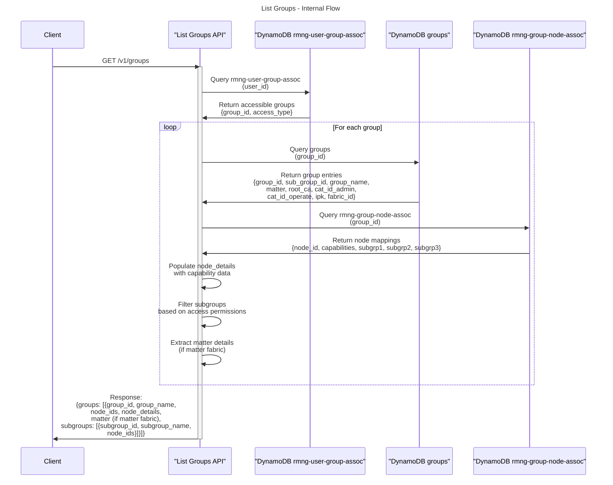
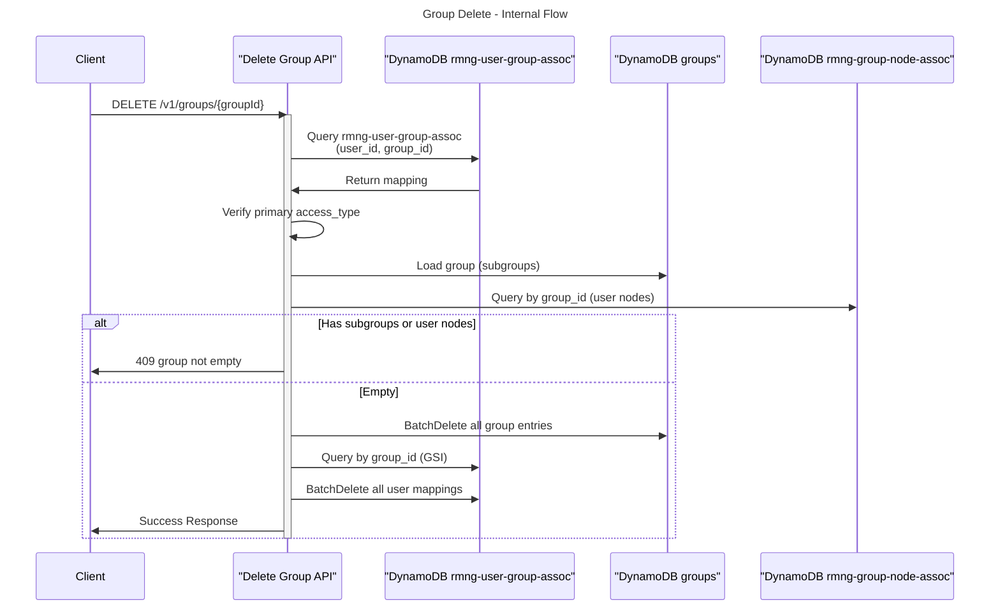
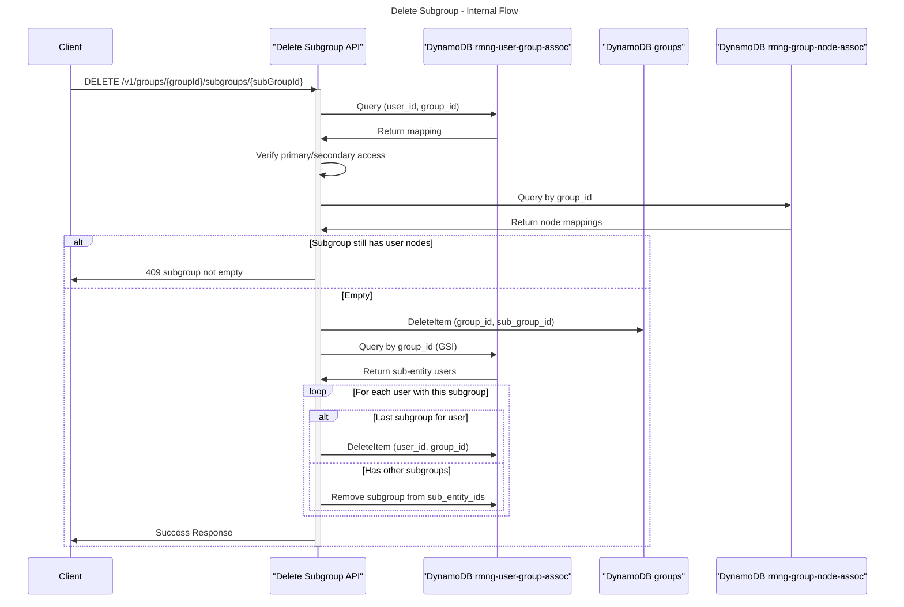
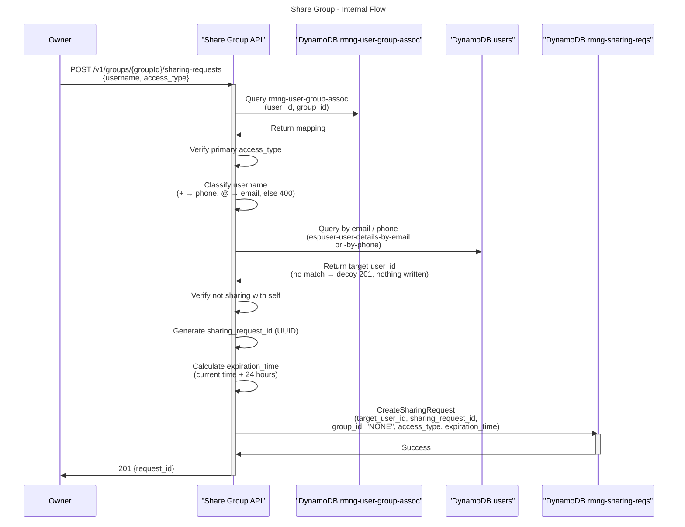
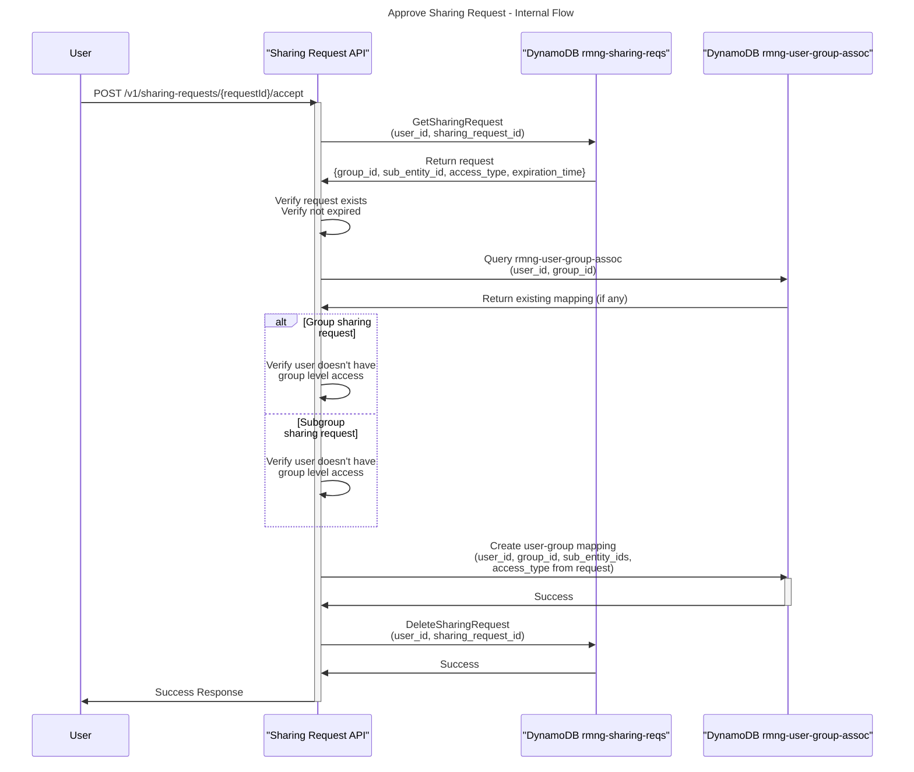
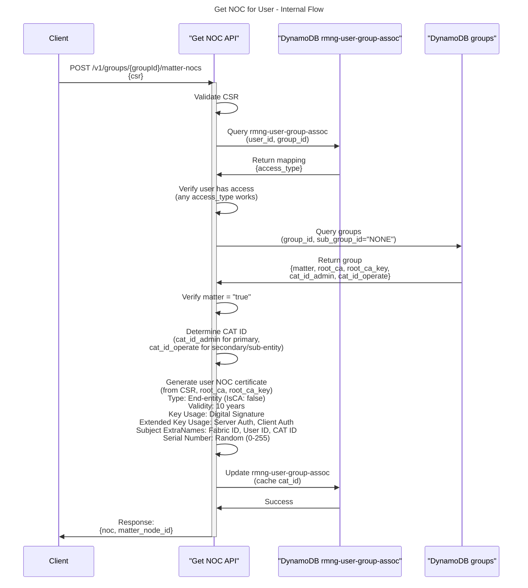

# Group

## What is group

Group is a logical collection of nodes and subgroups. It is the base context for nodes to exist for users. Think of it as a home. A user can have multiple groups.

## Why it is needed

Groups simplify user access control: what nodes a user can reach is scoped by the group or subgroup they have access to.

## Pre-requisites

- User is registered and authenticated

## Access Control

### Group Permissions

- **Primary Access**: Full access to group and all subgroups
  - Can create subgroups
  - Can add/remove nodes
  - Can update group/subgroup names
  - Can delete group
  - Can share/unshare group/subgroups with others
  
- **Secondary Access**: Limited access to group
  - Can create subgroups
  - Can delete subgroups
  - Cannot add/remove nodes
  - Can update group/subgroup names
  - Cannot delete group
  - Cannot share/unshare group/subgroups
  
- **Sub-entity Access**: Access only to specific subgroups
  - Can update subgroup names
  - Can list nodes in accessible subgroups
  - Cannot create subgroups
  - Cannot add/remove nodes
  - Cannot delete subgroups
  - Cannot share/unshare subgroups

## Naming rules

- Group/subgroup name: User-provided string, cannot be empty.
- Group/subgroup Id:
  - Group ID: 6 characters. The first character is a lowercase letter (to avoid all-numeric IDs), followed by 5 alphanumeric characters (lowercase letters and digits). Lowercase so that customer support is easier without worrying about case sensitivity.
  - Subgroup ID: 3 characters, consisting of lowercase letters and digits.

## Key Rules

- A node can belong to maximum 3 subgroups (subgrp1, subgrp2, subgrp3)
- A node can only be in one group at a time
- Primary access to group implies access to all subgroups

## Scope encoding

A member's scope is carried entirely by `sub_entity_ids` on their `rmng-user-group-assoc` row, and **an empty list is the canonical encoding of full-group access**. Every consumer relies on this: subgroup filters treat "no subgroup named" as "not restricted", and the assume-role access map buckets a row into full-group or subgroup-scoped by whether the list is empty rather than by reading `access_type`.

Two invariants follow, and both are enforced when the row is written rather than when it is read:

- A `subentity` grant must always name at least one subgroup. A `subentity` row with an empty list would be read as access to the *whole* group by every consumer, so it is rejected at write time.
- Group-level access supersedes subgroup access. When a member holding `subentity` access accepts a group share, `sub_entity_ids` is reset to empty and they are promoted to full-group access. The reverse is refused: a subgroup grant cannot be added on top of group-level access.

Consequently `access_type` alone is not sufficient to determine a member's scope, and the two fields must be written together. This is why `access_type` is validated against `primary`, `secondary` and `subentity` before a sharing request is created: an unrecognised value resolves to an empty permission set, which fails every authorized read of that group for that member.

## Capacity Limits

Creating groups is unbounded. The number of groups a user can *operate at one time* is not, and the ceiling is imposed by AWS rather than chosen by RainMaker.

Device control runs over MQTT, and the credentials for it come from `POST /v1/assumed-roles`. That endpoint returns an STS session policy which enumerates one set of AWS IoT topic ARNs **per accessible group** (see [user_auth.md](user_auth.md) §3.3). STS caps an inline session policy at **2048 characters**, so the number of groups a user can hold credentials for is bounded by how many ARNs fit in that document.

| Rule | Limit |
| --- | --- |
| Groups a user may create | Unbounded |
| Groups usable in one session | **4** with full access |
| Shared subgroups usable in one session | **8** |
| Mixed allowance | `343 × groups + 183 × shared_subgroups ≤ ~1545` characters |
| Subgroups per group | No enforced limit |
| Session policy size (AWS/STS) | 2048 characters |
| Sharing request validity | 24 hours from creation |
| Pending sharing requests per group/invitee pair | No enforced limit — repeated shares create additional requests |

See also [AWS Service Limits](limits.md) for the limits this deployment operates against.

Properties of the allowance that clients and product need to account for:

- It is **per user and pooled.** Groups the user owns and groups shared *to* them draw on the same allowance and cost exactly the same. Four people each sharing one group with a user can exhaust it.
- Subgroups a user creates inside their **own** group are free: the group-level grant already covers them with a `subgroups/*` wildcard. Only a subgroup shared *to* a user, from a group they do not otherwise have access to, consumes allowance.
- The number of nodes in a group does not affect the allowance.
- The `iot:Connect` resource embeds the caller's user name, so a long email address reduces the remaining allowance. A user with both an email and a phone number on record consumes two `iot:Connect` resources.
- A mapping row that points at a group or subgroup which has since been deleted still consumes allowance, because the access map is resolved from `rmng-user-group-assoc` rather than from the group table.

**Behaviour when the allowance is exceeded.** The credential request is rejected as a whole: `POST /v1/assumed-roles` returns HTTP 500 with `"Unable to issue credentials: too many accessible groups to encode in a session policy"`. The failure is *not* scoped to the group that crossed the threshold — the user loses MQTT access to **every** group, including groups they own. REST endpoints are unaffected, so `GET /v1/groups` continues to list every group; a client in this state shows a complete group list with no live device data.

**Sharing is not capacity-checked.** `POST /v1/groups/{groupId}/sharing-requests` does not evaluate the invitee's remaining allowance. A share can therefore be created (201) and approved (200) successfully and still leave the invitee unable to reach any device, with no error surfaced to either party. Clients should treat an over-allowance `assumed-roles` failure as an actionable state — prompting the user to leave a group — rather than as a transient fault to retry.

> The per-group and per-subgroup character costs above follow from the ARN templates the MQTT session policy emits and from the region and account-id lengths of the deployment. Adding or lengthening any per-group ARN lowers the group ceiling for every user, so these figures need re-deriving whenever that document changes.

### Known limitation: the ceiling is a property of the unscoped route

The allowance is consumed only because the unscoped `POST /v1/assumed-roles`
encodes *every* group the caller can reach into one policy. The group-scoped
routes

```
POST /v1/groups/{groupId}/assumed-roles
POST /v1/groups/{groupId}/subgroups/{subGroupId}/assumed-roles
```

encode exactly one group, at ~850 characters regardless of how many groups the
caller has — but they are **restricted to super-admins**, so a regular client
cannot use them to sidestep the ceiling. Opening them to regular users would
require resolving the caller's *own* scope for the requested group; the
super-admin path grants full-group access through a system actor, and reusing it
for a regular user would hand a `subentity` member the whole group's ARNs.

Two further properties are worth knowing:

- Even under a scoped policy, a member holding many shared subgroups **of the
  same group** still accumulates one ARN pair per subgroup, so roughly 8 shared
  subgroups overruns a single-group policy.
- The over-allowance failure surfaces as HTTP 500, which a client cannot
  distinguish from a transient fault. Clients must treat a repeated
  `assumed-roles` 500 alongside a non-empty group list as this condition.

## NOCs and CAT IDs

A group with the `matter` capability is a Matter fabric, and access to it is
carried by certificates rather than by cloud lookups. Two things do that work.

### The NOC

A **NOC** (Node Operational Certificate) is the identity a phone presents to a
device. It is an end-entity certificate signed by the fabric's Root CA, issued by
[Get NOC for user](#get-noc-for-user) against a CSR the phone generates, and it
proves two things to a device: that the holder belongs to this fabric, and what
role they hold in it.

A NOC is issued once per fabric per phone and kept in the platform keystore. It
is long-lived (10 years) and bound to a key that never leaves the device, so it
is not re-fetched per session. Its subject carries the fabric ID, a controller
node ID derived from the phone's key, and a CAT ID.

Controller identity is derived, not stored: the same user on two phones has two
keys and therefore two node IDs, and the cloud keeps no per-controller record.

### The CAT ID

A **CAT** (CASE Authenticated Tag) is a role tag baked into a NOC. Rather than
listing every member on every device, a device grants privilege to a *tag*, and
any NOC carrying that tag is granted it. This is what makes sharing device-free:
a new member needs a NOC, not a visit to each device.

A fabric has two, generated at [Group Create](#group-create):

| CAT | Range | Carried by | Grants |
| --- | --- | --- | --- |
| `group_cat_id_admin` | `0x0100`–`0x03FF` | primary members | `Administer` |
| `group_cat_id_operate` | `0x0600`–`0x08FF` | secondary members | `Operate` |

Each is 32 bits written as 8 hex digits, `XXXXVVVV` — a tag identity fixed for
the life of the group, and a version starting at `0001`. The ranges are disjoint,
so an operate tag can never be read as an admin one.

### How a CAT is written

The two halves are positional, never separate fields. The cloud stores one 8-hex
string and both destinations embed that 32-bit value whole; splitting it is a
reading convention, applied only to compare or increment a version.

**In a NOC**, it is a single UTF8String in the certificate subject under the
Matter `matter-noc-cat` OID `1.3.6.1.4.1.37244.1.6`, beside the fabric ID
(`…1.5`) and controller node ID (`…1.1`). The value is verbatim: `06D90001`.

**On a device**, an ACL subject is always a 64-bit Node ID, and a CAT subject is
one from the reserved range `0xFFFFFFFD_00000000`–`0xFFFFFFFD_FFFFFFFF`. The
controller prefixes the constant `FFFFFFFD`:

```
in a NOC              06D90001
                      ├──┤├──┤
                      tag  version

on a device      FFFFFFFD06D90001
                 ├──────┤├──┤├──┤
                 CAT      tag  version
                 marker
```

The prefix marks the subject as a CAT rather than a plain node ID, and applies
both to the admin subject passed to `AddNOC` and to an ACL entry's `subjects`.
Omitting it fails loudly: the device matches nothing and rejects commissioning
with `0x7E UnsupportedAccess`.

### How they reach a device, and how they are matched

The cloud never writes a device's ACL — it has no Matter path to a node, keeps no
record of any ACL, and cannot read back what a device enforces. A CAT reaches a
device only over a commissioner's Matter session: at commissioning, the phone
reads the CAT IDs from [List Groups](#list-groups) and writes the device's Access
Control cluster, setting `caseAdminSubject` to the admin CAT and adding an entry
granting `Operate` to the operate CAT.

A device then grants an entry's privilege when the tag halves are equal and the
NOC's version is `>=` the entry's. **Only the version is ordered.** A newer NOC
still satisfies an older entry, which is what lets a version be rotated without
locking out members who re-issue — and what makes the device-side rewrite, not
the rotation, the act that revokes. See [Unshare Fabric](#unshare-fabric).

## APIs

### Group Create

#### External Flow
- User clicks on the "create group" button in the client
- Adds name to the group
- Client calls group create API (`POST /v1/groups`)
- User is redirected to the group details page and get group API is called

#### Internal Flow

**API**: `POST /v1/groups`

**Request**:
```json
{
  "group_name": "Living Room",
  "capabilities": ["matter"]
}
```

`capabilities` is optional. Include `["matter"]` to create the group as a Matter fabric; omit it for a plain group.

**Process**:
1. Generate unique `group_id` (retries up to 3 times if duplicate)
2. Create group entry in database
   - TableName: `groups`
   - Attributes: `group_id` (PK), `sub_group_id` (SK), `group_name`
   - `group_id`: Generated ID
   - `sub_group_id`: `"NONE"` (indicates main group)
   - `group_name`: Provided name
   - If a Matter fabric, the main group entry gains a `capabilities` list containing `"matter"`, plus a single **`cap_matter`** column holding the fabric data as a JSON string. Capability data lives in a `cap_<name>` column, and only on the main group entry — never on subgroups. The keys inside `cap_matter` are:
     1. `fabric_id` — 64-bit (8 bytes, 16 hex chars). Derived from the `group_id` by hex-encoding its ASCII bytes and right-padding with zeros to 16 hex chars. Example: `group_id` `"abc123"` → hex `616263313233` → padded `6162633132330000`.
     2. `group_cat_id_admin` — 32-bit. Random hex value in range 0x0100-0x03FF (256–1023 decimal) + version `"0001"`, e.g. `03A30001`.
     3. `group_cat_id_operate` — 32-bit. Random hex value in range 0x0600-0x08FF (1536–2303 decimal) + version `"0001"`, e.g. `06D90001`.

     For what these are and how the tag and version halves are written into a
     NOC and into a device's ACL, see [NOCs and CAT IDs](#nocs-and-cat-ids).
     4. `root_ca` — ECDSA SHA256 Root CA certificate (PEM format)
        - Certificate type: CA certificate (self-signed)
        - Algorithm: ECDSA P-256 with SHA256 signature
        - Key Usage: CRLSign and CertSign
        - Subject: contains Fabric ID and Root CA ID (RCAC ID) as Matter-specific attributes (ExtraNames), e.g. `1.3.6.1.4.1.37244.1.4=AAD09FFFE7D8B03B, 1.3.6.1.4.1.37244.1.5=6162633132330000`
          - Fabric ID: UTF-8 encoded Matter Fabric ID — ASN.1 OID `1.3.6.1.4.1.37244.1.5` (MATTER_FABRIC_ID)
          - RCAC ID: randomly generated token (64-bit, e.g. `1234567890ABCDEF`), UTF-8 encoded — ASN.1 OID `1.3.6.1.4.1.37244.1.4` (MATTER_RCAC_ID)
        - Serial Number: randomly generated big integer (0-255), e.g. `42`
        - Validity: 15 years from creation date
     5. `root_ca_priv_key` — Root CA private key (PEM). Stored, never returned in any API response.
     6. `ipk` — Identity Protection Key, 128-bit (16-byte random hex string), e.g. `0123456789ABCDEF0123456789ABCDEF`.

     A group is a Matter fabric when `"matter"` appears in its `capabilities` list.
3. Create user-group mapping in database
   - TableName: `rmng-user-group-assoc`
   - Attributes: `user_id` (PK), `group_id` (SK), `sub_entity_ids`, `access_type`
   - `user_id`: Current authenticated user
   - `group_id`: Generated group ID
   - `sub_entity_ids`: Empty list
   - `access_type`: `"primary"` (creator gets primary access)
4. If the user-group mapping fails, rollback by deleting the group

**Response**:
```json
{
  "group_id": "abc123"
}
```

If matter fabric, the fabric data is returned under a nested `matter` object (`root_ca_priv_key` is never returned):
```json
{
  "group_id": "abc123",
  "matter": {
    "fabric_id": "6162633132330000",
    "root_ca": "-----BEGIN CERTIFICATE-----\nMIIBpjCCAUygAwIBAgIIX...\n-----END CERTIFICATE-----\n",
    "ipk": "0123456789ABCDEF0123456789ABCDEF",
    "group_cat_id_admin": "03A30001",
    "group_cat_id_operate": "06D90001"
  }
}
```

**Sequence Diagram**:



### List Groups

#### External Flow
- User navigates to groups list page
- Client calls list groups API
- Groups are displayed with their subgroups and nodes

#### Internal Flow

**API**: `GET /v1/groups`

**Request**: No request body

**Process**:
1. Query user's accessible groups
   - TableName: `rmng-user-group-assoc`
   - Query by `user_id` (PK) to get all accessible groups
2. For each group:
   - Load group details
     - TableName: `groups`
     - Query by `group_id` (PK) where `sub_group_id = "NONE"` for main group
     - Query by `group_id` (PK) where `sub_group_id != "NONE"` for subgroups
   - Load nodes with capability data
     - TableName: `rmng-group-node-assoc`
       | Column | Type | Notes |
       | --- | --- | --- |
       | `capabilities` | List\<String\> | Capability names for this node. `rmng` = RainMaker node; `matter` = Matter (fabric) node; `custom_cap` = feature capability. Node-level, not group-level. |
       | `alias`        | String         | Optional. Endpoint ID (detail for the `custom_cap` capability). Also GSI partition key. |
     - Query by `group_id` (PK) to get all nodes in the group
     - Extract subgroup memberships from `subgrp1`, `subgrp2`, `subgrp3` fields
     - Build each node's `capabilities` array from the stored list, and its
       `capability_details` map from per-capability data:
       - `custom_cap` → `{endpoint_id: alias}`
       - `matter` → `{matter_node_id}`, where `matter_node_id` is **derived from the
         node_id** — not stored
   - If group has Matter capability, extract matter details from main group entry (where `sub_group_id = "NONE"`):
       - `fabric_id`: Matter fabric ID
       - `root_ca`: Root CA certificate (PEM format)
       - `ipk`: Identity Protection Key
       - `group_cat_id_admin`: CAT ID for admin access
       - `group_cat_id_operate`: CAT ID for operate access
3. Filter subgroups based on user's access permissions
4. Populate `node_details` with capability information for nodes that have capabilities
5. Return groups with their subgroups, nodes, node capability details, and matter details (if matter fabric)

**Response**:
```json
{
  "groups": [
    {
      "group_id": "abc123",
      "group_name": "Living Room",
      "access_type": "primary",
      "node_ids": ["node1", "node2"],
      "node_details": {
        "node1": {
          "capabilities": ["rmng", "matter", "custom_cap"],
          "capability_details": {
            "custom_cap": { "endpoint_id": "de152ff2-f070-4d0e-94da-770828b1770f" },
            "matter": { "matter_node_id": "A1B2C3D4E5F60718" }
          }
        },
        "node2": {
          "capabilities": ["matter"],
          "capability_details": {
            "matter": { "matter_node_id": "B2C3D4E5F6071829" }
          }
        }
      },
      "subgroups": [
        {
          "subgroup_id": "sg1",
          "subgroup_name": "Corner Lights",
          "node_ids": ["node1"]
        }
      ]
    }
  ]
}
```

**Notes**:
- `access_type` indicates the user's access level for the group: `primary`, `secondary`, or `subgroup`
- `node_details` is optional and only included for nodes that have capability data
- Per node: `capabilities` is the list of capability names; `capability_details[name]` holds that capability's data (when any)
- Node capabilities and when they are assigned (at node association time, persisted on the `rmng-group-node-assoc` row):
  - `rmng`: a RainMaker node — set when a node joins via the RainMaker (challenge-response) association, or via the Matter flow whose `vendor_reserved1` matches a registered RainMaker device
  - `matter`: a Matter (fabric) node — set when a node joins via the Matter (nocsr_elements) flow and receives a device NOC. Its `matter_node_id` is **derived from the node_id** at response time, not stored. A **pure Matter node** (no `vendor_reserved1` / not a registered device) gets `matter` only, **without** `rmng`

If matter fabric, response includes matter details:
```json
{
  "groups": [
    {
      "group_id": "abc123",
      "group_name": "Living Room",
      "access_type": "primary",
      "node_ids": ["node1", "node2"],
      "node_details": {
        "node1": {
          "capabilities": ["rmng", "matter"],
          "capability_details": {
            "matter": { "matter_node_id": "A1B2C3D4E5F60718" }
          }
        }
      },
      "subgroups": [
        {
          "subgroup_id": "sg1",
          "subgroup_name": "Corner Lights",
          "node_ids": ["node1"]
        }
      ],
      "matter": {
        "fabric_id": "6162633132330000",
        "root_ca": "-----BEGIN CERTIFICATE-----\nMIIBpjCCAUygAwIBAgIIX...\n-----END CERTIFICATE-----",
        "ipk": "0123456789ABCDEF0123456789ABCDEF",
        "group_cat_id_admin": "01000001",
        "group_cat_id_operate": "06000001"
      }
    }
  ]
}
```

**Notes**:
- `node_details` is optional and only present for nodes with capabilities
- Each entry in `node_details` contains a `capabilities` list and a `capability_details` map
- Capability data structure depends on the capability type
- When the group is a Matter fabric, its fabric data is returned under a separate top-level `matter` object on the group

**Sequence Diagram**:



### Update Group

#### External Flow
- User clicks edit on a group
- User changes the group name
- Client calls update group API
- Group name is updated

#### Internal Flow

**API**: `PATCH /v1/groups/{groupId}`

**Request**:
```json
{
  "group_name": "Updated Name"
}
```

**Process**:
1. Get user-group mapping to verify access and set permissions
   - TableName: `rmng-user-group-assoc`
   - Query by `user_id` (PK) and `group_id` (SK)
   - Verify user has primary/secondary `access_type` to the group
2. Update group entry in database
   - TableName: `groups`
   - Update `group_name` where `group_id = groupId` (PK) and `sub_group_id = "NONE"` (SK)

**Response**:
```json
{
  "message": "success"
}
```

### Convert Group into Fabric (Enable Capabilities)

Enables one or more capabilities on an existing group. Enabling the `matter` capability
converts a plain group into a Matter fabric, generating its Root CA, IPK and CAT IDs.

#### External Flow
- User opens an existing (non-Matter) group
- User chooses to enable Matter / convert to fabric
- Client calls the capabilities API with `{"capabilities": ["matter"]}`
- The group becomes a Matter fabric; members can now request NOCs

#### Internal Flow

**API**: `POST /v1/groups/{groupId}/capabilities`

**Request**:
```json
{
  "capabilities": ["matter"]
}
```

**Process**:
1. Validate every requested capability is known; reject unknown names.
2. Get user-group mapping to set the caller's permissions.
   - TableName: `rmng-user-group-assoc`, query by `user_id` (PK) + `group_id` (SK)
3. For each capability, generate its data and persist it.
   - TableName: `groups` (PK `group_id`, SK `sub_group_id = "NONE"`)
   - Single atomic `UpdateItem`: appends the name to the `capabilities` list and writes
     the `cap_<name>` column.
   - **Authorization**: requires `group:updatecapabilities`, which only `primary` access
     carries — i.e. owner-only. Secondary/subentity callers are rejected.
   - **Enable-once**: the write is conditional on `cap_<name>` being absent, so a
     capability already enabled is rejected (the group is already a fabric).
4. Matter controller Node IDs require no per-user backfill; they are derived when NOCs are issued.

**Response** (matter capability shown):
```json
{
  "matter": {
    "fabric_id": "6162633132330000",
    "root_ca": "-----BEGIN CERTIFICATE-----\n...\n-----END CERTIFICATE-----",
    "ipk": "0123456789ABCDEF0123456789ABCDEF",
    "group_cat_id_admin": "01000001",
    "group_cat_id_operate": "06000001"
  }
}
```

**Errors**:
| Condition | Status |
| --- | --- |
| Missing/empty or unknown `capabilities` | 400 |
| Capability already enabled on the group | 409 |
| Caller is not the group owner | 403 |

> Note: 403 is the intended status for the owner-only check. The current handler
> only maps the "already enabled" case to 409 and lets every other error (including
> the DB-layer authorization rejection for a non-owner caller) fall through to 500,
> so today a non-owner caller receives a 500 rather than a 403.

> Note: A group that has **shared subgroups** can still be converted. The shared
> subgroup users keep subgroup-only access and cannot obtain fabric NOCs — see the
> [FAQ](#faqs).

### Delete Group

Deletes an **empty** group. The group must have no subgroups and no user nodes; a
group that still has either is rejected with 409. Remove all nodes and delete all
subgroups first, then delete the group. Deleting the group also removes the Matter
fabric data, since that data lives on the main group entry.

#### External Flow
- User removes all nodes and deletes all subgroups from the group
- User clicks delete on the (now empty) group
- User confirms deletion
- Client calls delete group API
- The group entry and all user-access mappings for it are deleted

#### Internal Flow

**API**: `DELETE /v1/groups/{groupId}`

**Request**: No request body

**Process**:
1. Get user-group mapping to verify access and set permissions
   - TableName: `rmng-user-group-assoc`
   - Query by `user_id` (PK) and `group_id` (SK)
   - Verify user has primary `access_type` to the group
2. Verify the group is empty
   - Reject with 409 if any subgroup exists (empty subgroups count too).
   - Reject with 409 if any user node is still attached. Child nodes (named with
     the `--` parent-managed convention) are not counted, so a group whose only
     remaining nodes are child nodes can still be deleted.
3. Delete all group entries from database (the main group entry, which carries any
   Matter fabric data)
   - TableName: `groups`
   - Query by `group_id` (PK) and batch delete all rows
4. Delete all user-group mappings from database
   - TableName: `rmng-user-group-assoc`
   - IndexName: `rmng-user-group-assoc-by-group-id`
   - Query by `group_id` using secondary index and batch delete

**Response**:
```json
{
  "message": "Group deleted successfully"
}
```

If the group still has subgroups or user nodes, the request is rejected:
```json
{
  "message": "group not empty"
}
```
(HTTP 409)

**Sequence Diagram**:



### Create Subgroup

#### External Flow
- User navigates to group details page
- User clicks "Create Subgroup/Room"
- User enters subgroup name
- Client calls create subgroup API
- Subgroup is created and displayed

#### Internal Flow

**API**: `POST /v1/groups/{groupId}/subgroups`

**Request**:
```json
{
  "subgroup_name": "Corner Lights"
}
```

**Process**:
1. Verify user has access to parent group
   - TableName: `rmng-user-group-assoc`
   - Query by `user_id` (PK) and `group_id` (SK)
   - Verify user has primary or secondary `access_type` to the group
2. Generate unique `subgroup_id` (retries up to 5 times if duplicate)
3. Create subgroup entry in database
   - TableName: `groups`
   - Attributes: `group_id` (PK), `sub_group_id` (SK), `group_name`
   - `group_id`: Parent group ID
   - `sub_group_id`: Generated subgroup ID
   - `group_name`: Provided subgroup name

**Response**:
```json
{
  "subgroup_id": "sg7"
}
```

### Update Subgroup

#### External Flow
- User clicks edit on a subgroup
- User changes the subgroup name
- Client calls update subgroup API
- Subgroup name is updated

#### Internal Flow

**API**: `PATCH /v1/groups/{groupId}/subgroups/{subGroupId}`

**Request**:
```json
{
  "subgroup_name": "Updated Subgroup Name"
}
```

**Process**:
1. Verify user has access to parent group OR specific subgroup: primary or secondary or sub-entity access
   - TableName: `rmng-user-group-assoc`
   - Query by `user_id` (PK) and `group_id` (SK)
   - Verify user has:
     - Primary or secondary `access_type` to the group (grants access to all subgroups), OR
     - Sub-entity `access_type` with the specific `subGroupId` in `sub_entity_ids` list
2. Update subgroup entry in database
   - TableName: `groups`
   - Update `group_name` where `group_id = groupId` (PK) and `sub_group_id = subGroupId` (SK)

**Response**:
```json
{
  "message": "success"
}
```

### Delete Subgroup

Deletes an **empty** subgroup. The subgroup must have no user nodes; a subgroup that
still has nodes is rejected with 409. Remove all nodes from the subgroup first, then
delete it. Nodes are not deleted and stay in the parent group.

#### External Flow
- User removes all nodes from the subgroup
- User navigates to group details page
- User clicks "Delete" on the (now empty) subgroup
- User confirms deletion
- Client calls delete subgroup API
- Subgroup is deleted; nodes remain in the parent group
- Users with sub-entity access to only this subgroup lose access entirely

#### Internal Flow

**API**: `DELETE /v1/groups/{groupId}/subgroups/{subGroupId}`

**Request**: No request body

**Process**:
1. Verify user has access to parent group
   - TableName: `rmng-user-group-assoc`
   - Query by `user_id` (PK) and `group_id` (SK)
   - Verify user has primary or secondary `access_type`
2. Verify the subgroup is empty
   - TableName: `rmng-group-node-assoc`
   - Query by `group_id` (PK) and check which nodes carry `subGroupId` in
     `subgrp1`, `subgrp2`, or `subgrp3`.
   - Reject with 409 if any user node is still in the subgroup. Child nodes (the
     `--` parent-managed convention) are not counted.
3. Delete subgroup entry from database
   - TableName: `groups`
   - DeleteItem by `group_id` (PK) and `sub_group_id` (SK)
4. Scrub the subgroup from every user's sub-entity access
   - TableName: `rmng-user-group-assoc`
   - IndexName: `rmng-user-group-assoc-by-group-id`
   - Query by `group_id` and remove `subGroupId` from each user's `sub_entity_ids`.
     Applied unconditionally, so a subgroup that was shared but had no nodes is also
     cleaned up.
   - If a user's `sub_entity_ids` becomes empty, delete the entire mapping entry.

> No node data is deleted. See the [Data Cleanup Reference](node_assoc.md#data-cleanup-reference) for the full comparison.

**Response**:
```json
{
  "message": "Subgroup deleted successfully"
}
```

If the subgroup still has user nodes, the request is rejected with 409:
```json
{
  "message": "subgroup not empty"
}
```

**Errors**:
| Condition | Status |
| --- | --- |
| Subgroup still has user nodes | 409 |
| Subgroup does not exist (parent group accessible) | 404 |
| Caller has sub-entity (subgroup-only) access, which lacks delete permission | 403 |
| Caller has no access to the group, or the group does not exist | 400 |

Sub-entity users can see the subgroup but cannot delete it: the delete permission is carried only by primary and secondary access.

**Sequence Diagram**:



### Add Node to Subgroup

#### External Flow
- User navigates to group/subgroup details
- User selects a node from the group
- User clicks "Add to Subgroup"
- User sees all subgroups in the group with their names
- Client calls add node to subgroup API
- Node is added to the subgroup

#### Internal Flow

**API**: `PUT /v1/groups/{groupId}/subgroups/{subGroupId}/nodes/{nodeId}`

**Request**: No request body

**Process**:
1. Verify user has permission on the group
   - TableName: `rmng-user-group-assoc`
   - Query by `user_id` (PK) and `group_id` (SK)
   - Verify user has:
     - Primary or secondary `access_type` to the group (grants access to all subgroups), OR
     - Sub-entity `access_type` with the specific `subGroupId` in `sub_entity_ids` list
2. Verify node exists in the group
   - TableName: `rmng-group-node-assoc`
   - Query by `group_id` (PK) and `node_id` (SK)
3. Check if node is already in 3 subgroups (maximum limit)
   - Check if `subgrp1`, `subgrp2`, and `subgrp3` are all populated
4. Update group-node mapping entry
   - TableName: `rmng-group-node-assoc`
   - Primary Key: `group_id` (PK), `node_id` (SK)
   - Add `subGroupId` to first available slot (`subgrp1`, `subgrp2`, or `subgrp3`)
   - Full item structure:
     ```json
     {
       "group_id": "group123",
       "node_id": "node456",
       "subgrp1": "sg1",  // Optional, first subgroup
       "subgrp2": "sg2",  // Optional, second subgroup
       "subgrp3": "sg3"   // Optional, third subgroup (newly added)
     }
     ```
5. Update node shadow with new group info via MQTT
   - Migrate shadow data from old shadow name to new shadow name
     - Old shadow name format: `params-<group_id>[-<subgroup>…]`
     - New shadow name format: `params-<group_id>-<subgrp1>[-<subgrp2>…]` (with the updated subgroups, sorted alphabetically)
     - Copy shadow state from old shadow to new shadow (only if same group)
     - Delete old shadow after migration
   - Publish updated group info to node via MQTT
     - Topic: `rainmaker/nodes/<node_id>/from_cloud`
     - Message format:
       ```json
       {
         "event": ["getGroupInfo"],
         "getGroupInfo": {
           "pgrp": "group123",
           "subgrps": ["sg1"]
         }
       }
       ```

**Response**:
```json
{
  "message": "success"
}
```

### Remove Node from Subgroup

#### External Flow
- User navigates to subgroup details
- User selects a node in the subgroup
- User clicks "Remove from Subgroup"
- Client calls remove node from subgroup API
- Node is removed from the subgroup

> Data deletion: this also unshares the node for users who had it shared via this subgroup. Node data — user tags, automations, schedules, timeseries and scenes — is **not** deleted, because it carries no record of which user created it and deleting it would destroy other members' data. Remaining members can delete what they no longer need.

#### Internal Flow

**API**: `DELETE /v1/groups/{groupId}/subgroups/{subGroupId}/nodes/{nodeId}`

**Request**: No request body

**Process**:
1. Verify user has permission on the group
   - TableName: `rmng-user-group-assoc`
   - Query by `user_id` (PK) and `group_id` (SK)
   - Verify user has:
     - Primary or secondary `access_type` to the group (grants access to all subgroups), OR
     - Sub-entity `access_type` with the specific `subGroupId` in `sub_entity_ids` list
2. Verify node exists in the group and subgroup
   - TableName: `rmng-group-node-assoc`
   - Operation: GetItem query by `group_id` (PK) and `node_id` (SK)
   - Verify node is in the specified subgroup:
     - Check if `subGroupId` matches any of the subgroup fields (`subgrp1`, `subgrp2`, or `subgrp3`)
3. Update group-node mapping entry
   - TableName: `rmng-group-node-assoc`
   - Remove `subGroupId` from the appropriate slot (`subgrp1`, `subgrp2`, or `subgrp3`)
4. Update node shadow with new group info via MQTT (same as above)

**Response**:
```json
{
  "message": "success"
}
```

### Share Group

An invitee is named one of two ways. Either the sharer knows who they are
inviting and names them by `username`, and the request lands in that person's
inbox; or the sharer does not, omits `username`, and turns the returned
`request_id` into a QR code that whoever scans it claims — see [QR-code sharing
requests](#qr-code-sharing-requests) below.

Sharing works the same way whether or not the group is a Matter fabric. A
subgroup-shared (`subentity`) user gets subgroup-only access and cannot obtain
Matter NOCs; see the [FAQ](#faqs).

> Why a user name rather than a user ID?
> The owner already knows the person by what they sign in with. A user ID is an
> opaque UUID nobody can recite, so requiring one forces an out-of-band exchange
> before any sharing can happen. This matches RainMaker, where sharing has always
> been by user name.
>
> Caveat: on Apple, an account may be registered against a private-relay
> address, so the owner has to be told which address to use.

#### External Flow
- User navigates to group settings and clicks on "Share"
- User enters the target user's user name — the email address or E.164 phone
  number that user signs in with
- User selects access type (primary/secondary)
- User clicks "Share"
- Client calls share group API
- Sharing request is created
- Target user receives notification and can approve/decline

To share by QR code instead, the user skips entering a user name; the client
calls the same API without `username`, renders the returned `request_id` as a QR
code, and whoever scans it accepts it.

#### Internal Flow

**API**: `POST /v1/groups/{groupId}/sharing-requests`

**Request**:
```json
{
  "username": "invitee@example.com",
  "access_type": "secondary"
}
```

`access_type` is optional and defaults to `secondary`. `username` is the
invitee's email address or E.164 phone number (`+919876543210`); internal user
IDs are rejected with HTTP 400. `username` is itself optional — omitting it
creates a QR-code request instead of naming a recipient.

**Process**:
1. Verify user has permission (requires primary access)
2. Resolve the target `username` to a `user_id`. Skipped entirely when
   `username` is absent — there is nobody to resolve, and the request is stored
   unclaimed (step 4).
   - TableName: `espuser-user-details`
   - A value starting with `+` is queried on IndexName
     `espuser-user-details-by-phone` (PK `phone`); a value containing `@` on
     IndexName `espuser-user-details-by-email` (PK `email`). Neither → HTTP 400.
   - Projection is the `user_id` only, limit 1. Matched exactly as stored —
     signup writes the address through verbatim, so case must match.
   - No match → a **byte-identical `201`** carrying a freshly generated decoy
     `request_id` and the same `message` as a real share. The endpoint must not
     confirm whether an address is registered, or it becomes an
     account-existence oracle for any authenticated caller — so the unresolved
     case is indistinguishable from success and nothing is written.
     A value that is neither an email address nor an E.164 phone number is a
     `400` (there is no index to resolve it against, and that is a client bug
     rather than a lookup miss).
   - Consequence for any future sharer-side lookup of `request_id`: it must
     fabricate decoy rows too, or it re-opens the oracle this closes.
3. Verify user is not sharing with themselves
4. Create sharing request in database
   - TableName: `rmng-sharing-reqs`
   - Attributes: `user_id` (PK), `sharing_request_id` (SK)
   - `user_id`: Target user ID, or `"req-" + sharing_request_id` when the
     request is unclaimed (see [QR-code sharing
     requests](#qr-code-sharing-requests))
   - `sharing_request_id`: Generated UUID
   - `group_id`: Group ID
   - `sub_entity_id`: `"NONE"` (for full group)
   - `access_type`: Provided access type (`primary` or `secondary`)
   - `expiration_time`: Unix timestamp — current time + 24 hours for a named
     invitee, + 7 days for an unclaimed request

**Response** (HTTP 201):
```json
{
  "request_id": "uuid-123"
}
```

**Sequence Diagram**:



#### QR-code sharing requests

Omitting `username` creates a request with no recipient named up front. The
sharer shows the returned `request_id` as a QR code and whoever scans it claims
it. This is for the case the named flow cannot serve: inviting someone whose
sign-in address the sharer does not know, or does not want to type.

**Storage**. `rmng-sharing-reqs` is keyed by the recipient's `user_id`, and an
unclaimed request has no recipient, so it is stored under the placeholder
partition key `"req-" + sharing_request_id`. The `req-` prefix keeps placeholder
keys disjoint from the real `user_id` namespace by construction — real ids are
bare Cognito subs — rather than relying on UUIDs never colliding with one, so
nothing that scans or backfills this table by `user_id` can mistake a placeholder
row for a real user's.

**Lifetime**. 7 days, against 24 hours for a named invitee. A named invite lands
in an inbox and pushes a notification, so a day is ample. A QR code has an
offline life — printed, held up on a screen, photographed, forwarded — and
prompts nobody, so it needs longer. Being generous costs little here: the invite
is single-use, and the sharer can spend it themselves at any time (see below).

**Single use**. The first person to act on the request consumes it, and a
decline consumes it exactly as an accept does. So a scanner who declines burns
the code, and the sharer rejecting their own request is how they cancel it — the
same operation viewed from the other end. Anyone holding the `request_id` is
entitled to claim it; the code itself is the credential, which is why it is
short-lived and single-use.

### List Sharing Requests

#### External Flow
- User navigates to sharing requests page
- Client calls list sharing requests API
- Pending requests are displayed

#### Internal Flow

**API**: `GET /v1/sharing-requests/received`

**Request**: No request body

**Process**:
1. Query sharing requests for current user
   - TableName: `rmng-sharing-reqs`
   - Query by `user_id` (PK) to get all requests for the current user
   - Unclaimed QR-code requests never appear here. They are keyed by a
     placeholder `user_id`, not the scanner's, and the scanner reaches one by
     the `request_id` they scanned rather than by listing an inbox.
2. Filter out expired requests (compare `expiration_time` with current time)
3. Enrich each request with the inviting user's details (email and phone number)
4. Return all pending requests

**Response**:
```json
{
  "sharing_requests": [
    {
      "sharing_request_id": "uuid-123",
      "group_id": "abc123",
      "subgroup_id": "",
      "access_type": "primary",
      "primary_user_id": "user-abc-123",
      "primary_email": "owner@example.com",
      "primary_phone_number": "+1234567890"
    }
  ]
}
```

The `primary_*` fields identify the user who created (sent) the sharing request.

### Approve/Decline Group/Subgroup Sharing Request

#### External Flow
- User views sharing requests
- User clicks "Accept" or "Reject" on a request
- Client calls approve/decline API
- If accepted, user gains access to the group/subgroup

#### Internal Flow

**API**:
- Accept: `POST /v1/sharing-requests/{requestId}/accept`
- Reject: `POST /v1/sharing-requests/{requestId}/reject`

**Request**: No request body. The request is identified by `requestId` in the path.

**Process** (Accept):
1. Get sharing request
   - TableName: `rmng-sharing-reqs`
   - Query by `user_id` (PK) and `sharing_request_id` (SK)
2. Verify request exists and is not expired
3. Verify existing access:
   1. If group sharing request and user already has the same access type, reject with "no change to user group mapping"
   2. If subgroup sharing request and user already has group level access, reject with "cannot add sub-group access to a group level access"
   3. If subgroup sharing request and user already has the same subgroup in `sub_entity_ids`, reject with "no change to user group mapping"
4. Create user-group mapping in database
   - TableName: `rmng-user-group-assoc`
   - Attributes: `user_id` (PK), `group_id` (SK)
   - `user_id`: Current user
   - `group_id`: From sharing request
   - `sub_entity_ids`:
     - Empty list if full group (if user previously had subgroup access, the list is reset to empty as group access supersedes)
     - Append subgroup Id to list if subgroup
     - Never empty for `subentity` access — see [Scope encoding](#scope-encoding). A `subentity` grant naming no subgroup is rejected at write time.
   - `access_type`: From sharing request (`primary`, `secondary`, or `subentity`). When switching between `primary` and `secondary`, the access type is overwritten.
5. Delete sharing request
   - TableName: `rmng-sharing-reqs`
   - Delete by `user_id` (PK) and `sharing_request_id` (SK)

**Process** (Reject):
1. Get sharing request
   - TableName: `rmng-sharing-reqs`
   - Query by `user_id` (PK) and `sharing_request_id` (SK)
2. Delete sharing request
   - TableName: `rmng-sharing-reqs`
   - Delete by `user_id` (PK) and `sharing_request_id` (SK)

**Response**:
```json
{
  "message": "Sharing request processed"
}
```

**Sequence Diagram**:



### Unshare Group

Removes a member from the group. A primary user can remove any member (kick); a
member can remove themselves (leave) by using the `me` alias as `userId`. The last
remaining primary user cannot be removed — the group must always have at least one
primary; that user should remove the node from the group instead.

The same API removes a member from a Matter fabric, but removing cloud access is
only half of revocation there: the member's NOC keeps working against the
devices until the fabric side is repaired too. See [Unshare
Fabric](#unshare-fabric).

#### External Flow
- User navigates to group settings
- User views the list of members via the [List Group Users](#list-group-users) API
- User clicks "Remove Access" for a member
- Client calls unshare group API with the target user's ID (or `me` to leave)
- The member's access is revoked

> Data deletion: node data — user tags, automations, schedules, timeseries and scenes — is **not** deleted, because it carries no record of which user created it and deleting it would destroy other members' data. Remaining members can delete what they no longer need.

#### Internal Flow

**API**: `DELETE /v1/groups/{groupId}/users/{userId}`

`userId` is the target's user ID, as returned by
[List Group Users](#list-group-users). User names (email / phone) are the
share-side identifier only and are **not** accepted here — path segments end up
in access logs, CDN logs and browser history, and a user ID leaks nothing.

Use `me` as `userId` to leave the group yourself.

**Request**: No request body.

**Process**:
1. Verify caller has permission (a primary user can remove others; any member can remove themselves via `me`)
2. Reject with 409 if the target is the last remaining primary user of the group
3. Remove the user-group mapping from database
   - TableName: `rmng-user-group-assoc`
   - IndexName: `rmng-user-group-assoc-by-group-id`
   - Query by `group_id` using the secondary index, filter by `user_id`, and delete the matching entries
4. For each capability on the group, run its user-exit hook. For `matter`, this
   rotates the CAT ID selected by the access type read in step 1, and writes the
   incremented value back to `cap_matter` on the group row.
   - The hook runs **after** the removal has committed, never before. Its side
     effect outlives the request — every NOC already issued under the old CAT is
     superseded — so it must not fire for a call that the permission check or the
     last-primary guard ultimately rejects.
   - A hook failure is logged and the unshare still succeeds: the member is
     already out, and failing the API would wrongly suggest they still have
     access.

**Response**:
```json
{
  "message": "success"
}
```

### Unshare Fabric

Revoking a fabric member is two jobs. [Unshare Group](#unshare-group) does the
cloud half — the assoc row goes, so no more fabric material, NOCs, or cloud
access to the nodes. It does not touch the devices. The member's NOC is already
in their phone's keystore and the devices accept it because of an ACL entry
written at commissioning; nothing in the cloud can invalidate either. Until a
controller rewrites those ACLs, the removed user keeps local Matter control.

#### What rotation does

Removing a member increments the version half of one CAT — see [NOCs and CAT
IDs](#nocs-and-cat-ids) for what those are and how they are written. Rotation is
a two-sided edit of one value: `cap_matter` goes `06D90001` → `06D90002`, NOCs
issued afterwards carry `06D90002`, and a controller rewrites each device's ACL
entry from `FFFFFFFD06D90001` to `FFFFFFFD06D90002`.

#### What the backend does

The `matter` user-exit hook increments one CAT's version — `group_cat_id_admin`
if the departing member was primary, `group_cat_id_operate` otherwise — and
writes it back to `cap_matter`. The tag half is untouched. See [Unshare
Group](#unshare-group) for why it runs only after the removal commits.

That rotated value, published in the `matter` object of [List
Groups](#list-groups), is the backend's entire contribution to revocation. No
notification, no ACL registry, no way to tell whether a device was repaired.

#### What each client is responsible for

Detection needs no new API: [List Groups](#list-groups) already returns the
current CAT IDs and every client already calls it on sync. The version half is a
rotation counter, so comparing it against the value the client last acted on is
the whole signal.

Both sides of that comparison are already on the client. A NOC is stored once per
fabric — it is long-lived and bound to a device-held key, so re-issuing per
session would be pointless — and the CAT IDs it was issued under are stored with
it. A NOC's subject also carries its own CAT.

The check must therefore be **version-keyed, not existence-keyed**. "Do I hold a
NOC?" is the wrong question after a rotation — the answer is yes and the NOC is
stale. A client that only checks presence never re-issues and never repairs.

**The primary's app** owns the repair, since only an admin-privileged controller
can write a device ACL. On a rotation it must:

- Re-issue its own NOC via [Get NOC for user](#get-noc-for-user) if the stored
  one predates the rotation.
- On every commissioned node, **replace** the entry for the rotated CAT: drop
  subjects carrying the same tag at a lower version, then add the new one.
  Appending without removing repairs nothing.
- Persist the version it finished sweeping, so an interrupted sweep resumes.

Until the sweep completes the removed user keeps local control of every unreached
node. 

**A remaining member's app** re-issues its NOC when the version check fails. It
cannot repair devices, so that is where its duty ends; a member still stale when
the sweep lands loses control until it re-issues.

**The removed user's app** has nothing to do and no way to know. Cloud access
ends at the next credential refresh, Matter access when the sweep reaches each
device.

#### Limits

- **No rotation notification.** Clients learn by polling, so the window is the
  gap until the primary's next sync.
- **No cloud record of ACL state.** Nothing lists which nodes are still on the old
  CAT, so a sweep covers every node rather than a delta, and an unreached device
  is indistinguishable from a repaired one. The commissioning-time ACL write is
  likewise non-fatal: if it fails, shared users silently cannot control that node.
- **Subgroup removal rotates nothing.** [Unshare
  Subgroup](#unshare-subgroup) runs no hook, and a `subentity` member never holds
  a NOC (see the [FAQ](#faqs)).

### Share Subgroup

#### External Flow
- User navigates to subgroup settings
- User enters the target user's user name (email address or E.164 phone number)
- User clicks "Share"
- Client calls share subgroup API
- Sharing request is created
- Target user receives notification and can approve/decline

#### Internal Flow

**API**: `POST /v1/groups/{groupId}/subgroups/{subGroupId}/sharing-requests`

**Request**:
```json
{
  "username": "invitee@example.com"
}
```

`access_type` is ignored for subgroup sharing — a subgroup can only be shared with `subentity` access.

**Process**:
1. Verify user has permission on parent group (requires primary access)
2. Resolve the target `username` to a `user_id` — same lookup, validation and
   decoy-`201` behaviour as [Share Group](#share-group)
3. Verify user is not sharing with themselves
4. Create sharing request in database
   - TableName: `rmng-sharing-reqs`
   - Attributes: `user_id` (PK), `sharing_request_id` (SK), `group_id`, `sub_entity_id`, `access_type`, `expiration_time`
   - `user_id`: Target user ID
   - `sharing_request_id`: Generated UUID
   - `group_id`: Parent group ID
   - `sub_entity_id`: Subgroup ID
   - `access_type`: `"subentity"` (subgroups can only be shared with subentity access)
   - `expiration_time`: Current time + 24 hours (Unix timestamp)

**Response** (HTTP 201):
```json
{
  "request_id": "uuid-123"
}
```

### Unshare Subgroup

#### External Flow
- User navigates to subgroup settings
- User views the list of members via the [List Group Users](#list-group-users) API
- User clicks "Remove Access" for a member
- Client calls unshare subgroup API with the target user's ID (or `me` to leave)
- The member's subgroup access is revoked

#### Internal Flow

**API**: `DELETE /v1/groups/{groupId}/subgroups/{subGroupId}/users/{userId}`

`userId` is a user ID only, same as [Unshare Group](#unshare-group).

Use `me` as `userId` to leave the subgroup yourself.

**Request**: No request body.

**Process**:
1. Verify caller has permission on the parent group (requires primary access; a member may remove themselves via `me`)
2. Get user-group mapping for the target user and group
   - TableName: `rmng-user-group-assoc`
   - Query by `user_id` (PK) and `group_id` (SK)
3. Remove the subgroup ID from the `sub_entity_ids` list
   - TableName: `rmng-user-group-assoc`
   - If it is the only subgroup, delete the entire entry
   - Otherwise, remove the subgroup ID from `sub_entity_ids` using a REMOVE expression

**Response**:
```json
{
  "message": "success"
}
```

### List Group Users

#### External Flow
- User navigates to group settings / members page
- Client calls list group users API
- Users with access to the group are displayed with their access type

#### Internal Flow

**API**: `GET /v1/groups/{groupId}/users`

**Access Control**: Requires group-level access (primary or secondary). The listing scope is determined by the caller's access type:
- **Primary Access**: Sees all users with group-level access (primary and secondary) and all subentity users
- **Secondary Access**: Sees only primary users (to discover group owners)
- **Subentity Access**: Denied (subentity users have no group-level access)

**Request**: No request body

**Process**:
1. Verify caller has group-level access to the group
   - TableName: `rmng-user-group-assoc`
   - Query by `user_id` (PK) and `group_id` (SK)
   - Reject if user has only subentity access (no group-level entry exists for this user)
2. List all users for the group based on caller's permission level
   - TableName: `rmng-user-group-assoc`, IndexName: `rmng-user-group-assoc-by-group-id`
   - Query by `group_id` to get all user entries
   - If caller has `group:listusers` permission (primary access), return all users
   - If caller has only `group:listprimaryusers` permission (secondary access), filter to primary users only
3. Batch-fetch user details (email, phone) from `user_details` table
   - Degrades gracefully if fetch fails (returns user IDs and access types without email/phone)
4. Map `sub_entity` access type to `"subgroup"` in response
   - For subentity users, include their list of subgroups they have access to

**Response**:
```json
{
  "users": [
    {
      "user_id": "user123",
      "email": "user@example.com",
      "phone": "+1234567890",
      "access_type": "primary"
    },
    {
      "user_id": "user456",
      "email": "other@example.com",
      "access_type": "secondary"
    },
    {
      "user_id": "user789",
      "email": "subgroup-user@example.com",
      "access_type": "subgroup",
      "subgroups": ["sg1", "sg2"]
    }
  ]
}
```

**Errors**:
| Condition | Status |
| --- | --- |
| Caller has no group-level access (subentity-only) | 400 |
| Caller not authorized to access the group | 400 |

**Notes**:
- `subgroups` is only present for users with `subgroup` access type and shows all subgroups the user has access to
- `access_type` values: `"primary"`, `"secondary"`, `"subgroup"`
- Secondary users can list group users to discover who the owners are, but see only primary users

### List Subgroup Users

#### External Flow
- User navigates to subgroup settings / members page
- Client calls list subgroup users API
- Users with access to the subgroup are displayed with their access type

#### Internal Flow

**API**: `GET /v1/groups/{groupId}/subgroups/{subGroupId}/users`

**Access Control**: Requires access to the specified subgroup (primary, secondary, or subentity access that includes this subgroup).

**Request**: No request body

**Process**:
1. Verify caller has access to the subgroup (primary, secondary group-level, or subentity access that includes this subgroup)
   - TableName: `rmng-user-group-assoc`
   - Query by `user_id` (PK) and `group_id` (SK), then check if user has group-level access or if `subgroup_id` is in `sub_entity_ids`
   - Reject if user has no access to this subgroup
2. Determine the listing scope based on caller's access level
   - If caller has `group:listusers` permission (primary access), return the full membership
   - Otherwise, use the DB layer to return primary-only users
   - TableName: `rmng-user-group-assoc`, IndexName: `rmng-user-group-assoc-by-group-id`
   - Query by `group_id` and filter to users with access to the specified `subGroupId`
   - If caller has only `group:listprimaryusers` permission, filter to primary users only
3. Batch-fetch user details (email, phone) from `user_details` table
4. Scope the `subgroups` field in response to only the requested subgroup (to prevent leaking which other subgroups a user belongs to)
5. Map `sub_entity` access type to `"subgroup"` in response

**Response**:
```json
{
  "users": [
    {
      "user_id": "user123",
      "email": "owner@example.com",
      "phone": "+1234567890",
      "access_type": "primary"
    },
    {
      "user_id": "user789",
      "email": "subgroup-user@example.com",
      "access_type": "subgroup",
      "subgroups": ["subgrp-001"]
    }
  ]
}
```

**Errors**:
| Condition | Status |
| --- | --- |
| Missing group ID or subgroup ID | 400 |
| Caller has no access to the subgroup | 400 |

**Notes**:
- Every returned user's `subgroups` field is scoped to only the requested subgroup, regardless of their actual subgroup memberships. This prevents the endpoint from leaking which other subgroups a user belongs to.
- `access_type` values: `"primary"`, `"secondary"`, `"subgroup"`
- Listing scope is determined by caller's access level: primary callers see all members; secondary and subgroup-only callers see only primary owners

### Get NOC for user

#### External Flow
- User wants to get a NOC (Node Operational Certificate) for a fabric
- Client generates a 32-bit nonce
- Each app installation creates and securely retains its own ECDSA P-256 operational key, then creates a CSR for that key
- Client calls the get NOC for user API
- User receives the NOC certificate for the fabric

#### Internal Flow

**API**: `POST /v1/groups/{groupId}/matter-nocs`

**Request**:
```json
{
  "csr": "<valid csr>"
}
```

**Process**:
1. Verify user has access to the group specified in the request — any access works
   - TableName: `rmng-user-group-assoc`
   - Query by `user_id` (PK) and `group_id` (SK) for the group in the request
   - Read `access_type` to select the CAT ID
2. Verify if the group is a Matter fabric
3. Validate the CSR
4. Load the group's Matter fabric data and generate the NOC
   - TableName: `groups`
   - Query by `group_id` (PK)
   - Get `root_ca`, `root_ca_key`, `cat_id_admin`, `cat_id_operate`
   - Verify `matter` is `"true"`
   - Derive the controller Node ID from the fabric ID, authenticated rmng user ID,
     and CSR operational public key.
     - SHA-256 hashes length-prefixed domain `rmng-matter-user-node-id-v1`,
       Fabric ID, rmng user ID, and canonical PKIX/SPKI public-key DER.
     - Map the digest into `1..0xFFFFFFEFFFFFFFFF` and encode it as 16 uppercase hex characters.
   - Generate the user NOC certificate from the CSR and `root_ca`, `root_ca_key`
   - Certificate details:
     - Type: End-entity certificate (IsCA: false)
     - Validity: 10 years (not exceeding Root CA validity)
     - Key Usage: Digital Signature
     - Extended Key Usage: Server Auth and Client Auth
     - Subject ExtraNames: Matter Fabric ID (OID 1.3.6.1.4.1.37244.1.5), derived controller Node ID (OID 1.3.6.1.4.1.37244.1.1), Matter Group CAT ID (OID 1.3.6.1.4.1.37244.1.6) - all UTF-8 encoded. CAT ID uses `cat_id_admin` for primary access or `cat_id_operate` for secondary/sub-entity access
     - The CAT ID is written as the 8-character hex string verbatim; the device
       derives its own ACL subject form from it. See [NOCs and CAT
       IDs](#nocs-and-cat-ids)
     - Serial Number: Cryptographically secure random number 0-255
5. Associate the CAT ID with the user and group
   - TableName: `rmng-user-group-assoc`
   - Attributes: `user_id` (PK), `group_id` (SK), `cat_id`: `cat_id_admin`/`cat_id_operate`
> The NOC itself is not stored.
6. Return the NOC

**Response**:
```json
{
  "noc": "user_noc_certificate",
  "matter_node_id": "0123456789ABCDEF"
}
```

#### Sequence diagram



## FAQs

1. **Can a node belong to multiple groups?**
   - No. A node can only belong to one main group at a time. When a node is associated with a new group, it is automatically removed from its previous group.

2. **How many subgroups can a node belong to?**
   - A node can belong to a maximum of 3 subgroups within its main group. This is enforced by the `subgrp1`, `subgrp2`, and `subgrp3` fields in the `rmng-group-node-assoc` table.

3. **What happens to nodes when a group is deleted?**
   - A group can only be deleted once it is empty — it must have no subgroups and no user nodes. Remove all nodes and delete all subgroups first; otherwise the delete is rejected with 409. Nodes are never deleted by the group-delete operation.

4. **How are group id and sub group ids guaranteed to be unique?**
   - The write uses a DynamoDB conditional check; if the generated group ID already exists, the operation is retried with a fresh ID.

5.  **Can I change my access type for a group?**
   - No. Access types are set when sharing is approved. To change/override access type, you would need to create a new sharing request and reshare with the higher access type.

6. **When a subgroup is shared, the shared user also has the `group_id` — which group-level APIs work for them?**
   - Four things: `GET /v1/groups` (the group appears with `access_type: "subgroup"`, listing only their subgroups and its nodes), `PATCH .../subgroups/{subGroupId}` to rename the shared subgroup, the two `users` GETs (which fall back to the primary-users-only view), and `DELETE .../subgroups/{subGroupId}/users/me` to leave. Everything else on the parent group is refused.
   - Node-scoped routes under the shared subgroup work, except `.../nodes/{nodeId}/tags`.

7. **What levels of groups are supported?**
   - Just 2 levels: main group and subgroups.

8. **Can a subgroup be shared?**
   - Yes. A subgroup is shared with `subentity` access: the target user can access only the nodes in that subgroup, and can never re-share it further. Sharing is approval-based (a sharing request is created, then the target user approves it).

9. **Can a subgroup be shared on a Matter fabric?**
   - Yes. Subgroup share/unshare is supported on matter-enabled groups. The subgroup-shared (`subentity`) user gets subgroup-only access but cannot obtain Matter NOCs, since NOC generation requires group-level access.

10. **Can a group that already has shared subgroups be converted into a fabric?**
    - Yes, conversion is allowed. Existing subgroup-shared (`subentity`) users keep subgroup-only access and cannot obtain Matter NOCs. Primary and secondary members require no per-user provisioning and can request NOCs immediately.

11. **Who can convert a group into a fabric / enable capabilities?**
    - Only the group owner (`primary` access). Enabling capabilities requires the `group:updatecapabilities` permission, which only `primary` access carries.

12. **What happens to existing members when a group is converted to a fabric?**
    - No Matter-specific membership backfill is required. Controller Node IDs are derived during NOC issuance.

13. **How many groups can a user have?**
    - There is no limit on how many a user can *create*, but only about **4** can be used at once, because every accessible group is encoded into the 2048-character STS session policy that `POST /v1/assumed-roles` issues. Shared subgroups are cheaper — roughly 8 fit. See [Capacity Limits](#capacity-limits).

14. **Does a group shared with me count against my own limit?**
    - Yes. The allowance is per user and pooled: a group shared to you costs exactly as much as one you own. This means other users' sharing decisions consume your allowance, and nothing warns either party when that happens.

15. **A user says all their devices stopped responding, but the app still lists every group. Why?**
    - This is the signature of an exceeded session-policy allowance. REST endpoints keep working, so the group list renders normally, but `POST /v1/assumed-roles` fails and the client holds no MQTT credentials, so no device in *any* group responds. Check the group count and the `assumed-roles` response; the user must leave a group to recover.
