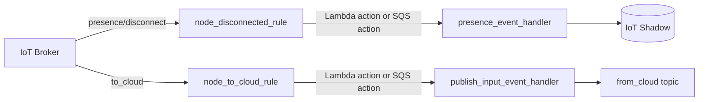
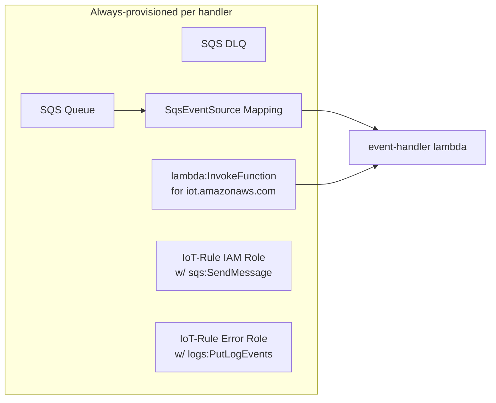
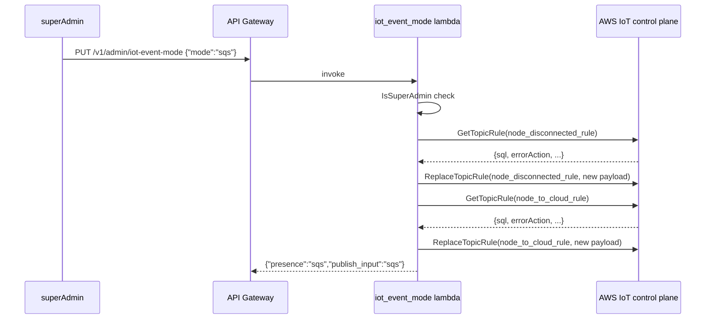
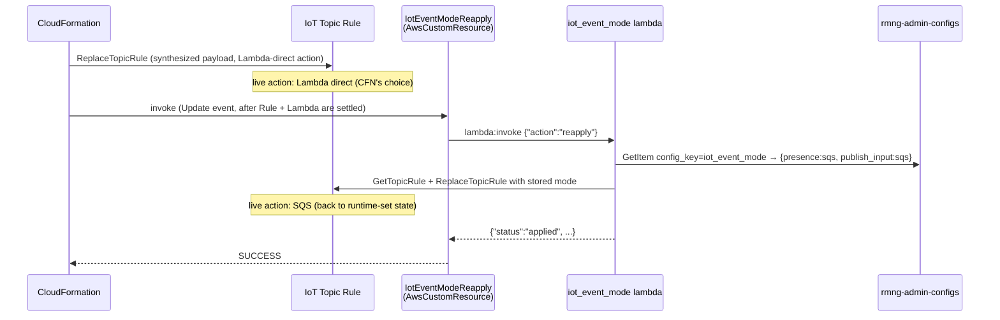
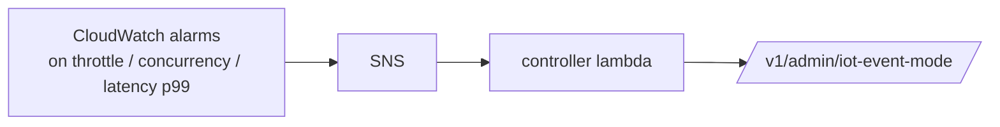

# IoT Event Mode: SQS-backed Lambdas with Runtime Mode Flip

## 1. Overview

Two RainMaker lambdas process high-volume MQTT-derived events:

- `presence_event_handler` — consumes IoT presence events
  (`$aws/events/presence/disconnected/#`) and updates each node's online
  status in the device shadow.
- `publish_input_event_handler` — consumes device-to-cloud requests
  (`rainmaker/nodes/+/to_cloud`) such as `getGroupInfo`, `setNodeConfig`,
  `getSchedDetails`, etc., and publishes responses back on
  `rainmaker/nodes/<thing>/from_cloud`.

Each lambda can be fed by the IoT topic rule in one of **two modes**, selected at
runtime:

- **direct** — the rule's action is a `Lambda` action carrying the function ARN,
  and AWS IoT calls `lambda:InvokeFunction` once per event. Lowest latency, one
  invocation per event.
- **sqs** — the rule writes the event to a Standard SQS queue, and the lambda is
  invoked with a batch of up to 10 messages through an SQS event-source mapping.
  Batching absorbs spikes and amortises invocation overhead.

Direct invocation is the cheaper mode until the fleet is large enough for bursts
to matter: 1M+ devices reconnecting after a network blip, or many devices booting
together, drive one invocation per event straight into the per-account Lambda
concurrency limit, and the resulting throttles turn into IoT rule retries and
back-pressure on the broker. The SQS path trades a little latency for a queue
that absorbs the burst.

Both paths are provisioned on every deploy, and a superAdmin REST API
(`/v1/admin/iot-event-mode`) flips each rule's action between them at runtime via
`iot:ReplaceTopicRule`. The flip takes effect in seconds and needs no redeploy.

---

## 2. Why the mode is a runtime setting, not a build flag

Whether a deployment needs SQS batching is a question about its current load, so
it is answered at runtime on a single build artifact. Selecting the path at build
time — a Go build tag mirrored by a CDK environment variable — would make every
mode change a rebuild plus a `cdk deploy`, costing minutes of lag and a
CloudFormation update that rewires the IoT rule action, and would put two
divergent artifacts through CI.



### 2.1 What a mode change does not affect

A single handler binary serves both modes: it sniffs the incoming payload and
dispatches either one event or a batch. The two modes are therefore functionally
equivalent from the caller's point of view, which is what makes flipping safe
mid-traffic and what bounds the blast radius of a partial flip.

---

## 3. Design

### 3.1 One handler, both payload shapes

Each handler is a single binary with one entry point. It inspects the incoming
payload and dispatches accordingly, so the same build serves either mode and a
flip needs no redeploy.

The discriminator is the top-level `Records` key: an SQS invocation always carries
it, a direct invocation from an IoT rule action never does. The probe
distinguishes "key absent" from "key present but empty", because an empty SQS
batch must still take the SQS path — that path has to answer with a batch response
listing per-message failures, while the direct path returns nothing (IoT rule
actions discard Lambda responses).

The business logic behind both paths is identical; only the envelope differs.

### 3.2 Both modes provisioned at deploy time

Each handler's infrastructure **always** includes the full SQS path, regardless of
which mode is currently active:



Concretely:

- Both queues (`node-conn-queue`, `node-to-cloud-queue`) and
  their DLQs always exist.
- Each lambda has `iot.amazonaws.com lambda:InvokeFunction` so the direct
  action can fire.
- Each lambda has `sqs:ReceiveMessage` on its queue and a live event-source
  mapping (`batch_size=10`, `max_batching_window=1s`,
  `report_batch_item_failures=true`) so the SQS path can fire.
- Each rule has both an IAM role with `sqs:SendMessage` (for SQS mode) and
  the `iot.amazonaws.com` invoke permission on the lambda (for direct mode).

The synthesized rule action is **always** the Lambda-direct action, on
every deploy. The deployment has no toggle for this. Operators who want
SQS mode call the runtime API after deploy. This is intentional — see
§4.4 *CloudFormation drift across deploys* for the reasoning.

### 3.3 Runtime mode flip via superAdmin API

A dedicated lambda exposes:

```
GET  /v1/admin/iot-event-mode
PUT  /v1/admin/iot-event-mode    body: {"mode": "direct"|"sqs"}
```

Both endpoints are super-admin only.

**GET** — calls `iot:GetTopicRule` for both `node_disconnected_rule` and
`node_to_cloud_rule` and reports `"sqs"` if the first action is an Sqs
action, else `"direct"`. No DB cache: the IoT rule is the single source of
truth, and this endpoint never disagrees with `aws iot get-topic-rule`.

```json
{ "presence": "direct", "publish_input": "direct" }
```

**PUT** — flips both rules together. For each rule:

1. `iot:GetTopicRule` to fetch the current SQL, SQL version, description,
   disabled flag, and error_action.
2. Build a new `TopicRulePayload` reusing all of the above and replacing
   only `Actions` with the requested action (Lambda or SQS).
3. `iot:ReplaceTopicRule` with the new payload.

Failure semantics: presence flip first, then publish_input. If the second
flip fails, the API returns 500 with a body describing which rule failed.
The operation is idempotent — the caller retries until both are in the target
state. There is deliberately no two-phase commit: a partial flip leaves the
deployment functional, because each rule independently routes events through a
working pipeline.



### 3.4 IAM for the mode-flip lambda

The lambda's role grants:

- `iot:GetTopicRule`, `iot:ReplaceTopicRule` on the two specific rule ARNs.
- `iam:PassRole` on **four** roles, conditioned on
  `iam:PassedToService=iot.amazonaws.com`:
  - `presence_event_handler` IoT-rule role (used by SQS action)
  - `presence_event_handler` IoT-rule error-action role
  - `publish_input_event_handler` IoT-rule role
  - `publish_input_event_handler` IoT-rule error-action role

The PassRole requirement comes from AWS IAM: any `ReplaceTopicRule` call
that puts a role-bearing action (SQS, DynamoDB, etc.) or error_action into
the rule must have PassRole on every role referenced in the new payload.
The condition narrows this credential to IoT-only — it can't be used to
attach the role to other services.

Environment variables (set by the CDK construct) supply the wiring needed
to construct each rule's actions: `PRESENCE_LAMBDA_ARN`,
`NODE_CONN_QUEUE_URL`, `PRESENCE_IOT_RULE_ROLE_ARN`, plus the
publish_input equivalents.

---

## 4. Operational behaviour

### 4.1 What happens during a flip

- **Direct → SQS**: in-flight Lambda invocations complete on their own
  threads. New events from the broker land on the SQS queue and are picked
  up by the existing event-source mapping. No event loss.

- **SQS → Direct**: messages already in the queue continue to drain
  through the active event-source mapping (the mapping is never deleted).
  New events bypass the queue and invoke the lambda directly. No event loss.

In both directions the cut-over is per-event: each broker event takes
whichever action is bound to the rule at the moment the rule fires.

### 4.2 When to flip

| Situation | Recommended mode |
| --------- | ---------------- |
| Steady-state, < few hundred events/sec | `direct` (simpler, lower latency p50) |
| Anticipated reconnection storm (deployment-wide MQTT reset, regional ISP outage) | `sqs` (queue absorbs spikes) |
| Lambda concurrency throttles seen in metrics | `sqs` |
| Backlog cleared and traffic normalised | flip back to `direct` if desired |

The `direct` path has marginally lower per-event latency (no queue hop).
The `sqs` path has a small per-batch latency floor (`max_batching_window`,
1 second) but caps invocation rate cleanly.

### 4.3 What NOT to do

- **Don't flip SQS → Direct under heavy backlog.** The queue will
  backlog-drain through the existing mapping (fine), but new events
  invoke the lambda directly and may hit per-region concurrency limits
  on top of the drain. Wait for the queue to drain, or stay on SQS.
- **Don't decommission the SQS queue or event-source mapping** thinking
  you're "permanently in direct mode." The runtime flip relies on both
  sides being live. The CDK construct hard-codes both as always-on.

### 4.4 CloudFormation drift across deploys

The runtime API mutates the IoT topic rule out-of-band via
`iot:ReplaceTopicRule`, then persists the chosen mode to a DynamoDB row
(`rmng-admin-configs`, `config_key="iot_event_mode"`). On every stack
create/update, a CloudFormation custom resource invokes the
`iot_event_mode` lambda with a `{"action":"reapply"}` payload; the lambda
reads the row and re-applies the stored mode to both rules. This means
the runtime-set mode survives any redeploy — including ones that edit the
rule itself (SQL change, error_action change, lambda ARN ref change),
ones that ship the synthesized template through SAM/CFN tooling rather
than `cdk deploy` directly, and ones that the operator does without
remembering the live state.



#### Why this works

The rule itself is **always** synthesized with the Lambda-direct action —
there is no deploy-time toggle; nothing in the synthesis pipeline produces
an SQS action. CloudFormation rewrites the rule via the whole-payload
`ReplaceTopicRule` API whenever any of its properties change. After CFN
finishes that rewrite, the reapply custom resource runs:

1. The `AwsCustomResource` is wired with `add_dependency` on both handler
   stacks (so it runs *after* both rules are written) and on the
   `iot_event_mode` lambda (so the lambda exists). Its
   `physical_resource_id` is timestamped, so CloudFormation invokes it
   on every Create/Update — not only when its own properties change.
2. The lambda reads the durable row from `rmng-admin-configs`. If the row
   is missing (fresh stack, never flipped), it's a no-op — the
   CFN-synthesized direct mode stays.
3. If the row says `sqs`, the lambda calls the flip (the same helper
   the runtime API uses) for both rules, returning them to SQS.

| Scenario | Behaviour |
| -------- | --------- |
| Operator flips to SQS via API, redeploys with no rule-related code change | rule stayed SQS through CFN's no-op update; reapply confirms |
| Operator flips to SQS, redeploys after editing the rule's SQL | CFN rewrites rule to direct + new SQL; reapply restores SQS, SQL change persists |
| Operator flips to SQS, redeploys after the lambda's CFN logical ID changes | CFN rewrites rule with new ARN ref + Lambda action; reapply restores SQS |
| Operator never flips, redeploys | row missing → reapply no-op; rule stays direct |
| Operator flips, then re-flips back to direct, then redeploys | row says direct; reapply applies direct (matching CFN); idempotent |

#### SAM / external CFN deployments

The reapply works for any CloudFormation deployment of the synthesized
template — `cdk deploy`, `aws cloudformation deploy`, `sam deploy`, a
custom pipeline, or a manual console update. CloudFormation custom
resources fire on every stack update regardless of which client triggered
the update, so the mechanism is transport-agnostic.

#### Transient state during a deploy

Between CFN's `ReplaceTopicRule` (action becomes Lambda-direct) and the
reapply lambda's restore (action returns to SQS), the rule briefly carries
the wrong action. Both modes are functionally equivalent (the unified
handler binary processes either payload), so a small fraction of events
during this window may take the unintended path. The window is bounded by
the lambda invoke time (~1 second) plus AWS IoT's eventual consistency on
the rule update.

#### Failure modes

- If the reapply lambda fails (DDB read error, IoT API error), the
  AwsCustomResource fails its Update, which fails the CFN stack update. The
  failure is loud by design: a mode that silently reverted on deploy would be
  discovered only under load.
- If the flip succeeds on the rules but fails to write the
  DDB row, the API returns 500 and the operator retries. The next reapply
  pass (next deploy) heals to whatever the row eventually says — at worst
  the mode reverts on next deploy.
- If a flip fails partway through (presence flipped,
  publish_input failed, or vice versa), the row is **not** written; the
  next reapply pass leaves the live state untouched (no-op). The
  operator retries the API.

#### Drift detection

`aws cloudformation detect-stack-drift` will flag both rules as drifted
whenever the runtime mode is `sqs` (CFN's recorded template says
Lambda-direct). This is informational, not a bug — it confirms the
mechanism is working as designed.

---

## 5. Components

| Component | Role |
| --- | --- |
| Presence handler | Consumes presence events; sniffs the payload shape and dispatches one event or a batch |
| Publish-input handler | Same, for device-to-cloud events |
| Mode-flip API | Super-admin `GET`/`PUT /v1/admin/iot-event-mode`, plus the reapply path the drift custom resource calls |
| Admin-configs table | `rmng-admin-configs`, one row per `config_key`, holding runtime-flippable admin state |
| Handler infrastructure | Provisions both paths on every deploy: queue, DLQ, event-source mapping and both sets of IAM |
| OpenAPI | `/v1/admin/iot-event-mode` `GET`/`PUT` |

## 6. Testing

### 6.1 Unit tests

Per handler: payload-shape detection across SQS, direct and malformed input;
batch handling for a full success, a partial failure that reports exactly the one
bad message, an empty batch and a multi-message batch; and the existing
direct-path coverage.

For the mode API: action construction for each mode, rejection of an invalid mode
and of SQS mode where the queue is not wired, mode detection from a live rule, and
the flip preserving the rule's SQL, SQL version and error action.

### 6.2 Integration tests

Against a deployed environment, two suites cover the feature. The mode API is
exercised as super-admin and as a non-admin (403 on both `GET` and `PUT`), with
an invalid mode rejected as 400 and no rule mutated; each successful flip is
cross-checked against the live `iot:GetTopicRule` and a follow-up `GET`, and is
verified to preserve the rule's SQL, SQL version, description, disabled flag and
error action. A round-trip `direct → sqs → direct` with a real connected device
confirms the pipeline keeps working across flips. Every mutating test snapshots
the starting mode and restores it on teardown, so the suite is order-independent.

A second suite writes directly to the queues, bypassing the IoT rule, to prove
the queue, event-source mapping, Lambda IAM and the handler's SQS dispatch path
work regardless of the rule's current mode: a synthetic `disconnected` event for
a live session must flip the node's `iparams` shadow to `online: false`, and a
`getGroupInfo` payload dropped on the to-cloud queue must produce the correct
`from_cloud` response.

### 6.3 Operational verification

Reading the mode back through the API and comparing it against
`aws iot get-topic-rule --rule-name node_disconnected_rule` (the action should be
`sqs` or `lambda` accordingly) is the quickest end-to-end check after a flip.

---

## 7. Future work: automatic flipping

**Out of scope for this feature.** This design supports automation cleanly
because the API is a simple, idempotent toggle, but the policy of *when* to
flip is deferred until there is operational data to drive the thresholds.

A plausible automation:



Risks to design around when implementing:

- **Direction asymmetry.** Auto-flip `direct → sqs` is safe under load (the
  queue absorbs spikes). Auto-flip `sqs → direct` under backlog can stack
  drain-load on top of new direct invocations and worsen throttling.
  Recommend gating auto-flip to one direction (toward SQS) and keeping the
  reverse a manual decision.
- **Hysteresis** — alarm thresholds need cooldowns to avoid flap.
- **Observability** — emit a CloudWatch metric on every flip so flip rate
  can be alarmed independently. Excessive flipping is itself a signal that
  thresholds are mis-tuned.
