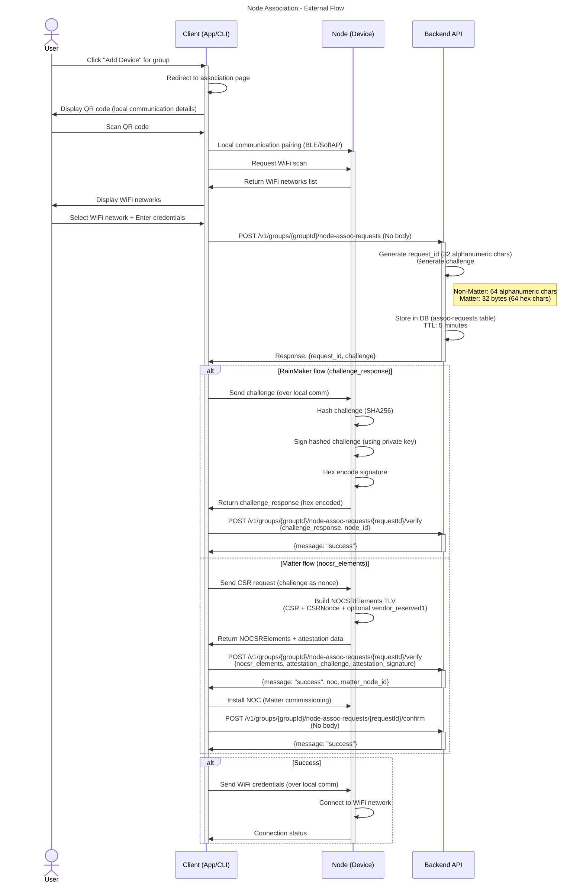
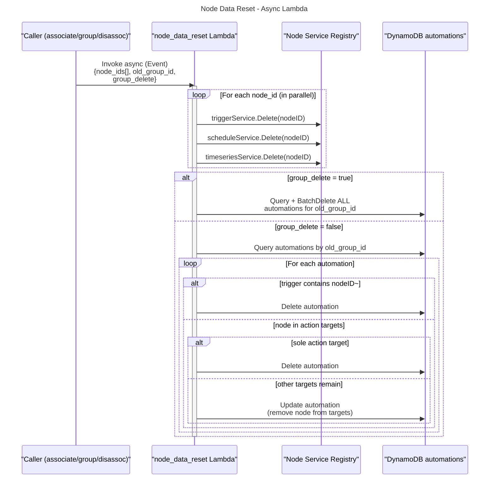
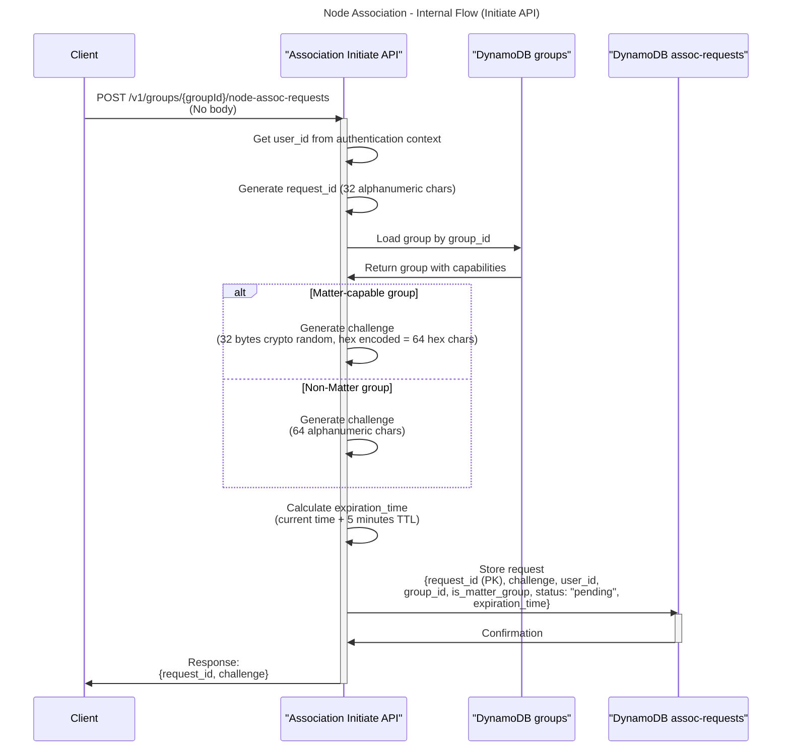
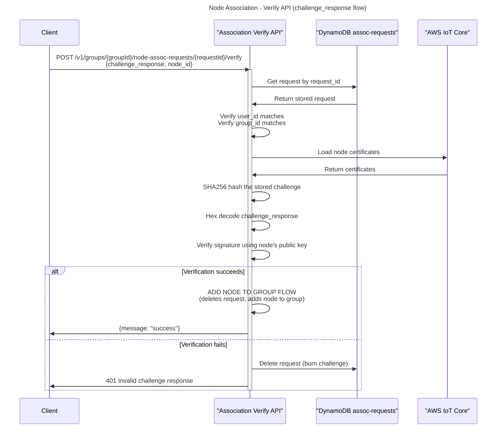
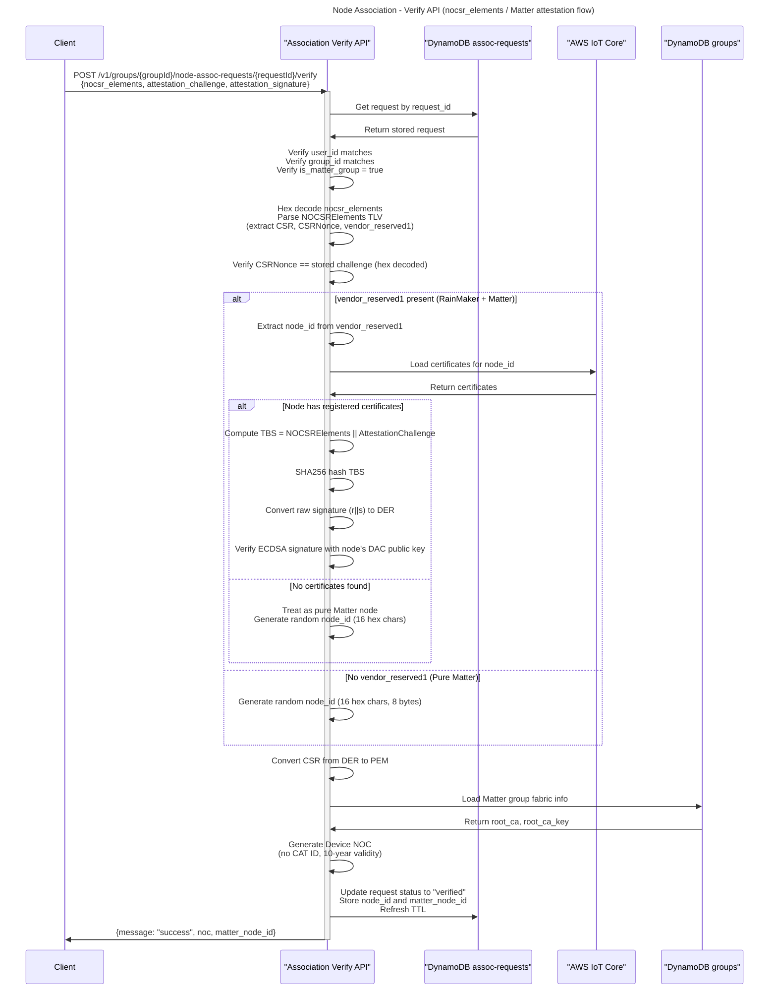
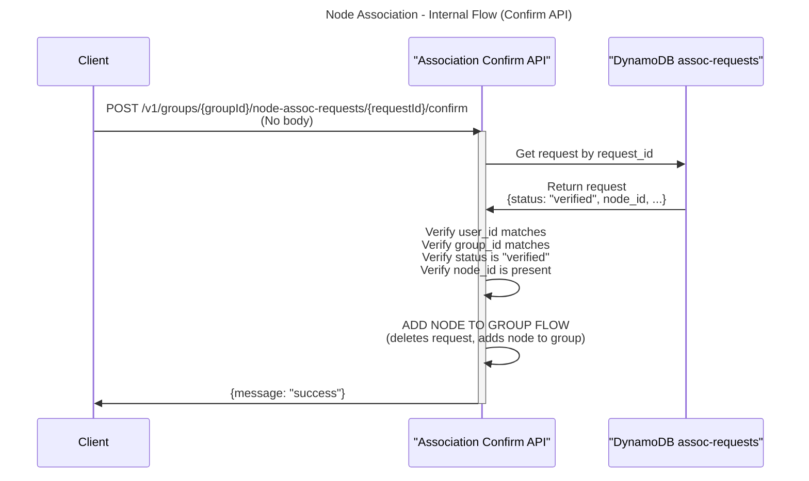
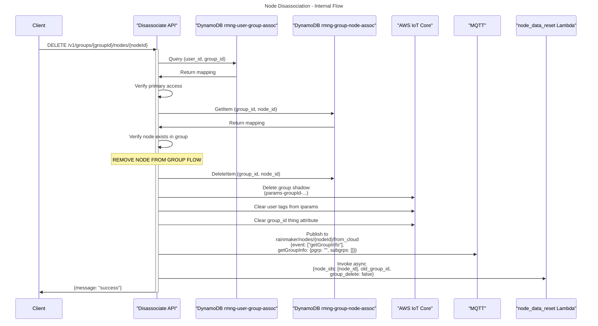

# Node association

## What is node association

Node association is the process of associating a node to a home/group and establishing ownership.

## Why it is needed

Node association establishes ownership of a node by a user, where both are already registered with the backend. Once ownership is established, the client can send Wi-Fi credentials to the node so it can join the network.

## Pre-requisites

- User is registered and authenticated
- Node is registered (for RainMaker nodes; pure Matter nodes need not be pre-registered). The node need **not** be connected to the cloud: in the primary flow it has no Wi-Fi credentials yet when `verify` runs, and the challenge is exchanged over the local link.
- Group is created (and must have `matter` capability for Matter flows)
- User and node can reach each other over a local channel — BLE or SoftAP during provisioning, or the node's mDNS control endpoint (`_esp_rmaker_ctrl._tcp`) once it has joined the network

## How is this secure

The challenge is signed by the node using its private key which confirms the node is registered with the backend. The user client and node need to be in vicinity (to enable local communication) which confirms the user owns the node.

## Node types

There are three types of nodes that can be associated:

| Node Type | Description | Verify Input | NOC Generated? | Confirm Required? |
|-----------|-------------|-------------|----------------|-------------------|
| **RainMaker** | Traditional RainMaker node registered in AWS IoT | `challenge_response` + `node_id` | No | No (added to group immediately) |
| **RainMaker + Matter** | RainMaker node with Matter capability | `nocsr_elements` + attestation fields (with `vendor_reserved1` containing node_id) | Yes | Yes |
| **Pure Matter** | Matter-only node, not pre-registered in RainMaker | `nocsr_elements` + attestation fields (without `vendor_reserved1`) | Yes | Yes |

> Note: RainMaker nodes can also use the `challenge_response` flow on Matter-capable groups. In that case they are added directly to the group without NOC generation.

## External Flow

> Here client can be the app or the cli

1. User clicks on the "add device" button in the client for the selected home/group
2. User is redirected to the node association page
3. User scans the QR code (This QR contains the local communication details)
4. Does local communication pairing with the node
5. Client asks node to scan for Wifi networks
6. User selects the Wifi network and enters the WiFi credentials
7. Client calls association initiate API to get the request ID and challenge
   1. For RainMaker nodes (challenge_response flow):
      1. Client sends the challenge to the node over local communication
      2. Node hashes the challenge (SHA256), signs it using its private key, and hex-encodes the signature
      3. Client sends the challenge response and node_id to the association verify API
      4. On success, node is added to the group immediately
   2. For Matter nodes (nocsr_elements flow):
      1. Client sends the CSR request to the node (challenge from initiate is used as CSR nonce)
      2. Node creates NOCSRElements TLV containing: CSR, CSRNonce, and optionally vendor_reserved1 (RainMaker node_id)
      3. Client also obtains the attestation challenge and attestation signature from the Matter commissioning session
      4. Client sends `nocsr_elements`, `attestation_challenge`, and `attestation_signature` to the verify API
      5. It gets the NOC (Node Operational Certificate) and matter_node_id back
      6. Does local Matter commissioning with the NOC
      7. Calls the association confirm API to finalize
8. Once the API returns success, client sends the WiFi credentials to the node locally
9. Node connects to the WiFi network

### Sequence Diagram



## Internal Flow

### API Endpoints

All endpoints require `POST` method. All other methods return 405 Method Not Allowed.

| Endpoint | Purpose |
|----------|---------|
| `POST /v1/groups/{groupId}/node-assoc-requests` | Initiate association |
| `POST /v1/groups/{groupId}/node-assoc-requests/{requestId}/verify` | Verify challenge/attestation |
| `POST /v1/groups/{groupId}/node-assoc-requests/{requestId}/confirm` | Confirm Matter association |

### Association Initiate API

`POST /v1/groups/{groupId}/node-assoc-requests`

- **Request**: No request body required
- **Process**:
  1. Extract `user_id` from Cognito authentication context
  2. Generate `request_id` (32 alphanumeric characters)
  3. Load the group by `group_id` and check its capabilities
  4. Generate challenge:
     - **Matter-capable group**: 32 bytes of cryptographically secure random data, hex-encoded (64 hex characters). This will be used as the CSR nonce.
     - **Non-Matter group**: 64 alphanumeric characters (a-z, A-Z, 0-9)
  5. Store in the database:
     - Table name: `rmng-node-assoc-reqs`
     - Attributes: `request_id` (PK), `challenge`, `user_id`, `group_id`, `is_matter_group`, `status` ("pending"), `expiration_time` (TTL of 5 minutes)
- **Response**:
  ```json
  {
    "request_id": "abc123def456...",
    "challenge": "<challenge_string>"
  }
  ```

### Association Verify API

`POST /v1/groups/{groupId}/node-assoc-requests/{requestId}/verify`

The verify API supports two mutually exclusive authentication methods. Exactly one of `challenge_response` or `nocsr_elements` must be provided.

#### Common Validation (both flows)

1. Verify `requestId` and `groupId` are present in path parameters
2. Parse the request body and enforce mutual exclusivity of `challenge_response` and `nocsr_elements`
3. Retrieve the stored association request from DynamoDB by `request_id`
4. Verify `user_id` from authentication context matches the stored `user_id`
5. Verify `group_id` from path matches the stored `group_id`

#### Flow 1: challenge_response (RainMaker signature verification)

This flow works for both Matter and non-Matter groups. It verifies the node using its registered certificate in AWS IoT Core.

- **Request**:
  ```json
  {
    "challenge_response": "<hex_encoded_signature>",
    "node_id": "<registered_node_id>"
  }
  ```
  > `node_id` is required when using `challenge_response`

- **Process**:
  1. Load the node's certificates from AWS IoT Core
  2. Compute SHA256 hash of the stored `challenge`
  3. Hex-decode the `challenge_response` to get the raw signature
  4. Verify the signature against the hashed challenge using the node's public certificate
     - Supports both ECDSA and RSA-PSS signature algorithms
  5. On **success**: Run the ADD NODE TO GROUP FLOW (node is added immediately, no confirm step needed)
  6. On **failure**: Delete the association request from DB (burns the challenge to prevent brute-force), return 401
- **Response** (success):
  ```json
  {
    "message": "success"
  }
  ```

#### Flow 2: nocsr_elements (Matter attestation verification)

This flow is only valid for Matter-capable groups. It uses Matter's NOCSRElements TLV structure for device attestation.

- **Request**:
  ```json
  {
    "nocsr_elements": "<hex_encoded_NOCSRElements_TLV>",
    "attestation_challenge": "<hex_encoded_16_bytes>",
    "attestation_signature": "<hex_encoded_64_bytes_raw_r_s>"
  }
  ```
  > All three fields are required. `attestation_challenge` and `attestation_signature` must accompany `nocsr_elements`.

- **NOCSRElements TLV Structure** (Matter spec format):
  ```
  0x15                          -- Structure start
  0x31 0x01 <2-byte-len> <data> -- Tag 1: CSR (DER-encoded PKCS#10)
  0x30 0x02 <1-byte-len> <data> -- Tag 2: CSRNonce (32 bytes)
  0x30 0x03 <1-byte-len> <data> -- Tag 3: VendorReserved1 (optional, contains RainMaker node_id)
  0x30 0x04 <1-byte-len> <data> -- Tag 4: VendorReserved2 (optional)
  0x30 0x05 <1-byte-len> <data> -- Tag 5: VendorReserved3 (optional)
  0x18                          -- Structure end
  ```

- **Process**:
  1. Validate this is a Matter-capable group (reject with 400 if not)
  2. Hex-decode `nocsr_elements` and parse the TLV structure
  3. **Validate CSRNonce**: Compare the `CSRNonce` field from the TLV with the stored `challenge` (hex-decoded). They must match exactly.
  4. **Attestation signature verification** (depends on `vendor_reserved1`):
     - **If `vendor_reserved1` is present** (RainMaker + Matter node):
       - Extract `node_id` from `vendor_reserved1` (it's the RainMaker node_id as a UTF-8 string)
       - Load certificates for this node from AWS IoT Core
       - If node has registered certificates: Verify the attestation signature
         - Compute TBS (to-be-signed): `NOCSRElements || AttestationChallenge`
         - Hash TBS with SHA256
         - Convert the raw signature (64 bytes: r||s) to DER format
         - Verify using the node's ECDSA public key from its DAC certificate
       - If node has no registered certificates: Treat as pure Matter node (skip signature verification, generate random node_id)
     - **If `vendor_reserved1` is absent** (Pure Matter node):
       - Skip attestation signature verification
       - Generate a random `node_id` (16 hex characters, 8 bytes)
  5. Convert the extracted CSR (DER) to PEM format
  6. **Generate Device NOC**:
     - Load Matter group fabric information: `root_ca`, `root_ca_key`
     - Generate `matter_node_id` from `node_id` (hex encoding of thingName)
     - Create NOC certificate:
       - Type: End-entity certificate (IsCA: false)
       - Public Key: From CSR (ECDSA P-256)
       - Validity: 10 years (not exceeding Root CA validity)
       - Key Usage: Digital Signature
       - Extended Key Usage: Server Auth and Client Auth
       - Subject: Matter Fabric ID (OID 1.3.6.1.4.1.37244.1.5), Matter Node ID (OID 1.3.6.1.4.1.37244.1.1) - UTF-8 encoded
       - No CAT ID for device NOCs
       - Serial Number: Cryptographically secure random
  7. **Update association request** status to `"verified"` in DB (stores `node_id` and `matter_node_id`; refreshes TTL to 5 more minutes)
- **Response** (success):
  ```json
  {
    "message": "success",
    "noc": "-----BEGIN CERTIFICATE-----\n...\n-----END CERTIFICATE-----",
    "matter_node_id": "A1B2C3D4E5F6A1B2"
  }
  ```

### Association Confirm API

`POST /v1/groups/{groupId}/node-assoc-requests/{requestId}/confirm`

This API is called after Matter commissioning is complete. It finalizes the association by adding the node to the group.

- **Request**: No request body required
- **Process**:
  1. Validate `requestId` and `groupId` from path parameters
  2. Retrieve the stored association request from DynamoDB
  3. Verify `user_id` matches the stored `user_id`
  4. Verify `group_id` from path matches the stored `group_id`
  5. Verify the request status is `"verified"` (reject with 400 if not)
  6. Verify `node_id` is present in the stored request
  7. Run the ADD NODE TO GROUP FLOW with the stored `node_id` and `group_id`
- **Response** (success):
  ```json
  {
    "message": "success"
  }
  ```

### ADD NODE TO GROUP FLOW

This flow is shared between the `challenge_response` verify path (called directly) and the confirm API (called after Matter commissioning).

1. Delete the association request from the database (prevents replay attacks)
2. **Duplicate check**: Look up the node's current group (if any)
   - TableName: `rmng-group-node-assoc`, IndexName: `rmng-group-node-assoc-by-node-id`
   - Query by `node_id`
   - If the node is already in the **target** group → the add is a **no-op that returns success**, with no side effects (no shadow migration, no iparams clear, no data reset, no Alexa/GVA notification). This is deliberate: a Wi-Fi reconfiguration re-runs association against the group the node is already in, and that must not tear down and rebuild its state.
3. **Handle old group** (if node is currently in a group):
   - Run **REMOVE NODE FROM GROUP FLOW** for the old group (unlink, delete group shadow, clean iparams user tags, notify)
   - **Trigger async node data reset** with `{node_ids: [node_id], old_group_id, group_delete: false}`. See [Async cleanup](#async-cleanup-node_data_reset-lambda) for details.
4. Grant the caller full access to the node for the remainder of this request (`NodeAll` in the request context). RBAC is evaluated per request from the user's group mapping — there is no stored per-node grant, and therefore nothing to revoke later; access ends when the node leaves the group.
5. Add node to group via `ShadowNodeAddToGroup`:
   1. Verify user has **primary access** to the target group
      - TableName: `rmng-user-group-assoc`
      - Query: `user_id` (PK) + `group_id` (SK)
   2. Add node to the new group
      - TableName: `rmng-group-node-assoc`
      - Attributes: `group_id` (PK), `node_id` (SK)
   3. Notify the node of its new group membership on MQTT topic `rainmaker/nodes/<node_id>/from_cloud` with event `getGroupInfo`:
      ```json
      {
        "event": ["getGroupInfo"],
        "getGroupInfo": {
           "pgrp": "group_id_here",
           "subgrps": ["subgrp_id_1", "subgrp_id_2", "subgrp_id_3"]
        }
      }
      ```

### Async cleanup (node_data_reset Lambda)

When a node is removed from a group (re-association, disassociation, or group deletion), the old node data must be cleaned up. The caller asynchronously invokes the `node_data_reset` Lambda.

**Input**:
```json
{
  "node_ids": ["node1", "node2"],
  "old_group_id": "grp123",
  "group_delete": false
}
```

| Field | Description |
|-------|-------------|
| `node_ids` | Array of node IDs to clean up (single node for re-association/disassociation, multiple for group deletion) |
| `old_group_id` | The group the nodes are being removed from |
| `group_delete` | `true` when the entire group is being deleted (deletes ALL automations for the group). `false` for single-node removal (selectively cleans automations referencing the node) |

**Process**:

The Lambda iterates all registered node services and calls `Delete(nodeID)` on each:

1. **Delete triggers** via trigger service — removes `triggers` and `triggersVer` from `rmng-nodes`, notifies device
2. **Delete schedules** via schedule service — removes `schedules` and `schedulesVer` from `rmng-nodes`, notifies device
3. **Delete timeseries data** via timeseries service:
   - Reads node's parameter names and data types from `rmng-nodes.config`
   - For each `(key, dt)` combination:
     - Construct partition key: `<node_id>.<key>.<dt>`
     - TableName: `rmng-raw-ts-data` — Query by partition key, batch delete all items
     - TableName: `rmng-processed-ts-data` — Query by partition key, batch delete all items
4. **Clean up automations** (depends on `group_delete` flag):
   - **If `group_delete = true`** (group deletion): Delete ALL automations for the group in one shot
     - TableName: `automations`, query by `old_group_id`, batch delete all
   - **If `group_delete = false`** (single-node removal): Selectively clean automations referencing the node
     - **Trigger references**: Trigger IDs use format `nodeID~automationID~triggerIndex`. If any trigger condition starts with `nodeID~`, delete the entire automation
     - **Action references**: If the node appears in an automation's action targets, remove it. If the node was the sole action target, delete the entire automation
     - TableName: `automations`, query by `old_group_id`



### Database Schema: assoc-requests

| Attribute | Type | Description |
|-----------|------|-------------|
| `request_id` | String (PK) | 32 alphanumeric characters, uniquely identifies the request |
| `challenge` | String | Hex (Matter) or alphanumeric (non-Matter) challenge string |
| `user_id` | String | Cognito user ID who initiated the request |
| `group_id` | String | Target group for the association |
| `is_matter_group` | Boolean | Whether the group has Matter capability |
| `status` | String | `"pending"` → `"verified"` (Matter flow only) |
| `node_id` | String | Set after verify in Matter flow |
| `matter_node_id` | String | Set after verify in Matter flow |
| `expiration_time` | Number | TTL, set to current time + 5 minutes (refreshed on status update) |

### Sequence Diagrams

#### Initiate API



#### Verify API (challenge_response flow)



#### Verify API (nocsr_elements flow)



#### Confirm API



## Node disassociation

### What is node disassociation

Node disassociation (= remove node from group) is the process of unlinking a node from a group. The node becomes orphaned and can later be re-associated to any group by a **different** user. After unlinking, a `node_data_reset` Lambda is invoked asynchronously to delete the node's triggers, schedules, timeseries data, and automations referencing the node.

### Disassociate/Remove Node from Group API

`DELETE /v1/groups/{groupId}/nodes/{nodeId}`

#### Access Control

- Requires **primary** access to the group

#### Request

No request body required.

#### Process

1. Validate `groupId` and `nodeId` from path parameters
2. Get user-group mapping and verify access
   - TableName: `rmng-user-group-assoc`
   - Query by `user_id` (PK) and `group_id` (SK)
   - Verify `access_type` is `"primary"`
3. Verify node exists in the group
   - TableName: `rmng-group-node-assoc`
   - GetItem by `group_id` (PK) and `node_id` (SK)
4. Run **REMOVE NODE FROM GROUP FLOW**
5. Invoke `node_data_reset` Lambda async with `{node_ids: [node_id], old_group_id: group_id, group_delete: false}` to delete triggers, schedules, timeseries, and automations. See [Async cleanup](#async-cleanup-node_data_reset-lambda) for details.

> **Matter node limitation**: Disassociation unlinks the node and cleans up its data for all node types, but the backend does not revoke the node's Matter operational certificate (NOC) or remove it from the group's Matter fabric. A disassociated Matter node therefore keeps a valid NOC on the fabric.

> See the [Data Cleanup Reference](node_assoc.md#data-cleanup-reference) for the full comparison.

#### Response

```json
{
  "message": "success"
}
```

#### Sequence Diagram



### REMOVE NODE FROM GROUP FLOW

This flow is shared between the disassociate API, the delete group API, and association. It unlinks a single node from a group. The caller is responsible for invoking the `node_data_reset` Lambda afterwards to clean up node data (triggers, schedules, timeseries, automations).

**Input**: `group_id`, `node_id`

1. **Delete group-device mapping**
   - TableName: `rmng-group-node-assoc`
   - DeleteItem by `group_id` (PK) and `node_id` (SK)

2. **Delete group IoT shadow**
   - The group shadow `params-<group_id>[-subgroups...]` is deleted
   - The node will stop receiving param updates for this group

3. **Clean `iparams`**
   - Clear user tags from `iparams` IoT shadow
   - Other iparams data remains

4. **Clear `group_id` IoT thing attribute**
   - Set the `group_id` attribute on the IoT thing to empty string
   - Prevents the device from subscribing to group control topics

5. **Notify node via MQTT**
   - Topic: `rainmaker/nodes/<node_id>/from_cloud`
   - Message:
     ```json
     {
       "event": ["getGroupInfo"],
       "getGroupInfo": {
         "pgrp": "",
         "subgrps": []
       }
     }
     ```

## Data Cleanup Reference

The following table shows what data is affected by each operation. "Remove Node from Subgroup" and "Delete Subgroup" are defined in the [group spec](group.md).

This table covers **node data** only. Table-level changes (`rmng-group-node-assoc`, `groups`, `rmng-user-group-assoc`) are documented in the respective API sections.

**Legend**: Sync = done in the API request. Async = done via `node_data_reset` Lambda.

| Data / Resource | Subgroup ops (remove node / delete subgroup) | Disassoc / Delete Group / Assoc (new group) | Unshare User |
|---|---|---|---|
| Group IoT Shadow (`params-<groupId>-...`) — contains params | Rename (updated subgrps) | Delete | No change |
| `iparams` (user tags only) | No change | Delete user tags | No change |
| IoT Thing `group_id` attribute | No change | Delete | No change |
| `rmng-nodes` (triggers, schedules) | No change | Delete (async) | No change |
| `automations` table | No change | Delete all for group (async)/Delete automations whose triggers reference node (async) | No change |
| Timeseries (`rmng-raw-ts-data`, `rmng-processed-ts-data`) | No change | Delete (async) | No change |

> `rmng-nodes.config` is never deleted — it is intrinsic to the node and re-reported on boot.

## FAQs
1. What happens if a node has more than 1 certificate?
   - The verification code iterates through all certificates registered for a node in AWS IoT Core. It succeeds if any one certificate's public key can verify the signature.
   - Could be useful for certificate rotation.
2. Supported signature algorithms:
   - For challenge_response flow: RSA-PSS, ECDSA (ASN.1 DER format)
   - For nocsr_elements flow: ECDSA P-256 only (raw r||s format, 64 bytes)
3. If I have primary access to a group, can I associate the node to that group even if I am not the owner of the group?
   - Yes. Users with primary access can associate nodes to the group, regardless of whether they are the original owner of the group.
4. If I have secondary access to a group, can I associate the node to that group even if I am not the owner of the group?
   - No. Only users with primary access can associate nodes to a group. Users with secondary access do not have permission to associate nodes.
5. Can I associate the node into a subgroup?
   - No. Association targets a group; subgroup membership is assigned afterwards with the update-subgroup API. A group is the base context a node exists in, and subgroups are a scoping layer on top of it.
6. What happens if I use `challenge_response` on a Matter-capable group?
   - It works. The node is verified and added to the group directly without NOC generation. This is useful for RainMaker nodes that are being added to a Matter-capable group but don't need a Matter NOC.
7. What if the attestation signature verification fails for a node with vendor_reserved1 but no registered certificates?
   - The node is treated as a pure Matter node. A random node_id is generated and signature verification is skipped.
8. Can a node be in multiple groups?
   - No. A node can only be in one group at a time. During association, the node is automatically removed from its old group (if any) and added to the new group.
