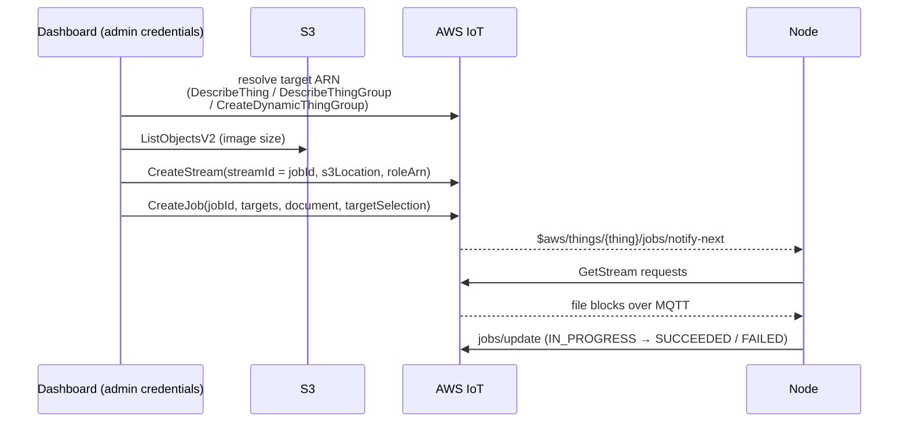

# OTA Firmware Updates

## 1. Overview

An admin ships a firmware image to a node, a group of nodes, or a query-defined
fleet, and watches the rollout land. The mechanism is **AWS IoT Jobs** for
orchestration and **AWS IoT Streams** for delivering the image over MQTT.

The distinguishing property of this feature is that **there is no backend for
it**. Every other admin capability in this deployment goes through an API
Gateway lambda; OTA does not. The dashboard holds admin credentials from the
identity pool (see [Admin Sessions & Permissions](admin/authentication.md)) and
calls the AWS IoT and S3 control planes directly with the AWS SDK. There is no
OTA endpoint in the HTTP API, no OTA lambda, and no DynamoDB table recording
jobs — AWS IoT *is* the job store.

That choice follows from what a job already is. IoT Jobs holds the job document,
the per-thing execution state, the retry and timeout policy and the rollout
status; a backend in front of it would add a table that has to be kept in sync
with the authoritative copy in IoT, and an endpoint per SDK call. What the
`AdminDeviceUsersRole` can do with IoT is already the authorization boundary, so
the lambda would enforce nothing the IAM policy does not.

The cost is equally real: **anything the dashboard does not do, nobody does.**
There is no server-side scheduling, no rollout policy the operator did not click
through, no server-side validation of an image before it reaches a device, and
no audit record beyond CloudTrail. A browser tab is the only orchestrator.

## 2. What identifies an OTA job

Job ids are prefixed **`AFR_OTA-`**, and the prefix is load-bearing rather than
decorative. `ListJobs` returns every IoT job in the account, including any
created by other tooling; the dashboard filters on the prefix on the way out, so
a job without it is invisible to the OTA views. The same filter is applied to
per-node execution listings.

The **stream id equals the job id**, so the pairing needs no lookup: given a
job, its stream name is the same string. The image itself lives under the
**`ota/` prefix** of the deployment's files bucket, keyed by its sanitised
firmware name, with its version, type, model and platform recorded as the S3
object tags `fw-version`, `fw-type`, `fw-model` and `fw-platform`, which are
what the operator browsing the image list sees.

### Metadata comes from the binary, not the operator

On file selection the upload form reads the **first 288 bytes** of the image —
`esp_image_header_t` at offset 0, then `esp_app_desc_t` at the fixed offset
`0x20` — and never the rest of the file. A parse is accepted only if the image
magic byte `0xE9` and the app-descriptor magic word `0xABCD5432` are both
present, and both are read at **absolute** offsets rather than by walking
forward from the image header, which is what keeps the descriptor from being
read 8 bytes early.

From a parsed descriptor it recovers **version**, **model** (the project name)
and **platform** (from `esp_chip_id_t`), plus the IDF and secure-version fields.
Those three are written into the form and **locked**: a value contradicting the
image cannot be entered, which is why there is no mismatch policy to specify —
the binary simply wins. Firmware name and type, which the header cannot answer
for, stay the operator's.

**A failed parse is not a rejection.** A `.hex` or `.elf`, an MCU image, or any
file without the two magic words yields no extraction and leaves every field
editable and operator-supplied. The parse is an authority on metadata when it
succeeds, not a gate on what may be uploaded.

The form's own rules are narrow by comparison: the filename must end in `.bin`,
`.elf`, `.img`, `.hex` or `.ota`, and the firmware name must match
`[a-zA-Z0-9._-]+`.

## 3. Creating a job



**The target is resolved to an ARN first**, in one of three ways:

- **A single node** — `DescribeThing` on the thing name.
- **An existing group** — `DescribeThingGroup` on the group name.
- **A query** — a *dynamic* thing group is created on the spot, named
  `ota-{otaUpdateId}`, from the supplied query string. This is what makes
  "every node on firmware 1.2 in this region" a valid target.

**The image size is read from S3, not supplied by the caller.** `ListObjectsV2`
on the firmware key yields the size that goes into the job document, so the
figure the device receives always matches the object it will download.

**The stream is created before the job.** `CreateStream` registers the S3
location under the job's own id and is passed the **OTA service role** (§5),
which is the identity IoT itself uses to read the object.

## 4. The job document

Two sections, one standard and one this platform's own:

```json
{
  "afr_ota": {
    "protocols": ["MQTT"],
    "streamname": "AFR_OTA-<otaUpdateId>",
    "files": [
      {
        "filepath": "<firmware key, with the ota/ prefix stripped>",
        "filesize": 1048576,
        "fileid": 0,
        "certfile": "NA",
        "sig-sha256-ecdsa": "AAAA…"
      }
    ]
  },
  "rmng_ota": {
    "fw_version": "2.1.0",
    "file_md5": "<32 lowercase hex chars>"
  }
}
```

`afr_ota` is the AFR-OTA format the device-side agent already understands.
**`protocols` is `["MQTT"]` only** — delivery is always over the IoT stream, so
the HTTP-mode fields (`update_data_url`, `auth_scheme`) are never populated and
no pre-signed URL is minted.

**Image signing is not in force.** `certfile` is the literal string `"NA"` and
`sig-sha256-ecdsa` is a fixed placeholder, present because the format requires
the fields. A device that verifies the ECDSA signature will reject these jobs;
integrity rests on `file_md5` (below) and on TLS to the broker.

`rmng_ota` carries the platform's own two fields:

- **`fw_version`** — the version the image claims to be, for the device to
  record and for the dashboard to display.
- **`file_md5`** — a lowercase hex MD5 of the *whole* image. Its presence is
  what enables **auto-resume of an interrupted download plus an end-to-end
  integrity check** on the device; omitting it disables both.

### `file_md5` is often absent, by design

The S3 ETag equals the object's MD5 only for a single-part upload. A multipart
upload produces an ETag of the form `<hex>-<n>`, which is not an MD5 of
anything. Rather than pass that through and have devices fail an integrity check
against a value that was never a checksum, a value that is not exactly 32
lowercase hex characters is **dropped**: `file_md5` stays absent and the device
falls back to a non-resumable download with no integrity check.

The practical consequence is that **large images — the ones most likely to be
uploaded multipart and most likely to have their download interrupted — are the
ones least likely to get resume**. An MD5 computed at upload time, rather than
inferred from the ETag, is what would close that gap.

## 5. Two roles, and why

**`AdminDeviceUsersRole`** is what the browser holds. For OTA it carries
`iot:CreateJob`, `DescribeJob`, `CancelJob`, `DeleteJob`, `ListJobs`,
`ListJobExecutionsForJob`, `ListJobExecutionsForThing`, `DescribeJobExecution`,
`CreateStream`, `DeleteStream`, and the dynamic-group actions
(`CreateDynamicThingGroup`, `DeleteDynamicThingGroup`,
`UpdateDynamicThingGroup`). On S3 it can `PutObject`/`GetObject` under
`ota/*` — firmware upload is a direct browser-to-S3 PUT.

**`rmng-ota-service-role-{region}`** is assumed by `iot.amazonaws.com`, not by
any human. It grants `s3:GetObject`/`GetObjectVersion` on `ota/*` and the job
and stream actions. This is the role passed as `roleArn` to `CreateStream`, so
it is **IoT's** identity when it fetches the image on a device's behalf — the
admin's credentials never transit the file.

The split is what keeps the image readable by the service without making the
service assumable by an operator. The admin role therefore also needs
`iam:PassRole` on exactly that role ARN, and nothing wider. Its ARN is published
at SSM `/rmng/base/ota-service-role-arn` so the dashboard can pass it without
hardcoding an account id.

Both roles' IoT statements are `resources=["*"]`. Job and stream ARNs are
minted at create time, so a policy cannot name them in advance, and several of
the list actions do not support resource-level scoping at all.

## 6. Rollout mode

`targetSelection` is the operator's choice of two AWS IoT behaviours:

- **`SNAPSHOT`** — the target set is frozen when the job is created. A node
  added to the group afterwards is not updated.
- **`CONTINUOUS`** — the job keeps applying to nodes as they enter the target
  group. Paired with a dynamic group this is a standing policy: a node that
  later matches the query is updated on arrival.

`CONTINUOUS` plus a dynamic group is the combination to be careful with — it is
a rollout with no end date, and it will update a node that joins the fleet
months later.

## 7. What the node does

Covered by the MQTT contract; summarised here because the job document is only
half a story.

The node subscribes to `$aws/things/{thing}/jobs/notify-next` on startup and
receives the pending execution with its document inline. It fetches blocks by
publishing GetStream requests and reading the data topic, then reports progress
on `jobs/update` — `IN_PROGRESS` while downloading, then `SUCCEEDED`,
`FAILED`, or `REJECTED`. Those five states (`QUEUED` included) are what every
dashboard view of a rollout is rendering.

## 8. Cancel and delete

**Cancel** is `CancelJob` with `force: true`.

**Delete** is a three-step sequence, in this order and deliberately tolerant of
failure: cancel the job (ignoring an error, since a completed job cannot be
cancelled), `DeleteJob` with `force: true`, then `DeleteStream` on the
same-named stream (ignoring an error, since the stream may already be gone).
Being tolerant is what makes delete usable as a cleanup for a job in any state,
rather than only for a tidily finished one.

Note what delete does *not* touch: the **firmware object in S3** and any
**dynamic group** created for the job both survive. Deleting a job removes the
orchestration, not the artefacts around it.

## 9. Limits worth knowing

- **Validation is the form's, not the prefix's.** Everything in §2 binds
  whoever uses the dashboard; a `PutObject` under `ota/` with the admin's own
  credentials is subject to none of it.
- **Nothing matches an image to its targets.** Job creation does not check the
  model and platform recorded on an image against the nodes it is about to
  update.
- **No signature enforcement**, per §4.
- **The browser is the orchestrator.** Closing the tab mid-create can leave a
  stream with no job, or a dynamic group with neither.
- **`AFR_OTA-` is the only bookkeeping.** A job created outside the dashboard
  but with the prefix appears in these views; one without it does not, however
  much it is an OTA.
- **Account-level AWS IoT Jobs quotas apply** — see [Limits](limits.md).
