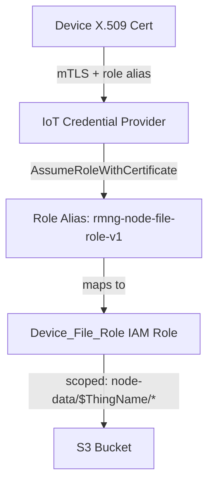
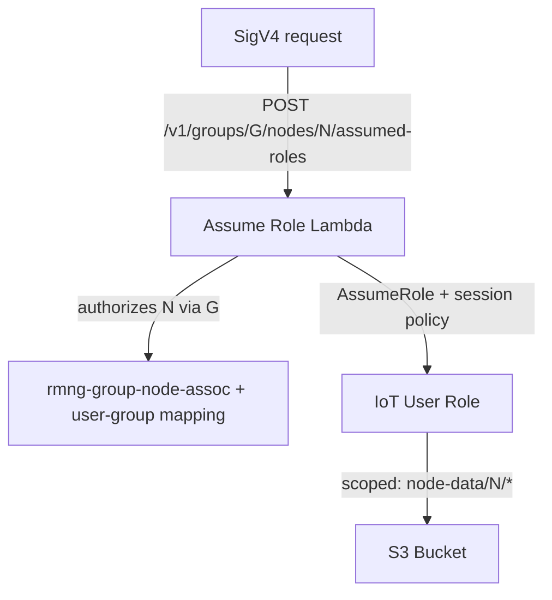

# S3 Device File Storage Feature Design

## 1. Overview

This document describes the design for device-scoped S3 file storage using the
AWS IoT Credential Provider. Devices can upload, list, download, and delete
files in their own S3 folder. End users who have a user-node mapping can list,
download, and delete those files via the existing assume-role mechanism.

Note the asymmetry: users get read and delete access only (list, download,
delete) — not upload. Devices are the producers of these files and users are
the consumers, so the user-side session policy deliberately omits `PutObject`.

The design reuses the existing `esp-rm-files` S3 bucket with a `node-data/`
prefix and requires no new Lambda functions or server-side compute — devices
and users interact directly with S3 using scoped temporary credentials.

### Key Design Decisions

1. **No server-side compute for file operations** — devices use standard S3
   API (PutObject, GetObject, ListObjectsV2, DeleteObject) directly via IoT
   Credential Provider temporary credentials.
2. **Reuse existing S3 bucket** — the `esp-rm-files-{account}-{region}` bucket
   gets a new `node-data/` prefix for device files.
3. **Device isolation via IAM policy variables** —
   `${credentials-iot:ThingName}` in the Device_File_Role scopes each device
   to its own folder.
4. **User access via session policy** — the assume-role Lambda adds S3
   statements scoped to the user's accessible node IDs, resolved through the
   existing group → node mapping.
5. **Separate IoT policy** — `iot:AssumeRoleWithCertificate` is in a dedicated
   `rmng-node-file-policy` to stay within the 2048-byte rmng-base-node-policy limit.

---

## 2. Background

### 2.1 IoT Credential Provider

The AWS IoT Credential Provider exchanges a device's X.509 certificate for
temporary STS credentials via a role alias. This is the same mechanism used by
the camera example in esp-rainmaker for KVS access (role alias
`esp-videostream-v1-NodeRole`).

The device calls:
```
GET https://<credential-endpoint>/role-aliases/<role-alias>/credentials
```
with mutual TLS (X.509 cert + private key) and receives `accessKeyId`,
`secretAccessKey`, `sessionToken`, and `expiration`.

### 2.2 Existing Assume Role Mechanism

Per-node service credentials come from the **per-node route**:

```text
POST /v1/groups/{groupId}/nodes/{nodeId}/assumed-roles
Body: { "services": ["s3"] }
```

The Lambda:
1. Authorizes the caller's access to `nodeId` via `groupId` — one `GetItem` on
   the group-node mapping plus one point query on the user-group mapping.
2. Builds a session policy containing **only** S3 statements for that one node
   — no IoT statements at all.
3. Calls `STS:AssumeRole` on `IoTUserRole-{region}` with that session policy.

Two properties of the request shape carry weight:

- The body field is **`services`**, and its only accepted values are `"s3"` and
  `"kvs"`. Anything else is a `400`.
- `services` is accepted **only** on the per-node route. On the group-level
  `POST /v1/assumed-roles` it is a `400`:
  `"services requires the /v1/groups/{group_id}/nodes/{node_id}/assumed-roles
  route"`. S3 credentials are minted one node per call.

MQTT credentials and service credentials are therefore separate calls returning
separate, non-overlapping session policies. See `user_auth.md` §3.2–3.4.

### 2.3 S3 Key Structure

```
esp-rm-files-{account}-{region}/
  node-data/
    {node_id}/
      {arbitrary_key}          # e.g. logs/2024-01-15.txt
      {nested/path/file.bin}   # nested paths supported
```

---

## 3. Design

### 3.1 Device File Access: Credential Provider Flow



1. Device presents X.509 certificate to IoT Credential Provider endpoint with
   role alias `rmng-node-file-role-v1`.
2. Credential Provider validates the certificate, checks the IoT policy for
   `iot:AssumeRoleWithCertificate` permission, and returns temporary
   credentials.
3. Device uses temporary credentials to call S3 APIs on
   `node-data/{ThingName}/*`.
4. IAM evaluates the Device_File_Role policy —
   `${credentials-iot:ThingName}` resolves to the device's ThingName,
   restricting access to its own prefix.

### 3.2 User File Access: Assume Role Flow



1. User obtains Identity-Pool credentials, then SigV4-signs
   `POST /v1/groups/{groupId}/nodes/{nodeId}/assumed-roles` with
   `{"services": ["s3"]}`.
2. Lambda confirms the node belongs to the group and the caller has access to
   it (full-group access, or a shared subgroup the node is tagged with).
   Super-admins pass unconditionally. Anything else is `403`.
3. Lambda builds a session policy with S3 statements scoped to
   `node-data/{nodeId}/*` — that node only.
4. Lambda calls `STS:AssumeRole` on IoT User Role with the session policy.
5. User uses returned credentials to call S3 APIs (ListObjectsV2, GetObject,
   DeleteObject) under that node's prefix.

### 3.3 Device_File_Role IAM Policy

```json
{
  "Version": "2012-10-17",
  "Statement": [
    {
      "Effect": "Allow",
      "Action": ["s3:PutObject", "s3:GetObject", "s3:DeleteObject"],
      "Resource": "arn:aws:s3:::esp-rm-files-{account}-{region}/node-data/${credentials-iot:ThingName}/*"
    },
    {
      "Effect": "Allow",
      "Action": "s3:ListBucket",
      "Resource": "arn:aws:s3:::esp-rm-files-{account}-{region}",
      "Condition": {
        "StringLike": {
          "s3:prefix": "node-data/${credentials-iot:ThingName}/*"
        }
      }
    }
  ]
}
```

### 3.4 rmng-node-file-policy (IoT Policy)

A separate IoT policy attached to device certificates alongside the existing
rmng-base-node-policy. Kept separate to stay within the 2048-byte policy size
limit. Permissions are unioned by IoT Core.

```json
{
  "Version": "2012-10-17",
  "Statement": [
    {
      "Effect": "Allow",
      "Action": "iot:AssumeRoleWithCertificate",
      "Resource": "arn:aws:iot:{region}:{account}:rolealias/rmng-node-file-role-v1"
    }
  ]
}
```

### 3.5 Session Policy S3 Statements

For a request naming `node-A`, the assume-role Lambda builds a session policy
containing exactly these statements — and nothing else:

```json
[
  {
    "Effect": "Allow",
    "Action": "s3:ListBucket",
    "Resource": "arn:aws:s3:::esp-rm-files-{account}-{region}",
    "Condition": {
      "StringLike": {
        "s3:prefix": ["node-data/node-A/*"]
      }
    }
  },
  {
    "Effect": "Allow",
    "Action": ["s3:GetObject", "s3:DeleteObject"],
    "Resource": [
      "arn:aws:s3:::esp-rm-files-{account}-{region}/node-data/node-A/*"
    ]
  }
]
```

If no files bucket is configured, no S3 statements are added (fail-closed) and
the credentials grant nothing.

### 3.6 IoT User Role S3 Permissions

The IoT User Role gets broad S3 permissions on `node-data/*`. The session
policy from the Lambda further restricts to specific node prefixes:

- `s3:ListBucket` on bucket ARN with condition `s3:prefix` = `node-data/*`
- `s3:GetObject`, `s3:DeleteObject` on `node-data/*`

---

## 4. Security Analysis

### 4.1 Cross-device isolation (device side)

The `${credentials-iot:ThingName}` IAM policy variable resolves to the
device's own ThingName at credential issuance time. A device cannot access
another device's `node-data/` prefix because the variable is bound to the
authenticated certificate's thing.

### 4.2 Cross-device isolation (user side)

The session policy generated by the assume-role Lambda includes S3 resource
ARNs only for nodes the user has access to (resolved via
`rmng-group-node-assoc`). A user cannot access files for devices they are not
mapped to because the session policy does not include those node prefixes.

### 4.3 Fail-closed behavior

If `FILES_BUCKET_NAME` is not set or no nodes are found for the user, the
Lambda omits S3 statements entirely. The user gets IoT-only credentials with
no S3 access.

---

## 5. Error Handling

| Scenario | Behavior |
|---|---|
| Invalid/expired device certificate | IoT Credential Provider returns 403 |
| Role alias not found | IoT Credential Provider returns 404 |
| Device accesses wrong prefix | S3 returns 403 AccessDenied |
| Object not found (GetObject) | S3 returns 404 NoSuchKey |
| Temporary credentials expired | S3 returns 403 ExpiredToken — re-acquire |
| rmng-group-node-assoc query fails | Lambda omits S3 statements (fail-closed) |
| User accesses unmapped device | S3 returns 403 AccessDenied |

---

## 6. What Does Not Change

| Component | Why |
|---|---|
| rmng-base-node-policy | Unchanged; AssumeRoleWithCertificate is in separate rmng-node-file-policy |
| `rmng-user-group-assoc` and `rmng-group-node-assoc` DB schemas | Unchanged; existing tables used for node resolution |
| User → group resolution | Unchanged; the existing group-access lookup resolves the user's groups |
| Existing IoT session policy statements | Unchanged; S3 statements are appended, not replacing |
| S3 bucket structure for OTA/certs | Unchanged; device files use separate `node-data/` prefix |

---

## 7. Deployment Notes

### 7.1 AWS Infrastructure

Deploying this feature provisions the following resources in the base stack:

- A `rmng-node-file-role-{region}` IAM role trusted by `iot.amazonaws.com`, scoped
  to the device's own `node-data/${credentials-iot:ThingName}/*` prefix.
- An `rmng-node-file-role-v1` IoT role alias mapping to that role.
- An `rmng-node-file-policy` IoT policy granting
  `iot:AssumeRoleWithCertificate` on the role alias.
- S3 read/delete permissions on `node-data/*` added to `IoTUserRole-{region}`.
- Stack outputs for the device-file role alias name, the IoT credential
  provider endpoint, and the files bucket name.
- `DELETE` added to the S3 bucket's CORS configuration.

### 7.2 Node Registration Behavior

S3 file access is opt-in per node at registration time. The node registration
API (`POST /v1/admin/nodes`) accepts an optional `capabilities` field in the
request body (e.g. `["s3"]`). The base node policy (`rmng-base-node-policy`) is
always attached to the device certificate; the `rmng-node-file-policy` is
attached only when `"s3"` is present in `capabilities`. Nodes registered
without it behave exactly as before (backward-compatible). Bulk registration
honors the same capabilities selection.

### 7.3 Assume-Role Behavior

The assume-role flow emits S3 statements only on the per-node route, and only
when `"s3"` appears in the request's `services` array. The statements are
`s3:ListBucket` plus `s3:GetObject`/`s3:DeleteObject`, scoped to that one node's
`node-data/{node_id}/*` prefix; the document carries no IoT statements. The
Lambda reads the target bucket name from the `FILES_BUCKET_NAME` environment
variable; the device-file policy name used at registration is supplied via the
`DEVICE_FILE_POLICY_NAME` environment variable.

### 7.4 Device Firmware

The device firmware needs to:
1. Call the IoT Credential Provider endpoint with role alias
   `rmng-node-file-role-v1` to obtain temporary S3 credentials.
2. Use the credentials with the S3 API to upload/list/download/delete files
   under `node-data/{node_id}/`.
3. Re-acquire credentials before expiration (default 1 hour).


### 7.5 Phone App / Dashboard

Use the credentials from `POST /v1/assumed-roles` to call S3 APIs directly
for listing, downloading, and deleting device files (read and delete only —
uploads are performed by devices, not users).
