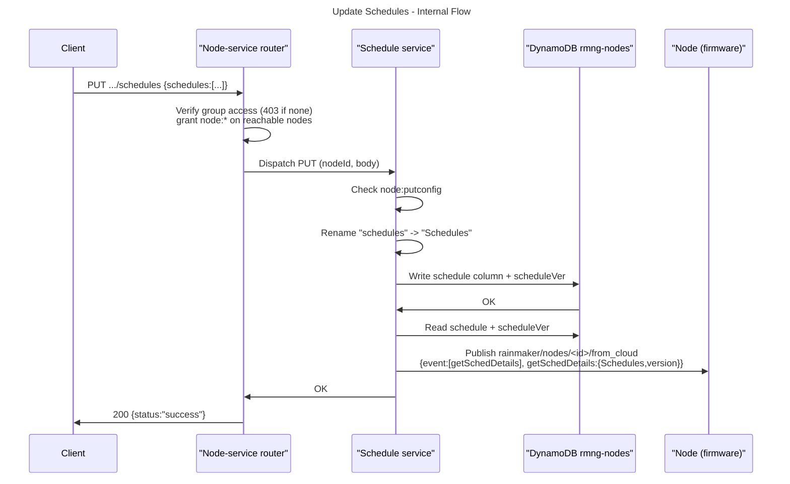

# Schedules

## What schedules are

A schedule is a time-based automation stored against a single node: "turn the light on at 07:00 on weekdays", "run the pump every day at sunset". Each schedule carries one or more time **triggers** (clock time, day/date, or solar) and an **action** — a node parameter-update payload applied on the device when the schedule fires.

Schedules execute **on the device itself**, not in the cloud. This is the ESP RainMaker built-in Schedules feature: the firmware keeps the schedule set in NVS and runs it against its own real-time clock, so schedules keep firing even while the node is offline from the cloud. The cloud's job is only to **store** the schedule set and **push it down** to the device whenever it changes.

## Why it is needed

- A durable, cloud-backed copy of each node's schedules that survives app reinstalls and is shared across every user with access to the node.
- A single API surface for clients to read/replace/clear schedules without talking MQTT directly.
- A change-notification path: any edit is pushed to the device over MQTT so the on-device schedule set stays in sync with the cloud copy.

## Architecture

- **Schedule service** — the schedule-specific logic: key translation, storage, and the device push.
- **Generic node-service router** — the Lambda that routes the REST request to the schedule service based on the URL.
- **Node-service contract** — the shared interface and registry that schedule plugs into.
- **Node-details storage** — the `rmng-nodes` table.
- **Device push** — the MQTT push that forwards the schedule set to the device.

Schedule is one of several node services (alongside `config`, `timeseries`, `trigger`) registered into a shared registry at startup and dispatched by the same generic router. It is a **node service**, so it is scoped to a `nodeId` and exposes only read (`GET`), replace (`PUT`), and clear (`DELETE`) operations.

## Key translation: `schedules` (API) ↔ `Schedules` (firmware)

The REST API is idiomatic snake_case; the device firmware wire shape is PascalCase and predates the cloud API. Rather than change the device contract, the cloud translates the top-level key at the service boundary:

- `schedules` — the key used on the REST API.
- `Schedules` — the key the firmware reads on MQTT and in storage.

- **On `PUT`** — the request's `schedules` array is renamed to `Schedules` before it is stored, so what lands in the DB is already in the shape the device expects.
- **On storage / MQTT** — data is kept under `Schedules`, so the MQTT push forwards the device-native shape untouched.
- **On `GET`** — the stored `Schedules` key is renamed back to `schedules` on the way out.

Only the top-level key is remapped; every other field (`message`, and each schedule's `id` / `name` / `triggers` / `action` / `validity`, etc.) is copied through verbatim. If the stored data has no `Schedules` key, it is returned as-is.

## Data model & storage

Schedules are stored on the node's row in the node-details table.

- **Table**: `rmng-nodes`, partition key `node_id`.
- **Data column**: `schedule` — the service's registry name. It holds the schedule payload map, e.g. `{ "Schedules": [ ... ] }`.
- **Version column**: `scheduleVer` — the convention is `<serviceName>Ver`. A Unix-seconds timestamp updated on every write (see [Versioning](#versioning)).

Writes go through the node-details storage layer:

- On write, both the `schedule` column and `scheduleVer` are set in a single `UpdateItem`.
- On delete, the `schedule` column is `REMOVE`d and a fresh `scheduleVer` is `SET`, again in a single write.

There is **no condition expression** on these writes, so a `PUT` for a `node_id` with no existing row simply creates the row — schedule data can exist before the rest of the node record does.

### Payload shape

The payload is the ESP RainMaker built-in Schedules structure — the exact shape the device parses; the cloud stores and forwards it unchanged. See the schedule payload schemas in `docs/api/Api_Swagger.yaml`.

```json
{
  "schedules": [
    {
      "id": "s1",
      "name": "Morning Lights",
      "enabled": true,
      "triggers": [ { "m": 420, "d": 62 } ],
      "action": { "Light": { "Power": true, "Brightness": 80 } },
      "validity": { "start": 1704067200, "end": 1735689600 }
    }
  ]
}
```

Notes:
- `id` is the unique identifier and is **mandatory for the device** on every operation: it must be 8 characters or fewer, and the device drops schedules with a missing, empty, non-string, or oversized `id`. (The firmware copies it into the `esp_schedule` name and uses it verbatim as the NVS key — there is no hashing. The NVS key itself allows 16 characters, but the RainMaker layer's own `MAX_ID_LEN` of 8 binds first.)
- `name` is display metadata, but the device is not indifferent to it: it is **mandatory on `add`** — a schedule with no `name` is dropped — and limited to 32 characters. On `edit` it is optional, and an absent or over-length one leaves the stored name unchanged.
- Neither field is truncated. The device's JSON parser refuses an over-length value outright, leaving the field empty, so the schedule fails the emptiness check and is skipped — logged, confusingly, as "ID not found" or "Name not found". Other schedules in the same payload still apply.
- A trigger's kind is discriminated by which keys are present (`rsec` one-shot; `m` + `d`/`dd` date-based; `lat`/`lon` + `sr`/`ss` solar) — there is no explicit `type` field.
- `action` is a node parameter-update payload. For a Matter node it mirrors the parameter-control payload (`{ "0x<endpoint>": { "c": { "s": { "0x<cluster>": { "c": { "0x<command>": "<TLV hex>" } } } } } }`).

The cloud does **not** validate the schedule contents — it stores and forwards whatever well-formed JSON is supplied. Semantic validation (`id` presence/length, trigger sanity) is the device's responsibility.

## Access control

Access is enforced in two layers; both must pass.

1. **Group access (router)** — before dispatching to the service, the router confirms `groupId` is in the caller's accessible groups. If not, it returns **403**. Loading the group together with its nodes walks the group's nodes and grants the caller `node:*` on every node they can reach — this is subgroup-aware, so a subgroup-only (`subentity`) member is granted node permissions only for nodes in the subgroups they can access.

2. **Node permission (service)** — each method re-checks the specific node action before touching the DB:

   | HTTP method | Required permission |
   |---|---|
   | `GET`    | `node:get`         |
   | `PUT`    | `node:putconfig`   |
   | `DELETE` | `node:deleteconfig`|

   Because layer 1 grants the `node:*` wildcard for reachable nodes, these checks pass for any group member who can see the node.

Consequence: **schedules do not distinguish `primary` / `secondary` / `subentity`** — any user who can reach the node through the group (or an accessible subgroup) can read, replace, and delete its schedules. There is no read-only tier for schedules.

## Versioning

The schedule service is versioned. Versioning uses the `scheduleVer` column, set to the current Unix time (seconds) on **every** `PUT` and `DELETE`. It is a monotonically-advancing change marker, not a sequential revision counter.

The version travels to the device with the schedule data (as a `version` field in the `getSchedDetails` payload), and the firmware can also fetch just the version via a `getSchedVer` request. This lets a device detect whether its locally-stored schedule set is stale relative to the cloud and re-sync if needed.

## APIs

All three share one route, distinguished by HTTP method:

`/v1/groups/{groupId}/nodes/{nodeId}/schedules`

### Routing

The route matches the generic node-service pattern `/v1/groups/{groupId}/nodes/{nodeId}/{serviceName}`. The URL segment is the plural `schedules`; the router remaps it to the singular registry name `schedule` (the same remap applies to `triggers` → `trigger`). Keeping the singular internal name preserves the DB column name and the shape forwarded over MQTT. The router then looks the service up in the registry and invokes the method for the HTTP verb.

### Get schedules

#### External Flow
- User opens a node's schedule screen in the client.
- Client calls the get-schedules API.
- The configured schedules are displayed (or an empty state if none).

#### Internal Flow

**API**: `GET /v1/groups/{groupId}/nodes/{nodeId}/schedules`

**Request**: No request body.

**Process**:
1. Router verifies group access (403 if the caller cannot access `groupId`), granting node permissions for reachable nodes.
2. The schedule service checks `node:get` on `nodeId`.
3. Read the `schedule` column from `rmng-nodes`.
4. If absent, return an empty object `{}`.
5. Otherwise translate the stored `Schedules` key to `schedules` and return.

**Response**:
```json
{
  "schedules": [
    { "id": "s1", "name": "Morning Lights", "enabled": true,
      "triggers": [ { "m": 420, "d": 62 } ],
      "action": { "Light": { "Power": true, "Brightness": 80 } } }
  ]
}
```
When no schedules are configured: `{}`.

### Create / update schedules

Replaces the node's entire schedule set with the supplied payload (it is a whole-object write, not a merge) and notifies the device.

#### External Flow
- User adds or edits schedules for a node.
- Client sends the full schedule set to the create/update API.
- The device is notified of the new schedule set over MQTT.

#### Internal Flow

**API**: `PUT /v1/groups/{groupId}/nodes/{nodeId}/schedules`

**Request**:
```json
{
  "schedules": [
    { "id": "s1", "name": "Morning Lights", "enabled": true,
      "triggers": [ { "m": 420, "d": 62 } ],
      "action": { "Light": { "Power": true, "Brightness": 80 } } }
  ]
}
```

**Process**:
1. Router verifies group access; the request body is parsed as generic JSON (invalid JSON → 400).
2. The schedule service checks `node:putconfig` on `nodeId`.
3. Translate the top-level `schedules` key to `Schedules`.
4. Write the `schedule` column and bump `scheduleVer` in one `UpdateItem`.
5. Push the new schedule set to the device over MQTT (see [MQTT push](#mqtt-push-to-the-device)).

**Response**:
```json
{ "message": "success" }
```

### Delete schedules

Clears the node's entire schedule set and notifies the device. There is no per-schedule delete — deletion removes the whole `schedule` column.

#### External Flow
- User clears schedules for a node.
- Client calls the delete-schedules API.
- The device is notified that its schedule set is now empty.

#### Internal Flow

**API**: `DELETE /v1/groups/{groupId}/nodes/{nodeId}/schedules`

**Request**: No request body.

**Process**:
1. Router verifies group access.
2. The schedule service checks `node:deleteconfig` on `nodeId`.
3. `REMOVE` the `schedule` column and `SET` a fresh `scheduleVer` in one `UpdateItem`.
4. Push the (now empty) schedule set to the device.

**Response**:
```json
{ "message": "success" }
```

## MQTT push to the device

Both `PUT` and `DELETE` push to the device **after** the DB write. The push does not send the request body — it re-reads the authoritative state from the DB and forwards that, so a `DELETE` naturally forwards an empty schedule set.

Push construction:
1. Read the `schedule` column and `scheduleVer` for the node from `rmng-nodes`.
2. Build a `getSchedDetails` payload: the stored schedule map (using the firmware `Schedules` key) plus a `version` field carrying `scheduleVer`.
3. Publish to the device's from-cloud topic: `rainmaker/nodes/<node_id>/from_cloud`.

Wire payload:
```json
{
  "event": ["getSchedDetails"],
  "getSchedDetails": {
    "Schedules": [ { "name": "Morning Lights", "triggers": [ { "m": 420, "d": 62 } ], "action": { "Light": { "Power": true } } } ],
    "version": 1704067200
  }
}
```

The same `getSchedDetails` (schedule data) and `getSchedVer` (version only) responses are also produced when a device proactively requests them; that inbound path is handled by the device-event input handler.



The push is best-effort in ordering only in the sense that it happens after a committed DB write; if the publish fails, the method returns an error (surfaced as 500) even though the DB already holds the new state. A device that misses a push can re-sync using the version (`getSchedVer` / `getSchedDetails`).

## Code vs. swagger notes

The swagger at `docs/api/Api_Swagger.yaml` documents the intended contract; a few points differ from the current handler:

- **Error status for authorization / storage failures.** Swagger lists `400`, `401`, `403`, `500`. In practice the router returns `403` only for the **group**-access check. Any error raised inside the service — including the node-level authorization rejection (`node:get` / `node:putconfig` / `node:deleteconfig`) and any DB/MQTT error — is mapped to **500** by the node-service router, not to `403`. So a caller who can access the group but not a particular node (e.g. a `subentity` member targeting a node outside their subgroups) receives `500`, not `403`.
- **`400` on GET/DELETE.** The handler only returns `400` for `PUT` with an unparseable JSON body. GET and DELETE have no request body and never return `400` from the handler.
- **`401`** is enforced upstream by API Gateway (SigV4 auth), not by this Lambda.
- **Success body.** PUT and DELETE return `{ "message": "success" }` — the standard API status object, whose only field is `message`.

## FAQs

1. **Do schedules run in the cloud?**
   No. Schedules execute on the device against its own clock and persist in NVS, so they fire even when the node is offline. The cloud stores the set and pushes changes.

2. **Is `PUT` a merge or a replace?**
   A replace. The `schedule` column is overwritten with the supplied payload; there is no per-schedule create/update/delete endpoint.

3. **Why `schedules` on the API but `Schedules` in storage and on MQTT?**
   The device wire shape (PascalCase `Schedules`) predates the REST API. The cloud translates the top-level key at the service boundary so the API can be idiomatic snake_case without changing the device contract.

4. **Who can edit a node's schedules?**
   Any user with access to the group (or accessible subgroup) that contains the node. Schedules do not have a read-only access tier — the same reachability that allows GET also allows PUT and DELETE.

5. **What is `scheduleVer` for?**
   It is a change marker (Unix seconds) bumped on every write and sent to the device with the schedule data, so firmware can detect a stale local copy and re-sync.
