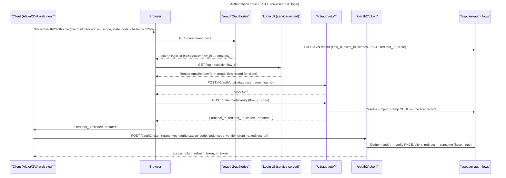

# Authorization Code + PKCE Flow (browser login)

## What this is

The standard OAuth 2.1 / OIDC browser login: a client (e.g. the Alexa or Google Voice Assistant account-linking web view) redirects the user to `GET /oauth2/authorize`, the user logs in passwordlessly via OTP on a **service-served login UI**, and we hand the client back a single-use **authorization code** at its `redirect_uri`. The client then exchanges that code (with its PKCE verifier) at `POST /oauth2/token` for the token set.

This is the interactive counterpart to [direct-token OTP](auth-flows.md#direct-token-otp-native-first-party): same OTP first factor, but the browser only ever carries an opaque flow id and the final code — never tokens or claims.

> Alexa account-linking runs here: the voice platform is a browser authorization-code + PKCE client of this surface. The access token issued here is what an end user later exchanges for AWS/IoT credentials — see [user_auth.md](../../../docs/en/specs/user_auth.md).

## Why it is needed

- Alexa/GVA account linking is a **browser redirect** flow: the voice platform opens our authorize URL, the user authenticates, and the platform receives a code at its registered redirect. It cannot use the native direct-token path (no app to hold a `flow_id`, must be OAuth-standard).
- The authorization code + PKCE handshake keeps tokens out of the browser URL and binds the code to the client that started the flow (RFC 7636), which direct-token mode sidesteps.

## Scope of this slice

**In:** `GET /oauth2/authorize`, a minimal service-served login UI, OTP as the first factor, single-use code issuance, and the `authorization_code` grant at `POST /oauth2/token`. First-party clients only.

**Out (deferred):** consent screen, SSO sessions / silent re-auth, social federation, per-client branding, custom-domain→issuer, and the full S3+CloudFront branded SPA. Those are deferred features and are **not** built here. Since first-party clients skip consent, the flow goes login → OTP → code with no consent step.

## Pre-requisites

- A registered client ([admin-clients.md](admin-clients.md)) with exact-match `redirect_uris`, `grant_types` including `authorization_code`, and `require_pkce=true` (forced for public clients).
- OTP delivery configured (SES/SNS) and the OTP endpoints deployed ([auth-flows.md](auth-flows.md)).
- The RS256 signing key and discovery/JWKS documents exist ([oidc-oauth2.md](oidc-oauth2.md)).

## Key Rules

1. **PKCE-S256 is required per the client's `require_pkce` policy** (forced `true` for public clients — RFC 9700 §2.1.1; optional for a confidential client registered with `require_pkce=false`). When required and a `code_challenge` is absent, `/oauth2/authorize` returns `invalid_request` (RFC 7636 §4.4.1); a challenge that is present MUST use `S256`. Downgrade protection at `/oauth2/token` (RFC 9700 §2.1.1): a code bound to a challenge MUST be redeemed with a matching `code_verifier`, and a code issued without one MUST be redeemed without a verifier.
2. **Exact `redirect_uri` match.** The `redirect_uri` must string-equal one of the client's registered URIs — no wildcards, no prefix/substring. A mismatch is rejected **on our error page**, never redirected (an unvalidated redirect is an open redirector).
3. **The browser carries only the opaque flow id and the final code.** Flow state (client, scopes, PKCE, redirect) lives in the [espuser-auth-flows](#espuser-auth-flows) record; the browser holds the flow id in a short-lived `HttpOnly` `Secure` `SameSite=Lax` cookie. (`HttpOnly` = unreadable by JavaScript, so `document.cookie` can't leak it; `Secure` = sent only over HTTPS; `SameSite=Lax` = not sent on cross-site requests, blunting CSRF.)
4. **The authorization code is single-use.** Redemption deletes the flow record under an item-exists condition, so a concurrent or replayed second exchange fails atomically and is denied with `invalid_grant` (RFC 6749 §4.1.2 / §10.5).
5. **The redeeming client must match the issuing client.** `/oauth2/token` checks that `client_id` and `redirect_uri` on the exchange equal those stamped on the code's flow record; a mismatch is `invalid_grant`.
6. **Codes are short-lived** (TTL ≤ 60s recommended, ≤ 10 min hard cap) via the flow record's `expires_on` TTL.
7. **`state` is echoed to the client's redirect** for CSRF protection. `nonce` is not accepted (see Open items).
8. **No tokens in URLs** beyond the spec-mandated `code` on the authorization redirect.

## The flow, end to end



## `GET /oauth2/authorize`

Starts the flow. Validates the request, writes a `LOGIN` flow record, and redirects the browser to the login UI with the flow-id cookie set.

**Query parameters**:

| Param | Required | Notes |
| --- | --- | --- |
| `response_type` | yes | Must be `code`. Anything else → `unsupported_response_type`. |
| `client_id` | yes | Must be a registered client. |
| `redirect_uri` | yes | Exact match against the client's registered URIs. |
| `scope` | no | Optional (RFC 6749 §4.1.1); space-delimited; include `openid` for an id_token. Each requested scope must be within the client's allowed scopes. |
| `state` | recommended | Opaque; echoed back on the redirect (client CSRF token). |
| `code_challenge` | conditional | PKCE (RFC 7636). Required when the client is registered with `require_pkce` (always true for public clients — RFC 9700 §2.1.1); optional otherwise. |
| `code_challenge_method` | conditional | Must be `S256` when a `code_challenge` is present. |

**Process**:
1. Validate `response_type=code` and that `client_id` is a registered client. A structural failure here renders the **service error page** (we cannot safely redirect yet).
2. Validate `redirect_uri` is an exact registered URI for the client. Mismatch → error page (never redirect).
3. PKCE: if the client's `require_pkce` is set, a `code_challenge` MUST be present (RFC 7636 §4.4.1, else `invalid_request`); if a challenge is present its method MUST be `S256`.
4. Validate requested `scope` ⊆ client's allowed scopes. An over-broad scope → redirect the client with `invalid_scope` (redirect is now safe, the URI is validated).
5. Write a `LOGIN` record to [espuser-auth-flows](#espuser-auth-flows): fresh `flow_id`, `client_id`, `requested_scope`, `code_challenge`, `code_challenge_method`, `redirect_uri`, `state`, TTL'd `expires_on`.
5. Set the `flow_id` in a short-lived `HttpOnly` `Secure` `SameSite=Lax` cookie and `302` to the login UI.

**Errors** — pre-redirect failures (steps 1–2) render the error page with an RFC 6749 §5.2 error body; post-validation failures (step 3+) redirect to `redirect_uri?error=<code>&state=<state>`.

## Login UI (service-served)

A minimal page (or small SPA) served by the identity service from its own origin — **no** custom domain, **no** per-client branding, **no** CloudFront in this slice. It:
1. Reads the `flow_id` cookie and loads the flow record to learn the client (display only; no secrets).
2. Renders an **email/phone** field (passwordless — no password field anywhere).
3. On submit, calls `POST /v1/auth/otp/initiate` with the username and the flow id, then renders the **OTP entry** field.
4. On code submit, calls `POST /v1/auth/otp/verify` with `{ flow_id, code }`. In-flow verify returns `{ redirect_to }`; the UI navigates the browser there, landing back at the client's `redirect_uri` with the `code`.

The UI never mints a token, never sees signing keys, and never puts claims in the URL. Responses are `Cache-Control: no-store`.

> The OTP `initiate`/`verify`/`resend` contracts and the in-flow vs direct-token split are owned by [auth-flows.md](auth-flows.md); this spec does not redefine them. In-flow `verify` stamps the flow's `subject`, transitions the `LOGIN` record to `CODE` (mints the `code`), and returns `{ redirect_to }`.

## `POST /oauth2/token` — `authorization_code` grant

Extends the existing token endpoint (which today serves `refresh_token`, [auth-flows.md](auth-flows.md#token-endpoint-post-oauth2token)) with the `authorization_code` grant.

**Client authentication** (both grants, RFC 6749 §3.2.1 → §2.3.1): HTTP Basic only. A confidential client MUST present `Authorization: Basic base64(client_id:secret)` — a bad/missing secret is `401 invalid_client`; a public client sends its `client_id` (in Basic or the form body) with no secret, and relies on PKCE (code) / rotation (refresh) instead. `client_secret_post` is not accepted (RFC 6749 §2.3.1 NOT RECOMMENDED). This mirrors [/oauth2/revoke](auth-flows.md#revoke-endpoint-post-oauth2revoke).

**Request** (form-encoded):
```
grant_type=authorization_code
code=<authorization code>
code_verifier=<PKCE verifier>   (required iff the code was bound to a challenge)
client_id=<client>
redirect_uri=<same redirect_uri used at authorize>
```

**Process**:
1. Require `grant_type=authorization_code`, `code`, `client_id`, `redirect_uri`. Missing/malformed → `invalid_request`. (`code_verifier` is conditional — see step 4.)
2. Look up the `CODE` flow record by `code`. Unknown/expired/already-consumed → `invalid_grant` (a consumed code additionally burns the flow — reuse = theft).
3. Verify `client_id` and `redirect_uri` equal those stamped on the record; mismatch → `invalid_grant`.
4. Verify PKCE: `BASE64URL(SHA256(code_verifier)) == code_challenge`. Mismatch, or a verifier supplied for a code with no challenge (or vice-versa), → `invalid_grant` (RFC 9700 §2.1.1).
5. Consume the code (conditional `consumed = false → true`); a lost race → `invalid_grant`.
6. Mint the token set for the record's `subject` + `granted_scope`: RS256 access token, a fresh refresh-token family, and an id_token when `openid` is in scope.

**Response** (`200`, `application/json`) — same shape as the refresh grant:
| field | example | notes |
|---|---|---|
| `access_token` | `eyJ...` |  |
| `token_type` | `Bearer` |  |
| `expires_in` | `3600` |  |
| `refresh_token` | `a1b2c3d4...` |  |
| `id_token` | `eyJ...` |  |
| `scope` | `openid email` |  |

**Errors** (RFC 6749 §5.2 error object):
- `400 invalid_request` — missing/malformed `code`, `code_verifier`, `client_id`, or `redirect_uri`.
- `400 invalid_grant` — unknown/expired/consumed code, client or redirect mismatch, or PKCE failure (uniform; no oracle).
- `400 unsupported_grant_type` — a `grant_type` this endpoint does not serve.

## espuser-auth-flows

The flow record threading a request from `/oauth2/authorize` through OTP login to the issued `code`. New table; add to `USER_TABLE_NAMES` / `USER_INDEX_NAMES` in [base_res_constants.py](../../base_res_constants.py). `ManagedTable` via the GSI orchestrator like the other `espuser-*` tables. TTL'd; holds no long-lived PII.

**Keys**: `flow_id` (PK), `sk` (SK).

| Attribute | Type | Notes |
| --- | --- | --- |
| `flow_id` (PK) | String | Opaque; only ever in the short-lived session cookie, never a URL. |
| `sk` (SK) | String | `LOGIN` (→ `CODE` at code issuance). |
| `client_id` | String | Originating client. |
| `requested_scope` | List<String> | From the authorize request. |
| `redirect_uri` | String | Validated, exact-match. |
| `state` | String | Echoed on the redirect (client CSRF token). |
| `code_challenge` / `code_challenge_method` | String | PKCE (`S256`). |
| `subject` | String | Resolved `user_id`; set by in-flow OTP verify. |
| `granted_scope` | List<String> | Stamped at code issuance (= requested, first-party no-consent). |
| `code` | String | The single-use authorization code; minted when the record becomes `CODE`. Looked up by a `by-code` GSI. |
| `consumed` | Bool | Single-use guard (conditional `false → true`). Pointer-backed so `false` persists. |
| `expires_on` | Number | **TTL** (epoch seconds); code lifetime ≤ 60s recommended. |

- Authorize writes the `LOGIN` record by `flow_id`.
- In-flow OTP verify (linked by `flow_id`) stamps `subject`/`granted_scope`, mints `code`, sets `sk=CODE`.
- Token exchange finds the record by `code` (a `by-code` GSI), verifies, and consumes.

> This slice keeps the OTP challenge in [espuser-otp](auth-flows.md) linked by `flow_id`. Audiences (RFC 8707) and folding the OTP challenge onto this table — see Open items.

## Standards reference

- **OAuth 2.1 / RFC 6749 §4.1** — authorization code grant.
- **RFC 7636 / RFC 9700 §2.1.1** — PKCE (`S256`); required for public clients and any client with `require_pkce`, with token-endpoint downgrade protection.
- **RFC 9700 (BCP 240) §2.1.1** — PKCE downgrade protection; exact redirect matching; no code replay.
- **OIDC Core 1.0** — `openid` scope → id_token.

## Open items

- `TODO:` `by-code` GSI vs deriving the record key from the code — finalize in the DB slice.
- `TODO:` login UI hosting: served inline by an authorize Lambda vs a small static bundle on the service origin (still no CloudFront/custom-domain in this slice).
- `TODO:` audit events (`authorize`, `code_issued`, `code_redeemed`) — same open question as the OTP audit log in [auth-flows.md](auth-flows.md).
- `TODO:` rate-limit `/oauth2/authorize` (flow-record creation) per client + IP.
- `TODO:` `nonce` (OIDC replay protection) — accept it and inject it into the id_token together (OIDC Core §2 requires an accepted `nonce` to appear in the id_token).
- `TODO:` `requested_audience` / `granted_audience` (RFC 8707) on the flow record — omitted this slice.
- `TODO:` fold the `OTP` challenge onto `espuser-auth-flows` instead of a separate `espuser-otp` row (one flow record carrying its challenge).
- `TODO:` additional client-auth methods beyond `client_secret_basic`: `private_key_jwt` / `client_secret_jwt` (RFC 7523, needs per-client JWKS) and mTLS `tls_client_auth` (RFC 8705, needs cert distribution).
- `TODO:` per-client `token_endpoint_auth_method` is derived (public → `none`, confidential → basic), not stored/configurable; make it an explicit registered field when more methods land.
- `TODO:` secret rotation for confidential clients (two active secrets during rollover); today a client has a single secret.
- `TODO:` `client_credentials` grant (M2M) — a confidential client with no user; separate later slice, same Basic auth.
- `TODO:` on authorization-code reuse, revoke the tokens (refresh-token family) minted from that code (RFC 6749 §10.5 SHOULD) — today reuse is only denied (`invalid_grant`), not revoked. Requires recording the minted family id on the flow record; mirror the refresh-token reuse-detection path.
