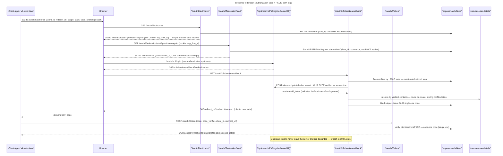

# Upstream identity providers — brokered federation

> Implements the brokered-federation design (the
> Dex "normalize and reissue" broker) for the first concrete upstream provider,
> **AWS Cognito**. This spec is the authoritative description of what is built;

## What it is

ESP User is its own OIDC issuer. An *upstream identity provider* (here, a Cognito
user pool with its hosted UI) authenticates the human, but the downstream client
**never** sees the upstream's tokens. ESP User brokers the upstream login, reads
the verified identity, resolves it to our `user_id`, and mints **our** access /
id / refresh tokens. To the client, ESP User is the only issuer, and refresh is
100% ours — the upstream is never contacted again after the callback.

This is the **user path only.** Admins authenticate against Cognito directly as a
separate issuer with no brokering — users carry the ESP User issuer, admins carry
Cognito's native issuer, and clients serving both validate both ("two issuers").

## Why brokered, not pass-through (security)

The client's downstream leg is unchanged: our `/oauth2/authorize` validates our
client, `redirect_uri`, PKCE and `state`, and issues **our** code bound to **our**
flow record. Federation adds a *second, independent* OAuth leg where ESP User is a
confidential client of the upstream. The two legs never share PKCE/state.

We deliberately do **not** replay the client's own PKCE/state against the upstream
(the way the MCP OAuth proxy does). That pass-through is safe only because the MCP
proxy re-exposes the upstream token unchanged — there is one authorization server
and one PKCE binding. Here we **mint our own tokens**, so a replay would:

- verify PKCE at the *upstream*, not at the token-minting server — our
  `/oauth2/token` would bind the code to nothing it proved possession of;
- collapse every downstream client into one upstream client, destroying the
  client↔code binding and enabling cross-client code injection (RFC 6749 §4.1.3,
  RFC 9700 §4.5);
- leak the client's `state` to a third party and couple our protocol surface to
  the upstream's PKCE/state quirks, breaking the multi-provider goal.

RFC 8693 token-exchange (client integrates the upstream itself, then swaps the
upstream token at our `/oauth2/token`) is **not** the base flow — it exposes
upstream tokens to clients and voice assistants cannot use it. It is reserved as
a future additive grant for native apps (RFC 8693 token exchange: the app presents
an upstream token at our token endpoint and receives OUR tokens).

## The flow, end to end

The two legs never mix: the client's `state`/PKCE ride only the downstream leg;
the broker mints its own `state` (HMAC over the flow id), `nonce`, and PKCE
verifier for the upstream leg.

## Endpoints

Both live on the authorize lambda (same `EspUserApi`), auth type `NONE`.

### `GET /oauth2/federation/start`

Begins the upstream leg for an in-flight authorization flow.

- **Input:** `provider` (query) + the `esp_flow_id` HttpOnly cookie set by
  `/oauth2/authorize`.
- **Process:** resolve a live `LOGIN` flow by the cookie; load the provider from
  [`espuser-identity-providers`](#provider-registry) (must be `enabled`);
  generate a fresh upstream `state`, `nonce`, and PKCE `code_verifier`/S256
  `code_challenge`; persist them on the flow record; build the upstream authorize
  URL (our broker `client_id`, provider scopes, our callback `redirect_uri`,
  `state`, `nonce`, `code_challenge`).
- **Output:** `302` to the provider `authorization_endpoint`.

State is `flow_id` + an HMAC tag (keyed by a domain-separated derivation of the
refresh-token secret) so the callback can trust it without a new GSI, and it is
*also* compared to the value stored on the flow — a tamper-evident, self-contained
correlation that defends CSRF and issuer mix-up (RFC 9207).

### `GET /oauth2/federation/callback`

Completes the upstream leg and issues **our** code.

- **Input:** `code`, `state` (+ optional `iss`).
- **Process:**
  1. Verify the `state` HMAC; load the flow; confirm it matches the flow's stored
     upstream `state`. Reject on any mismatch (CSRF/replay). If `iss` is present,
     assert it equals the provider's issuer (RFC 9207).
  2. Exchange `code` at the provider `token_endpoint` server-side, authenticating
     as our confidential broker client (secret) and sending the stored
     `code_verifier` (PKCE).
  3. Verify the upstream `id_token`: RS256 signature against the provider JWKS,
     `iss` == provider issuer, `aud` == our broker `client_id`, `nonce` == the
     flow's stored nonce, and `exp`.
  4. Normalize claims to an `Identity`. A contact the upstream did not mark verified is
     dropped, and an identity with nothing verified does **not** resolve to an account
     (rendered as a non-enumerating error).
  5. Identity resolution against every verified contact, described below. The upstream
     refresh token is discarded — never persisted.
  6. Bind the resolved subject onto the flow (conditional on `subject` empty), then
     issue our authorization code via `CompleteAuthFlowForSubject`.
- **Output:** `302` to the client `redirect_uri?code=…&state=…`. The client then
  redeems the code at `/oauth2/token` for **our** tokens, exactly as any login.

## Identity resolution

A login can vouch for an email, a phone, or both. **Either contact finds the account**, and a contact
the account did not yet have is recorded on it. So one person stays one user however they sign in
next, and verifying a second contact upstream later does not strand them in a fresh empty account.

| Situation | Outcome |
| --- | --- |
| Neither contact known | New account. The id derives from the email when present, otherwise the phone, so it does not depend on which contact signed in first |
| One contact known | That account is reused; the other contact is recorded on it |
| Both contacts known, same account | That account is reused |
| Both contacts known, **different** accounts | Refused. Choosing one would either strand the other's data or attach this login to the wrong account, so the login fails and an operator decides |
| Nothing verified | Refused |

Recording a contact is conditional on the account not already holding one, so a login can never
overwrite another user's email or phone.

## Provider selection at `/oauth2/authorize`

After a valid `/oauth2/authorize`, the login surface is chosen by the enabled
provider set:

- **1 enabled external provider** → `302` straight to `/oauth2/federation/start`
  for it (no chooser). This is the open-source `rmng` case: Cognito is the sole
  provider, so voice-assistant account-linking (Alexa/GVA) follows the extra hop
  transparently — nothing changes in their config, which already points at our
  `/oauth2/authorize` + `/oauth2/token`.
- **1 enabled `otp` provider** → `302` to its `authorize_url` (the hosted page of
  the enterprise OTP addon, which is not part of this repository).
- **0 or ≥2 providers** → the built-in login page (a dedicated chooser page is
  deferred). An enterprise deployment with Cognito + OTP enabled lands here —
  the built-in page carries the OTP form and the federation deep-link.

## Provider registry

DynamoDB table **`espuser-identity-providers`**, PK `provider_name`. Each row is
**self-describing**: everything the broker needs lives on the row, with anything
omitted resolved from the issuer's OIDC discovery document
(`{issuer}/.well-known/openid-configuration`, RFC 8414, cached per container).
Seeded at deploy with the Cognito provider (refreshing put — the pool id/client
can change on pool replacement). Fields:

| field | meaning |
| --- | --- |
| `provider_name` | stable id, e.g. `cognito` |
| `type` | `oidc` (Cognito) / `otp` (enterprise addon) / … |
| `enabled` | drives selection above |
| `display_name` | chooser label |
| `issuer` | upstream OIDC issuer (discovery base + id_token `iss` check) |
| `client_id` | our broker client id at the upstream |
| `client_secret` | the app client secret |
| `scopes` | space-separated upstream scopes (default `openid email phone`) |
| `token_endpoint_auth` | `client_secret_basic` (default) or `client_secret_post` |
| `attribute_mapping` | OUR claim name → upstream claim name; normalization reads only the fixed allow-listed key set, so a mapping cannot widen what we ingest |
| `authorize_url` | where a login begins: the upstream authorize endpoint, or the hosted page for an `otp` row |
| `token_url` / `userinfo_url` | optional pins; absent → OIDC discovery |
| `jwks_url` | optional URL pin for the upstream JWKS; absent → fetched from discovery `jwks_uri` |

The enterprise OTP addon writes its own `otp` row at install, so the core needs no
redeploy to gain a provider. Future admin CRUD for providers lands on this table.

## Flow-record additions

`espuser-auth-flows` gains (all `omitempty`): `provider`, `upstream_state`,
`upstream_nonce`, `upstream_pkce_verifier`. Written by `federation/start`, read +
cleared by `federation/callback`. No new GSI — the callback loads by flow id
recovered from the HMAC state.

## Cognito as the first provider (CDK)

- Re-add the `ESP-Users` Cognito user pool + hosted-UI domain (settings copied
  from the pre-OIDC `main`; helpers in `app_common.py`).
- **One** confidential broker client `espuser-idp-broker` (auth-code grant,
  scopes `openid email phone`, callback = our `/oauth2/federation/callback`,
  `generate_secret`). No `va-client`/`user-pool-client` on the pool — those ids
  live in our own client registry.
- Fetch the pool JWKS into SSM (reuse the admin-pool `jwks_fetcher_lambda`
  pattern) for the `id_token` signature check.
- Seed the `cognito` provider row.

MCP is unaffected: the proxy still fronts our issuer and validates our tokens.

## Deferred (tracked)

- `espuser-user-identities` table + by-`idp_sub`-GSI for O(1) returning-user
  lookup and multi-provider linking (temp design). Interim resolution is by
  verified email or phone, which is correct for a single upstream.
- Provider chooser page (≥2 providers) and per-client `allowed_providers` gating.
- Native RFC 8693 token-exchange grant; profile re-sync `sync_mode`.
- Email-change / `user_id` remap policy when a Cognito user changes email
  (email is the join key today).
