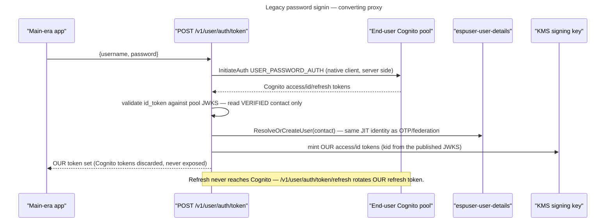

# Legacy native user auth (`/v1/user/auth/*`) — backward compatibility

> **Compatibility exception to the "users are passwordless" decision.**
> Apps built against `main` call the native `/v1/user/auth/*` endpoints
> (username+password login, signup, verify, password recovery/change). Those
> endpoints are restored here **byte-compatibly** so existing apps keep working,
> but they are converting proxies: authentication happens against the Cognito
> end-user pool (the same pool the [federation broker](federation.md) uses), and
> the tokens returned are **ESP User's own** — never Cognito's.
>
> New clients should use the OIDC browser flow (`/oauth2/authorize`) or OTP; this
> surface is legacy-only and slated for removal once main-era apps migrate.

## Contract (unchanged from `main`)

Same paths, request bodies, and response shapes as `main`, so a main-era client
needs no change:

| Route | Body | Returns |
|---|---|---|
| `POST /v1/user/auth/token` | `{username, password}` | token set |
| `POST /v1/user/auth/token/refresh` | `{refresh_token}` | token set |
| `POST /v1/user/auth/signup` | `{email?\|phone_number?, password}` | `{user_id, requires_verification, message}` |
| `POST /v1/user/auth/signup/verify` | `{email?\|phone_number?, code}` | `{message}` |
| `POST /v1/user/auth/password-recovery` | `{username}` | `{message}` |
| `POST /v1/user/auth/password-recovery/confirmation` | `{username, code, new_password}` | `{message}` |
| `POST /v1/user/auth/password` | `{access_token, old_password, new_password}` | `{message}` |
| `POST /v1/user/auth/signout` | `{access_token?, refresh_token?, global?}` | `{message}` |

Token response fields (RFC 6749 §5.1 names): `access_token`, `refresh_token`,
`id_token`, `token_type` (`Bearer`), `expires_in`, `must_change_password`.

## The flow, end to end

## Token conversion

- **`/token`**: `InitiateAuth USER_PASSWORD_AUTH` against the Cognito end-user
  pool. On success, read the authenticated user's verified email/phone from the
  Cognito id token, run [identity resolution](federation.md) (`ResolveOrCreateUser`
  → `DeriveUserID`), and mint **our** access/id/refresh tokens. The Cognito tokens
  are discarded. So a legacy password login and a federated/OTP login for the same
  verified contact resolve to the same `user_id` and issue the same shape of token.
- **`/token/refresh`**: rotates **our** refresh token via our refresh service —
  it never calls Cognito. See rotation note below.
- **signup / verify / password-recovery / password**: operate directly on the
  Cognito pool (`SignUp`, `ConfirmSignUp`, `ForgotPassword`, `ConfirmForgotPassword`,
  `ChangePassword`), exactly as `main`. These do not mint tokens.
- **signout**: revokes **our** refresh token / family (our revoke path). A missing refresh token is
  rejected rather than reported as success, and an all-devices request is refused: our sessions are
  refresh families of ours, which a provider-side sign-out does not touch, so a success there would
  mean nothing was ended.
- **password**: the client presents our access token plus the old password. The token is verified
  before anything else, because it names whose password is being changed. The old password is then
  re-presented to the provider to obtain a provider access token, which is what the provider's
  change-password operation requires — the client never holds one.

## Refresh rotation

`/token/refresh` rotates on every use and revokes the whole family on reuse —
identical to the OIDC `/oauth2/token` grant, with no per-grant exception. Every
response carries the new `refresh_token`, so a client must persist what it is
given and present that on the next refresh.

This is a deliberate divergence from `main`, whose Cognito refresh echoed the same
token back indefinitely: a client that re-sends an already-redeemed token is
treated as token theft and its login is terminated. Rotation is the point of the
refresh service (RFC 9700 §4.14), and exempting this grant would have meant
carrying a permanently weaker path for the one surface most likely to be attacked.

## Enumeration resistance

Every route answers the same whether or not the named account exists, so none of
this surface can be used to probe which contacts are registered:

| Operation | Account exists | Account does not exist |
|---|---|---|
| Sign-in (`/token`), wrong/any password | 401 `Authentication failed` | 401 `Authentication failed` |
| Signup (`/signup`) | 201 `Verification code sent. Existing RainMaker users should log in instead` — unconfirmed: code re-sent; confirmed: **no code sent** (provider refuses the resend, error dropped) | 201 same message — account created, code sent |
| Signup verify (`/signup/verify`), wrong/any code | 400 `Invalid verification code` | 400 `Invalid verification code` |
| Password recovery (`/password-recovery`) | 200 `If your account exists, you will receive a code` — code sent | 200 same message — nothing sent |
| Recovery confirmation (`/password-recovery/confirmation`) | 400 `Invalid verification code` without the mailed code | 400 `Invalid verification code` |
| Change password (`/password`) | 401 `Password change failed` unless the caller's own access token and old password both check out — no account probe possible without a token | 401 `Password change failed` |

## Security notes

- Password auth is ROPC-shaped, which OAuth 2.1 / RFC 9700 §2.4 discourage; it is
  retained **only** for backward compatibility and is not offered to new clients.
- Conversion means Cognito tokens never reach the client, so the client trust
  boundary is unchanged from the all-OIDC design.
- All eight routes are unauthenticated at the gateway; `POST .../password`
  and `.../signout`, which carry the caller's `access_token` in the body (as on
  `main`).
