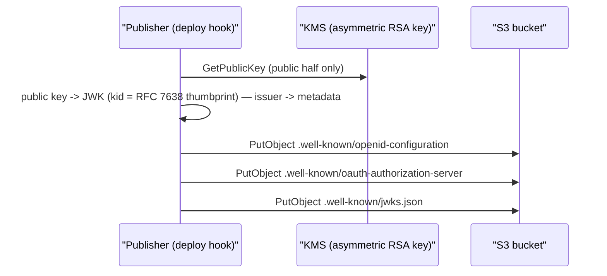

# OIDC Discovery & JWKS

## What this is

The read-only discovery documents an OAuth/OIDC client fetches **before** it ever
calls us — to learn where our endpoints are and how to verify our tokens. Three
static documents:

| Endpoint                                  | Purpose                       | Standard             |
| ----------------------------------------- | ----------------------------- | -------------------- |
| `/.well-known/openid-configuration`       | OIDC provider metadata        | OpenID Discovery 1.0 |
| `/.well-known/oauth-authorization-server` | OAuth 2.0 AS metadata         | RFC 8414             |
| `/.well-known/jwks.json`                  | Public signing keys (JWK Set) | RFC 7517             |

## Why it is needed

A client must discover endpoint URLs, supported grants/scopes, and the keys to
verify issued tokens. OIDC clients read `openid-configuration`; plain OAuth 2.0
clients read `oauth-authorization-server` (same data, RFC 8414 field names). Both
point at `jwks.json` for the public keys.

## Pre-requisites

- One RSA signing key exists as a **KMS asymmetric key** (`RSA_2048`,
  `SIGN_VERIFY`); the private half never leaves KMS. The public half is published
  in JWKS. (A `SecureString` PEM in SSM Parameter Store remains a **local/dev
  fallback**, used only when `ESPUSER_KMS_SIGNING_KEY_ARN` is unset.)
- The deployment `issuer` (public base URL) is known.

## Signing key (KMS)

- **Where it lives.** The signing key is a KMS asymmetric RSA key. The token
  minter signs by sending the token's SHA-256 **digest** to `kms:Sign`
  (`SigningAlgorithm=RSASSA_PKCS1_V1_5_SHA_256`, `MessageType=DIGEST`), which is
  exactly RS256 — so the JWS the minter assembles verifies against a standard
  RSA public key with no KMS on the verify path. The private key material is
  never exported; a lambda holds only `kms:Sign` (mint) or `kms:GetPublicKey`
  (publish), never the key bytes.
- **`kid` = RFC 7638 JWK thumbprint** of the public key. The minter and the JWKS
  publisher both derive it from the same public key, so they agree without
  sharing state, and it changes **iff** the key changes — which is precisely
  when a rotation wants a new `kid`.
- **Rotation.** A new KMS key yields a new thumbprint `kid`; publish an overlap
  JWKS containing both keys for at least `max(access-token TTL, JWKS S3 cache =
  86400s)` before retiring the old key. Verifiers cache the JWKS without
  refetching on an unknown `kid`, so a key **addition** needs a consumer refresh
  (a redeploy does this); a key **removal** is only safe after the overlap.
- **Provider parity.** `jwtutils.Minter` signs through a `crypto.Signer`, so the
  KMS signer (production) and a local `*rsa.PrivateKey` (tests, dev fallback)
  share one code path and produce identical RS256 output.

## Key Rules

- **RS256 only.** Sole signing alg; `alg: none` rejected (RFC 8725).
- **`issuer` = deployment base URL.** Every URL in all three docs is built from
  it; `jwks_uri` = `<issuer>/.well-known/jwks.json`.
- **Static, public, cacheable.** No secrets — JWKS publishes only public JWKs.
  Generated once and served from S3; no Lambda on the read path.
- **Issuer is fixed once chosen.** It is signed into every token, so changing it
  is a migration, not a toggle.

## Token usage: id token vs access token

The two issued JWTs serve distinct purposes, per OpenID Connect Core 1.0 token
semantics:

- **The id token identifies the user.** It is the identification artifact,
  consumed at the userinfo endpoint
  ([auth-flows.md](auth-flows.md#userinfo-endpoint-get-oauth2userinfo)); it is
  not an authorization credential for a resource server.
- **The access token authorizes actions.** It is the RFC 6749 / RFC 6750
  bearer credential a relying party presents to act on the user's behalf — for
  example, to obtain short-lived AWS/IoT credentials. Keeping the two separate
  avoids handing the id token to a resource surface it was not issued for.

> The access token issued here is what a relying party exchanges for AWS/IoT
> credentials via Cognito identity-pool OIDC federation; that mechanism (the
> identity pool, the device-users role, STS `AssumeRoleWithWebIdentity`) is
> owned by the ESP RainMaker Neo side — see
> [docs/en/specs/user_auth.md](../../../docs/en/specs/user_auth.md).

## Design

The three documents are immutable and identical for every caller, so they are
**generated once and served as static S3 objects** — not computed per request.

- **Tier 1 (default):** public S3 objects over HTTPS; `issuer` = the S3 URL.
- **Tier 2 (custom domain):** CloudFront (ACM cert) over a private S3 origin
  (OAC); `issuer` = the custom domain. Added only when a custom domain is attached.

A **publisher** (deploy hook; later, key rotation) builds the objects from the
issuer + the key's public half and writes them to S3:

The build logic (issuer → metadata struct, public key → JWK Set struct) lives in
shared utils so the publisher and any future request-time handler share it.

## APIs

### OIDC Provider Metadata

#### External Flow
- An OIDC client fetches `<issuer>/.well-known/openid-configuration`, then caches it.

#### Internal Flow

**API**: `GET /.well-known/openid-configuration`

**Process**:
1. Serve the static object built from `issuer`.
2. `Content-Type: application/json`, `Cache-Control: public, max-age=86400`.

**Response** (fields REQUIRED by OpenID Discovery 1.0):
| field | example | notes |
|---|---|---|
| `issuer` | `https://auth.customer.com` |  |
| `authorization_endpoint` | `https://auth.customer.com/oauth2/authorize` |  |
| `token_endpoint` | `https://auth.customer.com/oauth2/token` |  |
| `jwks_uri` | `https://auth.customer.com/.well-known/jwks.json` |  |
| `response_types_supported` | `["code"]` |  |
| `subject_types_supported` | `["public"]` |  |
| `id_token_signing_alg_values_supported` | `["RS256"]` |  |

### OAuth 2.0 Authorization Server Metadata

#### External Flow
- A plain OAuth 2.0 client fetches `<issuer>/.well-known/oauth-authorization-server`, then caches it.

#### Internal Flow

**API**: `GET /.well-known/oauth-authorization-server`

**Process**:
1. Serve the static object built from `issuer`.
2. `Content-Type: application/json`, `Cache-Control: public, max-age=86400`.

**Response** (fields required/recommended by RFC 8414):
| field | example | notes |
|---|---|---|
| `issuer` | `https://auth.customer.com` |  |
| `authorization_endpoint` | `https://auth.customer.com/oauth2/authorize` |  |
| `token_endpoint` | `https://auth.customer.com/oauth2/token` |  |
| `jwks_uri` | `https://auth.customer.com/.well-known/jwks.json` |  |
| `response_types_supported` | `["code"]` |  |
| `grant_types_supported` | `["authorization_code", "refresh_token"]` |  |
| `code_challenge_methods_supported` | `["S256"]` |  |
> Same issuer and endpoints as OIDC discovery; RFC 8414 drops the OIDC-only
> fields (`subject_types_supported`, `id_token_*`) and names PKCE/grants instead.
> Only `issuer` and `response_types_supported` are strictly required (endpoints
> are conditionally required); we also emit them. RFC 8414's
> `*_auth_signing_alg_values_supported` fields become required only once we
> advertise `private_key_jwt`/`client_secret_jwt` or a revocation/introspection
> endpoint — none in this slice, so they appear in the token/M2M slice.

### JWKS — public signing keys

#### External Flow
- The client fetches `jwks_uri`, then verifies each token by matching the JWT
  header `kid` to a key. On an unknown `kid` (rotation) it re-fetches once.

#### Internal Flow

**API**: `GET /.well-known/jwks.json`

**Process**:
1. Serve the static JWK Set — public half of every trusted signing key.
2. `Content-Type: application/json`, `Cache-Control: public, max-age=86400`.

**Response** (per-key fields required by RFC 7517/7518 for an RSA verify key —
`kty`, `kid`, `use`, `alg`, `n`, `e`):
| field | example | notes |
|---|---|---|
| `keys` | `[{"kty": "RSA", "use": "sig", "alg": "RS256", "kid": "2026-06-a", "n": "0vx7agoebGcQSuuPiLJXZptN...", "e": "AQAB"}]` |  |
> v1 publishes one active key. Rotation (publish-next → flip-active → retire) is
> deferred to the token-issuing slice.
>
> **Rotation overlap must be ≥ the JWKS cache lifetime.** JWKS is cached for 1
> day (`max-age=86400`), so a verifier may hold a stale key set for up to a day.
> When rotation lands, publish the new key **before** it signs and keep the old
> key in JWKS for **≥ 1 day** after the new key becomes active — otherwise tokens
> signed by the new key fail verification against caches that predate it.
